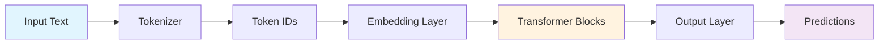

# Templates and Snippets Instructions for HF Transformer Trove

## Scope
This instruction file provides reusable templates and code snippets for consistent implementation across the repository.

## Repository Focus Areas
All templates and code snippets should align with the repository's focus areas:
- **Implementation with HF (Hugging Face)**: Primary framework and ecosystem for all implementations
- **NLP (Natural Language Processing)**: Core domain focus with comprehensive coverage of NLP tasks
- **Hate Speech Detection (Preferred)**: Emphasized application area for practical examples and use cases

## Notebook Templates

### Notebook Header Template
Add these badges at the top of every Jupyter notebook:

```markdown
[](https://colab.research.google.com/github/vuhung16au/hf-transformer-trove/blob/main/examples/NOTEBOOK_NAME.ipynb)
[](https://github.com/vuhung16au/hf-transformer-trove/blob/main/examples/NOTEBOOK_NAME.ipynb)

# Notebook Title

## 🎯 Learning Objectives
By the end of this notebook, you will understand:
- Key concept 1
- Key concept 2  
- Key concept 3
- Practical applications

## 📋 Prerequisites
- Basic understanding of machine learning concepts
- Familiarity with Python and PyTorch
- Knowledge of NLP fundamentals (refer to [NLP Learning Journey](https://github.com/vuhung16au/nlp-learning-journey))

## 📚 What We'll Cover
1. Section 1: Introduction and Setup
2. Section 2: Core Implementation
3. Section 3: Advanced Techniques
4. Section 4: Evaluation and Analysis
5. Section 5: Summary and Next Steps
```

### Notebook Footer Template
Add this footer at the end of every notebook (before metadata):

```markdown
---

## 📋 Summary

### 🔑 Key Concepts Mastered
- **Concept 1**: Brief explanation of what was learned
- **Concept 2**: Brief explanation of what was learned
- **Concept 3**: Brief explanation of what was learned

### 📈 Best Practices Learned
- Best practice 1 with brief explanation
- Best practice 2 with brief explanation
- Best practice 3 with brief explanation

### 🚀 Next Steps
- **Notebook XX**: Related advanced topic
- **Documentation**: Link to relevant docs for deeper understanding
- **External Resources**: Official HF documentation links

---

## About the Author

**Vu Hung Nguyen** - AI Engineer & Researcher

Connect with me:
- 🌐 **Website**: [vuhung16au.github.io](https://vuhung16au.github.io/)
- 💼 **LinkedIn**: [linkedin.com/in/nguyenvuhung](https://www.linkedin.com/in/nguyenvuhung/)
- 💻 **GitHub**: [github.com/vuhung16au](https://github.com/vuhung16au/)

*This notebook is part of the [HF Transformer Trove](https://github.com/vuhung16au/hf-transformer-trove) educational series.*
```

## Code Templates

### Device Detection Template
```python
import torch

def get_device() -> torch.device:
    """
    Automatically detect and return the best available device.
    
    Priority: CUDA > MPS (Apple Silicon) > CPU
    
    Returns:
        torch.device: The optimal device for current hardware
    """
    if torch.cuda.is_available():
        device = torch.device("cuda")
        print(f"🚀 Using CUDA GPU: {torch.cuda.get_device_name()}")
    elif torch.backends.mps.is_available():
        device = torch.device("mps") 
        print("🍎 Using Apple MPS (Apple Silicon)")
    else:
        device = torch.device("cpu")
        print("💻 Using CPU (consider GPU for better performance)")
    
    return device

# Standard usage pattern
device = get_device()
```

### Credential Loading Template
```python
import os
from typing import Optional

# For Google Colab compatibility
try:
    from google.colab import userdata
    COLAB_AVAILABLE = True
except ImportError:
    COLAB_AVAILABLE = False

def get_api_key(key_name: str, required: bool = True) -> Optional[str]:
    """
    Load API key from environment or Google Colab secrets.
    
    Args:
        key_name: Environment variable name
        required: Whether to raise error if not found
        
    Returns:
        API key string or None
        
    Raises:
        ValueError: If required key is missing
    """
    # Try Colab secrets first
    if COLAB_AVAILABLE:
        try:
            return userdata.get(key_name)
        except:
            pass
    
    # Try environment variable
    api_key = os.getenv(key_name)
    
    if required and not api_key:
        raise ValueError(
            f"{key_name} not found. Set it in:\n"
            f"- Local: .env.local file\n"
            f"- Colab: Secrets manager"
        )
    
    return api_key
```

### Model Loading Template
```python
from transformers import AutoTokenizer, AutoModel, AutoConfig, AutoModelForSequenceClassification

def load_model_with_error_handling(model_name: str, **kwargs):
    """
    Load HuggingFace model with comprehensive error handling.
    
    Args:
        model_name: Model identifier from HF Hub
        **kwargs: Additional model loading arguments
        
    Returns:
        Tuple of (tokenizer, model, config)
    """
    try:
        print(f"📥 Loading model: {model_name}")
        
        # Load components - use AutoModelForSequenceClassification for hate speech detection
        tokenizer = AutoTokenizer.from_pretrained(model_name)
        model = AutoModelForSequenceClassification.from_pretrained(model_name, **kwargs)
        config = AutoConfig.from_pretrained(model_name)
        
        # Move to optimal device
        device = get_device()
        model = model.to(device)
        
        print(f"✅ Model loaded successfully")
        print(f"📊 Model size: {model.num_parameters():,} parameters")
        
        return tokenizer, model, config
        
    except Exception as e:
        print(f"❌ Error loading model {model_name}: {e}")
        print("💡 Try checking model name or network connection")
        raise

### Preferred Hate Speech Detection Models
PREFERRED_HATE_SPEECH_MODELS = [
    "cardiffnlp/twitter-roberta-base-hate-latest",
    "facebook/roberta-hate-speech-dynabench-r4-target", 
    "GroNLP/hateBERT",
    "Hate-speech-CNERG/dehatebert-mono-english",
    "cardiffnlp/twitter-roberta-base-offensive"
]

def load_hate_speech_model(model_name: str = None):
    """
    Load preferred hate speech detection model with fallback options.
    
    Args:
        model_name: Specific model to load, defaults to preferred model
        
    Returns:
        Tuple of (tokenizer, model, config)
    """
    if model_name is None:
        model_name = PREFERRED_HATE_SPEECH_MODELS[0]  # Default to top preference
    
    print(f"🛡️ Loading hate speech detection model: {model_name}")
    return load_model_with_error_handling(model_name)
```

### Progress Tracking Template
```python
from tqdm.auto import tqdm
import time

def process_with_progress(items, process_fn, desc="Processing"):
    """
    Process items with progress bar and timing information.
    
    Args:
        items: Iterable of items to process
        process_fn: Function to apply to each item
        desc: Description for progress bar
        
    Returns:
        List of processed results
    """
    results = []
    start_time = time.time()
    
    with tqdm(total=len(items), desc=desc) as pbar:
        for item in items:
            result = process_fn(item)
            results.append(result)
            pbar.update(1)
    
    duration = time.time() - start_time
    print(f"⏱️ {desc} completed in {duration:.2f}s")
    print(f"🚀 Speed: {len(items)/duration:.1f} items/second")
    
    return results
```

## Documentation Templates

### Mathematical Notation Template
```markdown
The attention mechanism computes scaled dot-product attention:

$$\text{Attention}(Q, K, V) = \text{softmax}\left(\frac{QK^T}{\sqrt{d_k}}\right)V$$

Where:
- $Q \in \mathbb{R}^{n \times d_k}$ is the query matrix
- $K \in \mathbb{R}^{n \times d_k}$ is the key matrix  
- $V \in \mathbb{R}^{n \times d_v}$ is the value matrix
- $d_k$ is the dimension of the key vectors
- $n$ is the sequence length

The scaling factor $\frac{1}{\sqrt{d_k}}$ prevents the dot products from becoming too large.
```

### Mermaid Diagram Template
```markdown

```

### Warning and Tip Boxes Template
```markdown
> 💡 **Pro Tip**: Use `torch.cuda.empty_cache()` after processing large batches to free GPU memory.

> ⚠️ **Common Pitfall**: Always move both model and data to the same device to avoid CUDA errors.

> 🚀 **Performance**: Batch processing is significantly faster than processing items individually.

> **Key Takeaway**: The Transformer architecture's self-attention mechanism allows it to capture long-range dependencies in sequences.
```

## Error Handling Templates

### Comprehensive Error Handling Template
```python
def safe_model_inference(model, tokenizer, text, max_length=512):
    """
    Perform model inference with comprehensive error handling.
    
    Args:
        model: HuggingFace model
        tokenizer: HuggingFace tokenizer  
        text: Input text string
        max_length: Maximum sequence length
        
    Returns:
        Model outputs or None if error occurred
    """
    try:
        # Input validation
        if not text or not isinstance(text, str):
            raise ValueError("Input text must be a non-empty string")
        
        # Tokenization with error handling
        try:
            inputs = tokenizer(
                text, 
                return_tensors="pt", 
                max_length=max_length,
                truncation=True,
                padding=True
            )
        except Exception as e:
            print(f"❌ Tokenization error: {e}")
            return None
        
        # Move to same device as model
        device = next(model.parameters()).device
        inputs = {k: v.to(device) for k, v in inputs.items()}
        
        # Model inference
        with torch.no_grad():
            outputs = model(**inputs)
        
        return outputs
        
    except torch.cuda.OutOfMemoryError:
        print("❌ GPU out of memory. Try reducing batch size or sequence length.")
        if torch.cuda.is_available():
            torch.cuda.empty_cache()
        return None
        
    except Exception as e:
        print(f"❌ Unexpected error during inference: {e}")
        return None
```

### Dataset Loading Error Template
```python
from datasets import load_dataset

# Preferred hate speech datasets in order of preference
PREFERRED_HATE_SPEECH_DATASETS = [
    "tdavidson/hate_speech_offensive",
    "Hate-speech-CNERG/hatexplain", 
    "TrustAIRLab/HateBenchSet",
    "iamollas/ethos"
]

def load_dataset_safely(dataset_name, split='train', streaming=False):
    """
    Load dataset with error handling and fallback options.
    
    Args:
        dataset_name: Name of the dataset
        split: Dataset split to load
        streaming: Whether to use streaming mode
        
    Returns:
        Dataset object or None if failed
    """
    try:
        print(f"📥 Loading dataset: {dataset_name}")
        dataset = load_dataset(dataset_name, split=split, streaming=streaming)
        print(f"✅ Dataset loaded: {len(dataset) if not streaming else 'streaming'} examples")
        return dataset
        
    except ConnectionError:
        print("❌ Network error. Check internet connection.")
        print("💡 Try using a different dataset or enable streaming mode.")
        return None
        
    except Exception as e:
        print(f"❌ Error loading dataset: {e}")
        print("💡 Suggestions:")
        print("  - Check dataset name spelling")
        print("  - Verify dataset exists on HuggingFace Hub")
        print("  - Try with streaming=True for large datasets")
        return None

def load_hate_speech_dataset(dataset_name: str = None, split: str = 'train'):
    """
    Load preferred hate speech dataset with fallback options.
    
    Args:
        dataset_name: Specific dataset to load, defaults to preferred dataset
        split: Dataset split to load
        
    Returns:
        Dataset object or None if failed
    """
    if dataset_name is None:
        dataset_name = PREFERRED_HATE_SPEECH_DATASETS[0]  # Default to top preference
    
    print(f"🛡️ Loading hate speech dataset: {dataset_name}")
    return load_dataset_safely(dataset_name, split=split)
```

## Evaluation Templates

### Metrics Evaluation Template
```python
from sklearn.metrics import accuracy_score, precision_recall_fscore_support, confusion_matrix
import numpy as np

def evaluate_classification(y_true, y_pred, labels=None):
    """
    Comprehensive classification evaluation with educational output.
    
    Args:
        y_true: True labels
        y_pred: Predicted labels  
        labels: Label names for better readability
        
    Returns:
        Dictionary of evaluation metrics
    """
    # Basic metrics
    accuracy = accuracy_score(y_true, y_pred)
    precision, recall, f1, support = precision_recall_fscore_support(y_true, y_pred, average='weighted')
    
    # Confusion matrix
    cm = confusion_matrix(y_true, y_pred)
    
    print("📊 EVALUATION RESULTS")
    print("=" * 30)
    print(f"Accuracy:  {accuracy:.4f}")
    print(f"Precision: {precision:.4f}")
    print(f"Recall:    {recall:.4f}")  
    print(f"F1 Score:  {f1:.4f}")
    
    print(f"\n📋 Confusion Matrix:")
    print(cm)
    
    # Per-class metrics if labels provided
    if labels:
        per_class_precision, per_class_recall, per_class_f1, per_class_support = \
            precision_recall_fscore_support(y_true, y_pred, average=None)
        
        print(f"\n📈 Per-class Metrics:")
        for i, label in enumerate(labels):
            print(f"{label:12}: P={per_class_precision[i]:.3f}, R={per_class_recall[i]:.3f}, F1={per_class_f1[i]:.3f}")
    
    return {
        'accuracy': accuracy,
        'precision': precision, 
        'recall': recall,
        'f1': f1,
        'confusion_matrix': cm
    }
```

## Visualization Templates

### Training Progress Visualization Template
```python
import matplotlib.pyplot as plt
import seaborn as sns

def plot_training_history(history_dict, figsize=(12, 4)):
    """
    Plot training history with loss and metrics.
    
    Args:
        history_dict: Dictionary with 'loss', 'val_loss', 'accuracy', 'val_accuracy'
        figsize: Figure size tuple
    """
    fig, axes = plt.subplots(1, 2, figsize=figsize)
    
    # Loss plot
    axes[0].plot(history_dict['loss'], label='Training Loss', color='blue')
    if 'val_loss' in history_dict:
        axes[0].plot(history_dict['val_loss'], label='Validation Loss', color='red')
    axes[0].set_title('Model Loss')
    axes[0].set_xlabel('Epoch')
    axes[0].set_ylabel('Loss')
    axes[0].legend()
    axes[0].grid(True, alpha=0.3)
    
    # Accuracy plot
    if 'accuracy' in history_dict:
        axes[1].plot(history_dict['accuracy'], label='Training Accuracy', color='green')
    if 'val_accuracy' in history_dict:
        axes[1].plot(history_dict['val_accuracy'], label='Validation Accuracy', color='orange')
    axes[1].set_title('Model Accuracy')
    axes[1].set_xlabel('Epoch')
    axes[1].set_ylabel('Accuracy')
    axes[1].legend()
    axes[1].grid(True, alpha=0.3)
    
    plt.tight_layout()
    plt.show()
```

These templates ensure consistency across all notebooks and code files while maintaining the educational focus of the repository.