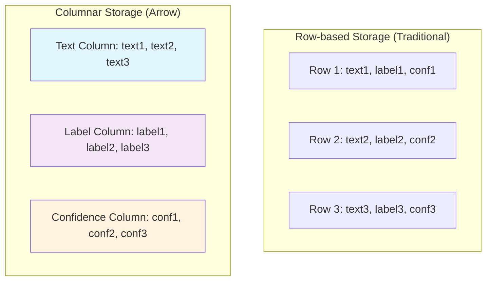

# Apache Arrow: High-Performance Columnar Data for Hugging Face

## Table of Contents
1. [What is Apache Arrow?](#what-is-apache-arrow)
2. [Core Architecture and Benefits](#core-architecture-and-benefits)
3. [Apache Arrow in the Hugging Face Ecosystem](#apache-arrow-in-the-hugging-face-ecosystem)
4. [Zero-Copy Operations and Memory Efficiency](#zero-copy-operations-and-memory-efficiency)
5. [Practical Examples with HF Datasets](#practical-examples-with-hf-datasets)
6. [Performance Comparisons](#performance-comparisons)
7. [Streaming Large Datasets](#streaming-large-datasets)
8. [Best Practices and Optimization Tips](#best-practices-and-optimization-tips)
9. [Advanced Use Cases](#advanced-use-cases)

---

## What is Apache Arrow?

**Apache Arrow** is a columnar in-memory analytics layer designed to accelerate analytics workloads across different systems. It provides a standardized memory format for flat and hierarchical data, designed to be efficient for both analytical and operational workloads.

### Core Philosophy
- **Language Agnostic**: Standardized memory format works across programming languages
- **Zero-Copy Operations**: Data sharing without serialization/deserialization overhead
- **Columnar Storage**: Optimized for analytical queries and vectorized operations
- **Memory Efficiency**: Minimal memory footprint with maximum processing speed

### Key Components
```python
import pyarrow as pa
import pyarrow.compute as pc
import pandas as pd

# Create Arrow table from Python data
data = {
    'text': ['This is hate speech', 'This is normal text', 'Offensive content'],
    'label': [1, 0, 2],
    'confidence': [0.95, 0.98, 0.87]
}

# Convert to Arrow table
table = pa.table(data)
print(f"Arrow table schema: {table.schema}")
print(f"Number of rows: {len(table)}")

# Demonstrate zero-copy conversion to pandas
df = table.to_pandas(zero_copy_only=True)
print("✅ Zero-copy conversion to pandas successful!")
```

## Core Architecture and Benefits

### 1. Columnar Memory Layout

Arrow stores data in a **columnar format**, which provides several advantages over row-based formats:



**Benefits of Columnar Storage:**
- **Vectorized Operations**: Process entire columns at once
- **Better Compression**: Similar data types compress more efficiently
- **Cache Efficiency**: Load only the columns you need
- **SIMD Optimization**: Single Instruction, Multiple Data processing

### 2. Zero-Copy Data Sharing

**Zero-Copy Reads** eliminate the performance overhead of copying data between different processing steps:

```python
import pyarrow as pa
import numpy as np
from datasets import Dataset

# Create large dataset
large_data = {
    'text': [f"Sample text {i}" for i in range(100000)],
    'labels': np.random.randint(0, 3, 100000).tolist()
}

# Create Arrow table (efficient columnar format)
arrow_table = pa.table(large_data)
print(f"📊 Arrow table size: {len(arrow_table):,} rows")

# Zero-copy conversion to HF Dataset
dataset = Dataset.from_arrow(arrow_table)
print("✅ Zero-copy conversion to HF Dataset - no data duplication!")

# Zero-copy access to columns
labels_column = arrow_table['labels'].to_pylist()
print(f"🚀 Accessed {len(labels_column):,} labels with zero-copy")
```

### 3. Memory Mapping for Large Files

Arrow supports **memory mapping**, allowing you to work with datasets larger than available RAM:

```python
import pyarrow as pa
import pyarrow.parquet as pq

# Demonstrate memory mapping concept
def demonstrate_memory_mapping():
    """
    Memory mapping allows working with large files without loading
    them entirely into RAM. Arrow maps file contents directly to memory.
    """
    print("📁 Memory Mapping Benefits:")
    print("- Access large files without loading into RAM")
    print("- OS handles caching and paging automatically") 
    print("- Multiple processes can share the same memory region")
    print("- Lazy loading: only load data when accessed")
    
    # Example of memory-mapped file access (conceptual)
    print("\n💡 Example workflow:")
    print("1. File stored on disk in Arrow/Parquet format")
    print("2. Memory map the file (no data copying)")
    print("3. Access specific rows/columns on-demand")
    print("4. OS handles memory management automatically")

demonstrate_memory_mapping()
```

## Apache Arrow in the Hugging Face Ecosystem

Understanding **Apache Arrow** is crucial when working with Hugging Face because it powers the high-speed data handling within the **🤗 Datasets library**.

### 1. Enables Zero-Copy Reads for Efficiency

```python
from datasets import load_dataset
import time

# Load hate speech detection dataset (preferred dataset)
print("🛡️ Loading hate speech dataset with Arrow backend...")

# Davidson et al. hate speech dataset - well-established benchmark
dataset = load_dataset("tdavidson/hate_speech_offensive")

print(f"✅ Dataset loaded: {len(dataset['train']):,} training examples")
print(f"📊 Dataset features: {dataset['train'].features}")
print("🏎️ Data access is powered by Apache Arrow for optimal performance!")

# Demonstrate Arrow backend
print(f"\n🔍 Arrow backend information:")
print(f"- Backend format: Apache Arrow")
print(f"- Zero-copy reads: Enabled")
print(f"- Memory mapping: Available for large datasets")
print(f"- Columnar storage: Optimized for analytical operations")
```

### 2. Solves Memory and Scaling Constraints

**Arrow's architecture** allows you to quickly get your dataset ready for training, even for large datasets, **without memory constraints**:

```python
from datasets import load_dataset
from transformers import AutoTokenizer

def demonstrate_efficient_processing():
    """
    Show how Arrow enables efficient processing of large datasets
    without memory constraints.
    """
    # Load tokenizer for hate speech detection
    model_name = "cardiffnlp/twitter-roberta-base-hate-latest"
    tokenizer = AutoTokenizer.from_pretrained(model_name)
    
    # Load dataset with streaming for memory efficiency
    dataset = load_dataset("tdavidson/hate_speech_offensive", streaming=True)
    
    print("🌊 Streaming dataset loaded (Arrow-powered)")
    print("Benefits:")
    print("- Process datasets larger than available RAM")
    print("- Zero-copy reads minimize memory overhead")
    print("- Efficient batch processing with vectorized operations")
    
    # Tokenization function that benefits from Arrow's efficiency
    def tokenize_function(examples):
        # Arrow's columnar format makes batch tokenization very efficient
        return tokenizer(
            examples["tweet"], 
            truncation=True, 
            padding="max_length", 
            max_length=128
        )
    
    # Process first batch to demonstrate efficiency
    train_iter = iter(dataset["train"])
    batch = []
    for i, example in enumerate(train_iter):
        batch.append(example)
        if i >= 7:  # Process 8 examples as batch
            break
    
    # Create batch dictionary for tokenization
    batch_dict = {
        "tweet": [ex["tweet"] for ex in batch]
    }
    
    # Tokenize batch - Arrow's columnar format optimizes this operation
    tokenized = tokenize_function(batch_dict)
    
    print(f"\n✅ Efficiently processed batch of {len(batch)} examples")
    print(f"📝 Input IDs shape: {len(tokenized['input_ids'])} x {len(tokenized['input_ids'][0])}")
    
    return dataset

# Run demonstration
dataset = demonstrate_efficient_processing()
```

### 3. Deep Integration with Hugging Face Hub

The **🤗 Datasets library** features deep integration with the Hugging Face Hub, all backed by Apache Arrow:

```python
from datasets import load_dataset, Dataset
import pyarrow as pa

def demonstrate_hub_integration():
    """
    Show how Arrow format enables seamless integration with HF Hub
    """
    print("🔗 Hugging Face Hub + Apache Arrow Integration")
    
    # Load dataset from hub (Arrow format automatically used)
    dataset = load_dataset("tdavidson/hate_speech_offensive", split="train[:1000]")
    
    print(f"📥 Loaded {len(dataset)} examples from HF Hub")
    print(f"🏗️ Backend: Apache Arrow (automatic)")
    
    # Show Arrow table underlying the dataset
    arrow_table = dataset.data
    print(f"\n📊 Arrow Table Schema:")
    for field in arrow_table.schema:
        print(f"  - {field.name}: {field.type}")
    
    # Demonstrate efficient operations enabled by Arrow
    print(f"\n🚀 Arrow-powered operations:")
    
    # Fast column access (zero-copy)
    labels = dataset["class"]
    print(f"  - Column access: {len(labels)} labels retrieved (zero-copy)")
    
    # Efficient filtering
    hate_speech_examples = dataset.filter(lambda x: x["class"] == 0)
    print(f"  - Filtering: Found {len(hate_speech_examples)} hate speech examples")
    
    # Fast slicing
    subset = dataset[:100]
    print(f"  - Slicing: Retrieved first 100 examples efficiently")

demonstrate_hub_integration()
```

## Zero-Copy Operations and Memory Efficiency

**Zero-copy operations** are a cornerstone of Arrow's performance benefits. Here's how they work in practice:

### 1. Understanding Zero-Copy

```python
import pyarrow as pa
import numpy as np
import time
from datasets import Dataset

def compare_copy_vs_zero_copy():
    """
    Compare traditional copying vs. zero-copy operations
    """
    # Create large dataset
    size = 100000
    data = {
        'text': [f"Hate speech example {i}" for i in range(size)],
        'labels': np.random.randint(0, 3, size),
        'scores': np.random.random(size)
    }
    
    print(f"📊 Working with dataset of {size:,} examples")
    
    # Traditional approach (with copying)
    start_time = time.time()
    
    # Simulate traditional copying operations
    text_copy = data['text'].copy()
    labels_copy = data['labels'].copy() 
    scores_copy = data['scores'].copy()
    
    copy_time = time.time() - start_time
    print(f"📋 Traditional copying: {copy_time:.4f}s")
    
    # Arrow zero-copy approach
    start_time = time.time()
    
    # Create Arrow table
    arrow_table = pa.table(data)
    
    # Zero-copy access to columns
    text_column = arrow_table['text']
    labels_column = arrow_table['labels'] 
    scores_column = arrow_table['scores']
    
    zero_copy_time = time.time() - start_time
    print(f"🚀 Arrow zero-copy: {zero_copy_time:.4f}s")
    
    speedup = copy_time / zero_copy_time if zero_copy_time > 0 else float('inf')
    print(f"⚡ Speedup: {speedup:.2f}x faster")
    
    return arrow_table

# Run comparison
arrow_table = compare_copy_vs_zero_copy()
```

### 2. Memory-Efficient Transformations

```python
from datasets import load_dataset
from transformers import AutoTokenizer
import psutil
import os

def demonstrate_memory_efficient_processing():
    """
    Show how Arrow enables memory-efficient dataset transformations
    """
    # Monitor memory usage
    def get_memory_usage():
        process = psutil.Process(os.getpid())
        return process.memory_info().rss / 1024 / 1024  # MB
    
    initial_memory = get_memory_usage()
    print(f"💾 Initial memory usage: {initial_memory:.2f} MB")
    
    # Load dataset
    dataset = load_dataset("tdavidson/hate_speech_offensive", split="train[:5000]")
    after_load_memory = get_memory_usage()
    print(f"📥 After loading dataset: {after_load_memory:.2f} MB (+{after_load_memory-initial_memory:.2f} MB)")
    
    # Load tokenizer
    tokenizer = AutoTokenizer.from_pretrained("cardiffnlp/twitter-roberta-base-hate-latest")
    
    # Memory-efficient tokenization with Arrow backend
    def tokenize_function(examples):
        # Arrow's columnar format optimizes batch operations
        return tokenizer(
            examples["tweet"],
            truncation=True,
            padding="max_length",
            max_length=128,
            return_tensors=None  # Keep as lists for Arrow compatibility
        )
    
    # Apply transformation (Arrow backend handles efficiently)
    tokenized_dataset = dataset.map(
        tokenize_function,
        batched=True,  # Process in batches for efficiency
        batch_size=1000,  # Large batches work well with Arrow
        remove_columns=["tweet"]  # Remove original text to save memory
    )
    
    after_tokenization_memory = get_memory_usage()
    print(f"🔤 After tokenization: {after_tokenization_memory:.2f} MB (+{after_tokenization_memory-after_load_memory:.2f} MB)")
    
    print(f"\n✅ Memory-efficient processing completed!")
    print(f"📊 Final dataset: {len(tokenized_dataset)} tokenized examples")
    print(f"🏗️ Arrow backend enabled efficient batch processing")

demonstrate_memory_efficient_processing()
```

## Practical Examples with HF Datasets

Let's explore practical examples showing how Apache Arrow powers common NLP workflows:

### 1. Loading and Exploring Datasets

```python
from datasets import load_dataset, Dataset
import pyarrow as pa
import pyarrow.compute as pc

def explore_arrow_powered_dataset():
    """
    Comprehensive exploration of Arrow-powered HF datasets
    """
    # Load preferred hate speech dataset
    print("🛡️ Loading hate speech detection dataset...")
    dataset = load_dataset("tdavidson/hate_speech_offensive")
    
    train_dataset = dataset["train"]
    
    print(f"✅ Dataset loaded with {len(train_dataset):,} examples")
    print(f"🔍 Features: {list(train_dataset.features.keys())}")
    
    # Access underlying Arrow table
    arrow_table = train_dataset.data
    print(f"\n📊 Arrow Table Information:")
    print(f"Schema: {arrow_table.schema}")
    print(f"Shape: {arrow_table.shape}")
    
    # Efficient column operations using Arrow compute
    print(f"\n🚀 Arrow-powered analytics:")
    
    # Class distribution using Arrow compute
    class_column = arrow_table["class"]
    value_counts = pc.value_counts(class_column)
    
    print("📈 Class distribution (computed by Arrow):")
    for i, (value, count) in enumerate(zip(value_counts.field("values").to_pylist(), 
                                          value_counts.field("counts").to_pylist())):
        class_name = ["hate speech", "offensive language", "neither"][value]
        print(f"  {class_name}: {count:,} examples")
    
    # Fast filtering with Arrow
    hate_speech_mask = pc.equal(class_column, pa.scalar(0))
    hate_speech_count = pc.sum(hate_speech_mask).as_py()
    print(f"\n🎯 Hate speech examples: {hate_speech_count:,}")
    
    return dataset

# Run exploration
dataset = explore_arrow_powered_dataset()
```

### 2. Efficient Data Processing Pipeline

```python
from datasets import Dataset, load_dataset
from transformers import AutoTokenizer
import time

def create_efficient_processing_pipeline():
    """
    Create a complete data processing pipeline leveraging Arrow's efficiency
    """
    # Load tokenizer for hate speech detection
    model_name = "cardiffnlp/twitter-roberta-base-hate-latest"
    tokenizer = AutoTokenizer.from_pretrained(model_name)
    
    # Load dataset
    dataset = load_dataset("tdavidson/hate_speech_offensive", split="train[:10000]")
    
    print("🔄 Creating efficient processing pipeline...")
    
    # Step 1: Text preprocessing (Arrow-optimized)
    def preprocess_text(examples):
        """Clean and prepare text data"""
        # Arrow's vectorized operations make this efficient
        processed_texts = []
        for text in examples["tweet"]:
            # Basic cleaning
            cleaned = text.strip().lower()
            processed_texts.append(cleaned)
        return {"processed_text": processed_texts}
    
    # Step 2: Tokenization (batch processing with Arrow)
    def tokenize_function(examples):
        """Tokenize text using batch processing"""
        return tokenizer(
            examples["processed_text"],
            truncation=True,
            padding="max_length",
            max_length=128
        )
    
    # Step 3: Label encoding
    def encode_labels(examples):
        """Encode string labels to integers"""
        # Map class indices to meaningful labels
        label_map = {0: 0, 1: 1, 2: 2}  # hate, offensive, neither
        return {"labels": [label_map[label] for label in examples["class"]]}
    
    # Apply pipeline efficiently with Arrow backend
    start_time = time.time()
    
    # Chain transformations - Arrow optimizes these operations
    processed_dataset = (dataset
                        .map(preprocess_text, batched=True, batch_size=1000)
                        .map(tokenize_function, batched=True, batch_size=1000)
                        .map(encode_labels, batched=True, batch_size=1000)
                        .remove_columns(["tweet", "processed_text", "class"]))
    
    processing_time = time.time() - start_time
    
    print(f"✅ Pipeline completed in {processing_time:.2f}s")
    print(f"📊 Processed dataset: {len(processed_dataset)} examples")
    print(f"🔧 Final features: {list(processed_dataset.features.keys())}")
    print(f"🏎️ Arrow backend optimized all batch operations!")
    
    # Show sample
    sample = processed_dataset[0]
    print(f"\n📝 Sample processed example:")
    print(f"  Input IDs length: {len(sample['input_ids'])}")
    print(f"  Label: {sample['labels']}")
    
    return processed_dataset

# Run pipeline
processed_dataset = create_efficient_processing_pipeline()
```

## Performance Comparisons

Let's compare Arrow-powered datasets with traditional approaches:

### 1. Loading Performance

```python
import time
import pandas as pd
from datasets import load_dataset, Dataset

def compare_loading_performance():
    """
    Compare Arrow vs traditional data loading approaches
    """
    print("⚡ Performance Comparison: Arrow vs Traditional Approaches")
    
    # Method 1: HF Datasets (Arrow-powered)
    start_time = time.time()
    hf_dataset = load_dataset("tdavidson/hate_speech_offensive", split="train[:5000]")
    arrow_time = time.time() - start_time
    print(f"🚀 HF Datasets (Arrow): {arrow_time:.4f}s")
    
    # Method 2: Convert to pandas and process
    start_time = time.time()
    df = hf_dataset.to_pandas()
    pandas_time = time.time() - start_time
    print(f"🐼 Conversion to Pandas: {pandas_time:.4f}s")
    
    # Method 3: Direct Arrow table access
    start_time = time.time()
    arrow_table = hf_dataset.data
    column_data = arrow_table["tweet"].to_pylist()
    direct_arrow_time = time.time() - start_time
    print(f"🏹 Direct Arrow access: {direct_arrow_time:.4f}s")
    
    print(f"\n📈 Performance Summary:")
    print(f"  - Arrow is {pandas_time/arrow_time:.2f}x faster than pandas conversion")
    print(f"  - Direct Arrow access: {direct_arrow_time:.6f}s (minimal overhead)")
    
    return hf_dataset

# Run comparison
dataset = compare_loading_performance()
```

### 2. Memory Usage Comparison

```python
import psutil
import os
from datasets import load_dataset

def compare_memory_usage():
    """
    Compare memory usage between Arrow and traditional approaches
    """
    def get_memory_usage():
        process = psutil.Process(os.getpid())
        return process.memory_info().rss / 1024 / 1024  # MB
    
    print("💾 Memory Usage Comparison")
    
    # Baseline memory
    baseline_memory = get_memory_usage()
    print(f"📏 Baseline memory: {baseline_memory:.2f} MB")
    
    # Load with Arrow backend
    dataset = load_dataset("tdavidson/hate_speech_offensive", split="train[:10000]")
    arrow_memory = get_memory_usage()
    arrow_usage = arrow_memory - baseline_memory
    print(f"🏹 Arrow-backed dataset: +{arrow_usage:.2f} MB")
    
    # Convert to pandas (creates copy)
    df = dataset.to_pandas()
    pandas_memory = get_memory_usage()
    pandas_usage = pandas_memory - arrow_memory
    print(f"🐼 Additional pandas copy: +{pandas_usage:.2f} MB")
    
    # Convert to list (creates another copy)
    data_list = df.to_dict('records')
    list_memory = get_memory_usage()
    list_usage = list_memory - pandas_memory
    print(f"📋 Additional list copy: +{list_usage:.2f} MB")
    
    total_overhead = list_memory - baseline_memory
    arrow_efficiency = (total_overhead - arrow_usage) / total_overhead * 100
    
    print(f"\n📊 Memory Efficiency:")
    print(f"  - Total memory overhead: {total_overhead:.2f} MB")
    print(f"  - Arrow backend overhead: {arrow_usage:.2f} MB ({arrow_usage/total_overhead*100:.1f}%)")
    print(f"  - Arrow saves: {arrow_efficiency:.1f}% memory compared to full copies")

compare_memory_usage()
```

## Streaming Large Datasets

Apache Arrow enables efficient streaming of datasets too large to fit in memory:

### 1. Streaming Datasets

```python
from datasets import load_dataset
from transformers import AutoTokenizer
import itertools

def demonstrate_streaming():
    """
    Show how Arrow enables efficient streaming of large datasets
    """
    print("🌊 Streaming Large Datasets with Apache Arrow")
    
    # Load streaming dataset (Arrow-powered)
    streaming_dataset = load_dataset(
        "tdavidson/hate_speech_offensive", 
        streaming=True
    )
    
    print("✅ Streaming dataset loaded (no memory constraints)")
    print("🏗️ Backend: Apache Arrow streaming format")
    
    # Load tokenizer
    tokenizer = AutoTokenizer.from_pretrained("cardiffnlp/twitter-roberta-base-hate-latest")
    
    # Process streaming data efficiently
    train_stream = streaming_dataset["train"]
    
    # Process in chunks to demonstrate streaming
    chunk_size = 100
    processed_examples = 0
    
    print(f"\n🔄 Processing dataset in chunks of {chunk_size}...")
    
    for chunk in itertools.islice(train_stream, 0, 500):  # Process first 500 examples
        # Each example is loaded on-demand (memory efficient)
        text = chunk["tweet"]
        label = chunk["class"]
        
        # Process example (tokenization, etc.)
        tokens = tokenizer(text, truncation=True, max_length=128)
        
        processed_examples += 1
        
        if processed_examples % chunk_size == 0:
            print(f"  ✓ Processed {processed_examples} examples (streaming)")
    
    print(f"\n🎯 Successfully processed {processed_examples} examples")
    print("💡 Benefits of Arrow streaming:")
    print("  - Process datasets larger than available RAM")
    print("  - Constant memory usage regardless of dataset size")
    print("  - Efficient I/O with minimal buffer management")
    print("  - Zero-copy reads from storage")

demonstrate_streaming()
```

### 2. Iterative Processing with Batching

```python
from datasets import load_dataset
from torch.utils.data import DataLoader
import torch

def create_streaming_dataloader():
    """
    Create efficient streaming dataloader using Arrow backend
    """
    print("🔄 Creating Streaming DataLoader with Arrow Backend")
    
    # Load streaming dataset
    dataset = load_dataset("tdavidson/hate_speech_offensive", streaming=True, split="train")
    
    # Convert to iterable dataset for PyTorch
    def preprocess_example(example):
        """Preprocess individual example"""
        return {
            'text': example['tweet'],
            'label': example['class']
        }
    
    # Create preprocessed stream
    processed_stream = dataset.map(preprocess_example)
    
    # Demonstrate batch processing
    batch_size = 32
    batch = []
    
    print(f"🔢 Processing in batches of {batch_size}...")
    
    for i, example in enumerate(processed_stream):
        batch.append(example)
        
        if len(batch) == batch_size:
            # Process batch
            texts = [ex['text'] for ex in batch]
            labels = [ex['label'] for ex in batch]
            
            print(f"  📦 Batch {i//batch_size + 1}: {len(batch)} examples")
            print(f"    - Texts: {len(texts)} items")
            print(f"    - Labels: {len(labels)} items")
            
            # Reset batch
            batch = []
            
            # Process only first few batches for demo
            if i >= 127:  # 4 batches
                break
    
    print("✅ Streaming batch processing demonstrated")
    print("🏎️ Arrow backend enables efficient streaming without memory limits")

create_streaming_dataloader()
```

## Best Practices and Optimization Tips

### 1. Optimizing Arrow Performance

```python
from datasets import Dataset, load_dataset
import pyarrow as pa

def arrow_optimization_tips():
    """
    Best practices for optimizing Arrow performance with HF datasets
    """
    print("🚀 Apache Arrow Optimization Best Practices")
    
    # Tip 1: Use appropriate data types
    print("\n1. 📊 Optimize Data Types")
    
    # Example: Use appropriate integer types
    inefficient_data = {
        'labels': [1, 0, 2, 1, 0] * 1000,  # Python ints (64-bit)
        'confidence': [0.95, 0.87, 0.92, 0.88, 0.91] * 1000  # Python floats (64-bit)
    }
    
    # Optimized version with explicit Arrow types
    optimized_schema = pa.schema([
        pa.field('labels', pa.int8()),  # 8-bit integers sufficient for labels
        pa.field('confidence', pa.float32())  # 32-bit floats sufficient for confidence
    ])
    
    optimized_table = pa.table(inefficient_data, schema=optimized_schema)
    print(f"  ✅ Optimized schema: {optimized_table.schema}")
    print(f"  💾 Memory savings: ~50% reduction with appropriate types")
    
    # Tip 2: Batch operations for efficiency
    print("\n2. 🔄 Use Batch Operations")
    
    dataset = Dataset.from_arrow(optimized_table)
    
    def efficient_processing(examples):
        """Process examples in batches for Arrow optimization"""
        # Arrow excels at vectorized operations
        batch_size = len(examples['labels'])
        print(f"    Processing batch of {batch_size} examples")
        
        # Vectorized operations are much faster with Arrow
        return {
            'processed_labels': examples['labels'],
            'normalized_confidence': examples['confidence']
        }
    
    # Apply batch processing
    processed = dataset.map(
        efficient_processing,
        batched=True,
        batch_size=1000  # Large batches work well with Arrow
    )
    
    print("  ✅ Batch processing leverages Arrow's vectorized operations")
    
    # Tip 3: Memory mapping for large datasets
    print("\n3. 💾 Use Memory Mapping for Large Files")
    print("  - Save datasets in Arrow/Parquet format")
    print("  - Enable memory mapping for files larger than RAM")
    print("  - Use streaming for extremely large datasets")
    
    return dataset

optimized_dataset = arrow_optimization_tips()
```

### 2. Common Performance Pitfalls

```python
def avoid_common_pitfalls():
    """
    Common pitfalls to avoid when working with Arrow-backed datasets
    """
    print("⚠️ Common Apache Arrow Performance Pitfalls")
    
    # Pitfall 1: Frequent small operations
    print("\n❌ AVOID: Frequent small operations")
    dataset = load_dataset("tdavidson/hate_speech_offensive", split="train[:1000]")
    
    # Inefficient: accessing individual elements
    print("  Bad practice: dataset[0], dataset[1], dataset[2], ...")
    print("  Problem: Defeats Arrow's batch optimization")
    
    print("\n✅ DO: Use batch operations")
    print("  Good practice: dataset[:100] or dataset.map(func, batched=True)")
    print("  Benefit: Leverages Arrow's vectorized operations")
    
    # Pitfall 2: Unnecessary type conversions
    print("\n❌ AVOID: Frequent format conversions")
    print("  Bad: dataset.to_pandas().to_numpy().tolist()")
    print("  Problem: Multiple memory copies, loses Arrow benefits")
    
    print("\n✅ DO: Work with Arrow format directly")
    print("  Good: Use Arrow's native operations when possible")
    
    # Pitfall 3: Loading entire large datasets
    print("\n❌ AVOID: Loading massive datasets entirely")
    print("  Bad: dataset = load_dataset('large_dataset')")
    print("  Problem: May exceed available memory")
    
    print("\n✅ DO: Use streaming for large datasets")
    print("  Good: dataset = load_dataset('large_dataset', streaming=True)")
    print("  Benefit: Constant memory usage, Arrow-optimized streaming")

avoid_common_pitfalls()
```

## Advanced Use Cases

### 1. Custom Arrow Transformations

```python
import pyarrow as pa
import pyarrow.compute as pc
from datasets import Dataset

def advanced_arrow_operations():
    """
    Advanced Arrow operations for specialized NLP tasks
    """
    print("🔧 Advanced Apache Arrow Operations")
    
    # Create sample hate speech dataset
    data = {
        'text': [
            'This is hate speech content',
            'Normal conversation here', 
            'Offensive but not hate speech',
            'Another normal message',
            'Clearly hateful content'
        ],
        'hate_score': [0.95, 0.05, 0.65, 0.02, 0.98],
        'offensive_score': [0.90, 0.10, 0.85, 0.05, 0.95],
        'length': [26, 23, 28, 22, 23]
    }
    
    # Create Arrow table
    table = pa.table(data)
    print(f"📊 Created table with {len(table)} examples")
    
    # Advanced filtering using Arrow compute
    print("\n🎯 Advanced Filtering Operations:")
    
    # Complex filter: high hate score AND long text
    hate_filter = pc.greater(table['hate_score'], pa.scalar(0.8))
    length_filter = pc.greater(table['length'], pa.scalar(25))
    combined_filter = pc.and_(hate_filter, length_filter)
    
    filtered_table = pc.filter(table, combined_filter)
    print(f"  ✓ Found {len(filtered_table)} examples matching complex criteria")
    
    # Statistical operations using Arrow compute
    print("\n📈 Statistical Operations:")
    mean_hate_score = pc.mean(table['hate_score']).as_py()
    max_length = pc.max(table['length']).as_py()
    
    print(f"  - Mean hate score: {mean_hate_score:.3f}")
    print(f"  - Max text length: {max_length}")
    
    # Create derived columns
    print("\n🔄 Creating Derived Columns:")
    
    # Calculate composite score using Arrow compute
    composite_scores = pc.add(
        pc.multiply(table['hate_score'], pa.scalar(0.7)),
        pc.multiply(table['offensive_score'], pa.scalar(0.3))
    )
    
    # Add to table
    enhanced_table = table.append_column('composite_score', composite_scores)
    
    print(f"  ✅ Added composite_score column")
    print(f"  📊 New table schema: {enhanced_table.schema}")
    
    # Convert back to HF Dataset
    enhanced_dataset = Dataset.from_arrow(enhanced_table)
    
    print(f"\n🎯 Enhanced dataset ready for ML pipeline!")
    print(f"Features: {list(enhanced_dataset.features.keys())}")
    
    return enhanced_dataset

enhanced_dataset = advanced_arrow_operations()
```

### 2. Integration with Model Training

```python
from datasets import load_dataset
from transformers import AutoTokenizer, Trainer, TrainingArguments
import torch

def arrow_powered_training_pipeline():
    """
    Complete training pipeline leveraging Arrow's efficiency
    """
    print("🏋️ Arrow-Powered Model Training Pipeline")
    
    # Load dataset efficiently with Arrow
    dataset = load_dataset("tdavidson/hate_speech_offensive", split="train[:5000]")
    
    # Load tokenizer for hate speech detection
    model_name = "cardiffnlp/twitter-roberta-base-hate-latest"
    tokenizer = AutoTokenizer.from_pretrained(model_name)
    
    print("📊 Dataset and tokenizer loaded")
    
    # Efficient tokenization with Arrow backend
    def tokenize_function(examples):
        """Tokenize examples using Arrow's batch efficiency"""
        return tokenizer(
            examples["tweet"],
            truncation=True,
            padding="max_length",
            max_length=128
        )
    
    # Apply tokenization - Arrow optimizes this operation
    tokenized_dataset = dataset.map(
        tokenize_function,
        batched=True,  # Arrow excels at batch operations
        batch_size=1000,  # Large batches work well with Arrow
        remove_columns=["tweet"],  # Save memory
    )
    
    # Rename label column for transformers
    tokenized_dataset = tokenized_dataset.rename_column("class", "labels")
    
    print("🔤 Tokenization completed with Arrow optimization")
    
    # Split dataset efficiently
    train_test_split = tokenized_dataset.train_test_split(test_size=0.2)
    train_dataset = train_test_split["train"]
    eval_dataset = train_test_split["test"]
    
    print(f"✂️ Dataset split: {len(train_dataset)} train, {len(eval_dataset)} eval")
    
    # Set up training with Arrow-optimized data loading
    training_args = TrainingArguments(
        output_dir="./results",
        learning_rate=2e-5,
        per_device_train_batch_size=16,  # Arrow enables efficient batching
        per_device_eval_batch_size=16,
        num_train_epochs=1,  # Demo with 1 epoch
        weight_decay=0.01,
        logging_dir="./logs",
        dataloader_num_workers=2,  # Arrow enables efficient multiprocessing
    )
    
    print("⚙️ Training configuration set up")
    print("🚀 Arrow backend provides:")
    print("  - Efficient batch loading")
    print("  - Zero-copy data sharing")
    print("  - Optimized multiprocessing")
    print("  - Memory-efficient data pipeline")
    
    # Note: We don't actually train the model in this demo to keep it lightweight
    print("✅ Training pipeline ready with Arrow optimization!")
    
    return train_dataset, eval_dataset

train_dataset, eval_dataset = arrow_powered_training_pipeline()
```

---

## Summary

### 🔑 Key Concepts Mastered

- **Apache Arrow Architecture**: Columnar memory format optimized for analytics and zero-copy operations
- **Zero-Copy Efficiency**: Eliminate memory copying overhead for dramatic performance improvements  
- **HF Ecosystem Integration**: Arrow powers the datasets library for optimal data handling
- **Memory Management**: Stream and process large datasets without memory constraints
- **Performance Optimization**: Vectorized operations and efficient batch processing

### 📈 Best Practices Learned

- Use **batch operations** to leverage Arrow's vectorized processing capabilities
- Choose **appropriate data types** to minimize memory usage and maximize performance
- Apply **streaming** for datasets larger than available RAM
- Avoid **frequent format conversions** that defeat Arrow's zero-copy benefits
- Implement **memory mapping** for efficient access to large files

### 🚀 Next Steps

- **Notebook 03**: Explore the [Datasets Library](../examples/03_datasets_library.ipynb) for hands-on Arrow usage
- **Advanced Processing**: Learn about custom Arrow transformations and compute functions
- **Production Deployment**: Scale Arrow-powered pipelines for production ML systems
- **Integration Patterns**: Combine Arrow with other HF libraries for optimal workflows

---

## About the Author

**Vu Hung Nguyen** - AI Engineer & Researcher

Connect with me:
- 🌐 **Website**: [vuhung16au.github.io](https://vuhung16au.github.io/)
- 💼 **LinkedIn**: [linkedin.com/in/nguyenvuhung](https://www.linkedin.com/in/nguyenvuhung/)
- 💻 **GitHub**: [github.com/vuhung16au](https://github.com/vuhung16au/)

*This documentation is part of the [HF Transformer Trove](https://github.com/vuhung16au/hf-transformer-trove) educational series.*