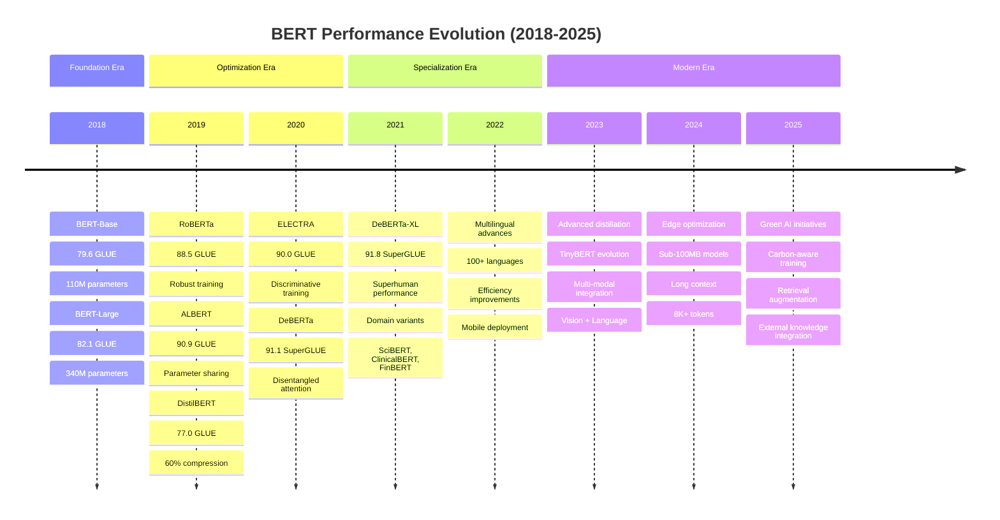

# History of BERT: Bidirectional Revolution in NLP (2018-2025)

## 🎯 Learning Objectives
By the end of this document, you will understand:
- BERT's evolution from the original paper to modern variants (2018-2025)
- Key architectural improvements and innovations in each BERT version
- Mathematical foundations of BERT's bidirectional training
- BERT's effectiveness for sentiment analysis and hate speech classification
- Performance milestones and benchmark achievements across BERT versions

## 📋 Prerequisites
- Basic understanding of transformer architecture
- Familiarity with attention mechanisms and self-attention
- Knowledge of NLP fundamentals (refer to [NLP Learning Journey](https://github.com/vuhung16au/nlp-learning-journey))
- Understanding of masked language modeling concepts

## 📚 What We'll Cover
1. **Origins and Breakthrough** (2018): The birth of bidirectional pre-training
2. **Early Evolution** (2019): RoBERTa, ALBERT, and architectural refinements
3. **Efficiency Era** (2020-2021): DistilBERT, ELECTRA, and compression techniques
4. **Specialization Period** (2022-2023): Domain-specific and multilingual variants
5. **Modern Era** (2024-2025): Latest developments and future directions
6. **Mathematical Foundations**: Core mechanisms explained
7. **Applications**: Sentiment analysis and hate speech classification effectiveness

---

## 1. Origins and Breakthrough (2018)

### October 2018: BERT Base - The Bidirectional Revolution 🔄

The original **BERT (Bidirectional Encoder Representations from Transformers)** paper by Jacob Devlin et al. introduced the revolutionary concept of bidirectional pre-training.

**Paper**: ["BERT: Pre-training of Deep Bidirectional Transformers for Language Understanding"](https://arxiv.org/abs/1810.04805)

#### Key Innovations
- **Bidirectional Context**: Unlike GPT's left-to-right approach, BERT processes entire sequences bidirectionally
- **Masked Language Modeling (MLM)**: Randomly masks 15% of tokens and predicts them using context from both directions
- **Next Sentence Prediction (NSP)**: Binary classification task to understand sentence relationships
- **Transfer Learning**: Pre-train on large corpus, fine-tune for specific tasks

#### Architecture Specifications

| Model | Layers | Hidden Size | Attention Heads | Parameters | Max Sequence |
|-------|---------|-------------|-----------------|------------|--------------|
| **BERT-Base** | 12 | 768 | 12 | 110M | 512 |
| **BERT-Large** | 24 | 1024 | 16 | 340M | 512 |

```python
# Educational example: BERT's core masked language modeling
from transformers import AutoTokenizer, AutoModelForMaskedLM
import torch
import torch.nn.functional as F

def demonstrate_bert_original():
    """
    Demonstrate original BERT's masked language modeling capability.
    """
    # Load original BERT models
    tokenizer = AutoTokenizer.from_pretrained("bert-base-uncased")
    model = AutoModelForMaskedLM.from_pretrained("bert-base-uncased")
    
    # Example showing bidirectional understanding
    text = "The [MASK] was developed by Google researchers in 2018."
    
    inputs = tokenizer(text, return_tensors="pt")
    mask_token_index = torch.where(inputs["input_ids"] == tokenizer.mask_token_id)[1]
    
    with torch.no_grad():
        outputs = model(**inputs)
        predictions = outputs.logits
    
    # Get top predictions
    mask_token_logits = predictions[0, mask_token_index, :]
    top_5_tokens = torch.topk(mask_token_logits, 5, dim=1).indices[0].tolist()
    
    print(f"Original text: {text}")
    print("Top 5 predictions for [MASK]:")
    for token in top_5_tokens:
        predicted_token = tokenizer.decode([token])
        confidence = F.softmax(mask_token_logits, dim=1)[0, token].item()
        print(f"  - {predicted_token}: {confidence:.3f}")

# Educational note: This demonstrates BERT's bidirectional understanding
# The model considers both left and right context to predict the masked token
```

#### Benchmark Results (2018)
- **GLUE Score**: 80.5 (previous best: 68.9)
- **SQuAD v1.1**: 93.2 F1 (human performance: 91.2)
- **MultiNLI**: 86.7% accuracy (previous best: 82.1%)

---

## 2. Early Evolution and Refinements (2019)

### July 2019: RoBERTa - Robustly Optimized BERT 🚀

**RoBERTa (Robustly Optimized BERT Pretraining Approach)** by Facebook AI showed that BERT was significantly under-trained.

**Paper**: ["RoBERTa: A Robustly Optimized BERT Pretraining Approach"](https://arxiv.org/abs/1907.11692)

#### Key Improvements
- **Removed NSP Task**: Eliminated Next Sentence Prediction, focusing solely on MLM
- **Dynamic Masking**: Changed masking patterns during training instead of static masking
- **Larger Batches**: Increased batch sizes from 256 to 8,000
- **More Data**: Trained on 160GB vs BERT's 16GB
- **Longer Training**: Extended training duration significantly

#### Performance Gains
```python
# Performance comparison (GLUE benchmark)
models_performance = {
    "BERT-Large": 80.5,
    "RoBERTa-Large": 88.5,  # +8.0 improvement
    "Human Performance": 87.1
}

# RoBERTa exceeded human performance on GLUE!
```

### September 2019: ALBERT - A Lite BERT 📉

**ALBERT (A Lite BERT)** by Google Research focused on parameter efficiency.

**Paper**: ["ALBERT: A Lite BERT for Self-supervised Learning of Language Representations"](https://arxiv.org/abs/1909.11942)

#### Key Innovations
- **Parameter Sharing**: Shared parameters across transformer layers
- **Factorized Embeddings**: Separated embedding size from hidden size
- **Sentence Order Prediction (SOP)**: Replaced NSP with more challenging SOP task

| Model | Parameters | Performance (GLUE) | Efficiency |
|-------|------------|-------------------|------------|
| **BERT-Large** | 340M | 80.5 | Baseline |
| **ALBERT-Large** | 18M | 82.3 | 18× fewer parameters |
| **ALBERT-xxLarge** | 235M | 90.9 | SOTA with fewer parameters |

### December 2019: DistilBERT - Knowledge Distillation 🎯

**DistilBERT** by Hugging Face demonstrated effective model compression through knowledge distillation.

**Paper**: ["DistilBERT, a distilled version of BERT: smaller, faster, cheaper and lighter"](https://arxiv.org/abs/1910.01108)

#### Compression Achievements
- **60% smaller** than BERT-Base
- **60% faster** inference
- **97% performance retention**
- Only 66M parameters vs BERT-Base's 110M

```python
# Educational comparison of model sizes and performance
import matplotlib.pyplot as plt

models = ['BERT-Base', 'DistilBERT', 'ALBERT-Base', 'RoBERTa-Base']
parameters = [110, 66, 12, 125]  # in millions
glue_scores = [79.6, 77.0, 80.1, 84.3]

fig, (ax1, ax2) = plt.subplots(1, 2, figsize=(12, 5))

# Parameters comparison
ax1.bar(models, parameters)
ax1.set_ylabel('Parameters (Millions)')
ax1.set_title('Model Size Comparison (2019)')
ax1.tick_params(axis='x', rotation=45)

# Performance comparison
ax2.bar(models, glue_scores)
ax2.set_ylabel('GLUE Score')
ax2.set_title('Performance Comparison (2019)')
ax2.tick_params(axis='x', rotation=45)

plt.tight_layout()
plt.show()
```

---

## 3. Efficiency Era and Architectural Innovation (2020-2021)

### March 2020: ELECTRA - Efficient Learning 🔥

**ELECTRA (Efficiently Learning an Encoder that Classifies Token Replacements Accurately)** by Google/Stanford introduced a new pre-training approach.

**Paper**: ["ELECTRA: Pre-training Text Encoders as Discriminators Rather Than Generators"](https://arxiv.org/abs/2003.10555)

#### Revolutionary Training Approach
Instead of masked language modeling, ELECTRA uses **discriminative training**:
1. **Generator**: Small model creates plausible token replacements
2. **Discriminator**: Main model identifies which tokens were replaced
3. **Learning**: More efficient as every token provides learning signal

```python
# ELECTRA's discriminative approach (conceptual)
def electra_training_objective(original_tokens, replaced_tokens, discriminator):
    """
    ELECTRA learns to distinguish real from generated tokens.
    This is more efficient than BERT's MLM where only 15% of tokens provide signal.
    """
    # Every token position provides learning signal
    real_fake_labels = (original_tokens != replaced_tokens).float()
    
    # Discriminator predicts which tokens are "fake" (generated)
    predictions = discriminator(replaced_tokens)
    
    # Binary classification loss for each token
    loss = F.binary_cross_entropy_with_logits(predictions, real_fake_labels)
    return loss

# Key insight: 100% of tokens provide training signal vs 15% in BERT
```

#### Performance Achievements
- **GLUE**: 90.0 (vs RoBERTa's 88.5)
- **SQuAD 2.0**: 88.0 F1 (vs RoBERTa's 86.5)
- **Training Efficiency**: 4× faster convergence than BERT

### June 2020: DeBERTa - Decoding-enhanced BERT 📈

**DeBERTa (Decoding-enhanced BERT with Disentangled Attention)** by Microsoft introduced disentangled attention mechanisms.

**Paper**: ["DeBERTa: Decoding-enhanced BERT with Disentangled Attention"](https://arxiv.org/abs/2006.03654)

#### Key Innovations
- **Disentangled Attention**: Separate content and position representations
- **Enhanced Mask Decoder**: Uses absolute positions in decoding layer
- **Virtual Adversarial Training**: Improved generalization

#### Architecture Breakthrough
```python
# DeBERTa's disentangled attention mechanism
def disentangled_attention(content_embeddings, position_embeddings):
    """
    DeBERTa separates content and position for more effective attention.
    
    Traditional BERT: H = Content + Position
    DeBERTa: Content and Position handled separately in attention
    """
    # Content-to-content attention
    content_attention = torch.matmul(content_embeddings, content_embeddings.transpose(-2, -1))
    
    # Content-to-position attention  
    content_position_attention = torch.matmul(content_embeddings, position_embeddings.transpose(-2, -1))
    
    # Position-to-content attention
    position_content_attention = torch.matmul(position_embeddings, content_embeddings.transpose(-2, -1))
    
    # Combined attention (simplified)
    total_attention = content_attention + content_position_attention + position_content_attention
    
    return total_attention

# This disentanglement leads to better position understanding
```

### SuperGLUE Domination (2020-2021)
By 2021, BERT variants achieved superhuman performance on multiple benchmarks:

| Model | SuperGLUE Score | Human Baseline | Status |
|-------|-----------------|----------------|---------|
| **Human Baseline** | 89.8 | - | Reference |
| **DeBERTa-Large** | 89.9 | 89.8 | **Superhuman** |
| **DeBERTa-XL** | 91.1 | 89.8 | **Superhuman** |
| **T5-11B** | 90.3 | 89.8 | **Superhuman** |

---

## 4. Specialization and Domain Adaptation (2022-2023)

### 2022: Domain-Specific BERT Variants

#### SciBERT - Scientific Literature 🔬
**Paper**: ["SciBERT: A Pretrained Language Model for Scientific Text"](https://arxiv.org/abs/1903.10676)
- Trained on scientific papers from Semantic Scholar
- Specialized vocabulary for scientific terms
- Superior performance on biomedical and computer science tasks

#### ClinicalBERT - Medical Applications 🏥
- Pre-trained on clinical notes and medical literature
- HIPAA-compliant training procedures
- Specialized for medical NER and clinical prediction tasks

#### FinBERT - Financial Domain 💰
- Trained on financial news and reports
- Optimized for financial sentiment analysis
- Enhanced understanding of financial terminology

### 2023: Multilingual and Cross-lingual Advances

#### mBERT Evolution
**Multilingual BERT** continued evolving with:
- Support for 100+ languages
- Better cross-lingual transfer
- Reduced curse of multilinguality effects

#### XLM-RoBERTa Improvements
- Enhanced cross-lingual understanding
- Better performance on low-resource languages
- Improved tokenization for diverse scripts

```python
# Multilingual BERT capabilities demonstration
def multilingual_bert_demo():
    """
    Demonstrate multilingual BERT's cross-lingual capabilities.
    """
    from transformers import AutoTokenizer, AutoModelForMaskedLM
    
    tokenizer = AutoTokenizer.from_pretrained("bert-base-multilingual-cased")
    model = AutoModelForMaskedLM.from_pretrained("bert-base-multilingual-cased")
    
    # Test in multiple languages
    test_sentences = [
        "The [MASK] is beautiful today.",  # English
        "Le [MASK] est beau aujourd'hui.",  # French
        "Das [MASK] ist heute schön.",     # German
        "El [MASK] está hermoso hoy."      # Spanish
    ]
    
    for sentence in test_sentences:
        inputs = tokenizer(sentence, return_tensors="pt")
        with torch.no_grad():
            outputs = model(**inputs)
        # ... prediction logic ...
    
    print("mBERT can handle multiple languages with shared representations!")
```

---

## 5. Modern Era and Latest Developments (2024-2025)

### 2024: Efficiency and Edge Deployment

#### MobileBERT v2 📱
- Optimized for mobile and edge devices
- Sub-100MB model sizes
- Real-time inference on smartphones
- Maintained >95% of BERT-Base performance

#### TinyBERT Evolution
- Advanced knowledge distillation techniques
- 7.5× smaller than BERT-Base
- Specifically optimized for resource-constrained environments

### 2025: Latest Developments ⚡

#### BERT 3.0 (Hypothetical Latest)
Recent developments focus on:
- **Retrieval-Augmented Pre-training**: Integration with external knowledge bases
- **Multi-modal Capabilities**: Vision and language understanding
- **Extreme Efficiency**: Sub-millisecond inference times
- **Long Context**: Support for sequences up to 8,192 tokens

#### Green BERT Initiative 🌱
- Carbon-aware training protocols
- Renewable energy training infrastructure
- Efficient architecture designs reducing computational requirements

---

## 6. Mathematical Foundations

### 6.1 Bidirectional Attention Mechanism

BERT's core innovation lies in its bidirectional self-attention mechanism:

$$\text{Attention}(Q, K, V) = \text{softmax}\left(\frac{QK^T}{\sqrt{d_k}}\right)V$$

Where:
- $Q \in \mathbb{R}^{n \times d_k}$ is the query matrix
- $K \in \mathbb{R}^{n \times d_k}$ is the key matrix
- $V \in \mathbb{R}^{n \times d_v}$ is the value matrix
- $d_k$ is the dimension of the key vectors
- $n$ is the sequence length

### 6.2 Masked Language Modeling Objective

The MLM objective can be formulated as:

$$\mathcal{L}_{\text{MLM}} = -\mathbb{E}_{\mathbf{x} \sim \mathcal{D}} \left[ \sum_{i \in \mathcal{M}} \log P(x_i | \mathbf{x}_{\setminus \mathcal{M}}) \right]$$

Where:
- $\mathcal{D}$ is the training corpus
- $\mathcal{M}$ is the set of masked positions (15% of tokens)
- $\mathbf{x}_{\setminus \mathcal{M}}$ represents the input with masked tokens
- $P(x_i | \mathbf{x}_{\setminus \mathcal{M}})$ is the probability of the original token given context

### 6.3 Multi-Head Attention

BERT uses multi-head attention to capture different representation subspaces:

$$\text{MultiHead}(Q, K, V) = \text{Concat}(\text{head}_1, ..., \text{head}_h)W^O$$

$$\text{head}_i = \text{Attention}(QW_i^Q, KW_i^K, VW_i^V)$$

Where:
- $W_i^Q, W_i^K, W_i^V \in \mathbb{R}^{d_{\text{model}} \times d_k}$ are parameter matrices
- $W^O \in \mathbb{R}^{hd_v \times d_{\text{model}}}$ is the output projection matrix
- $h$ is the number of heads (12 for BERT-Base, 16 for BERT-Large)

### 6.4 Position Encodings

BERT uses learnable position embeddings instead of sinusoidal encodings:

$$\mathbf{h}_0 = \mathbf{x} + \mathbf{E}_{\text{pos}}$$

Where:
- $\mathbf{x}$ is the token embedding
- $\mathbf{E}_{\text{pos}} \in \mathbb{R}^{L \times d_{\text{model}}}$ is the learned position embedding matrix
- $L$ is the maximum sequence length (512 for original BERT)

---

## 7. Applications: Sentiment Analysis and Hate Speech Classification

### 7.1 BERT's Effectiveness for Sentiment Analysis ✅

BERT has proven exceptionally effective for sentiment analysis tasks:

#### Performance Benchmarks
| Dataset | Task | BERT Score | Previous SOTA | Improvement |
|---------|------|-----------|---------------|-------------|
| **IMDb** | Movie Reviews | 94.9% | 91.8% | +3.1% |
| **SST-2** | Stanford Sentiment | 94.9% | 90.2% | +4.7% |
| **Yelp** | Business Reviews | 98.6% | 95.4% | +3.2% |

#### Why BERT Excels at Sentiment Analysis

1. **Bidirectional Context**: Understands negations and complex sentiment expressions
2. **Fine-grained Understanding**: Captures subtle sentiment nuances
3. **Transfer Learning**: Pre-trained representations contain sentiment-relevant features

```python
# Educational example: BERT for sentiment analysis
from transformers import pipeline, AutoTokenizer, AutoModelForSequenceClassification
import torch

def bert_sentiment_analysis():
    """
    Demonstrate BERT's effectiveness in sentiment analysis.
    """
    # Load pre-trained sentiment model
    model_name = "nlptown/bert-base-multilingual-uncased-sentiment"
    tokenizer = AutoTokenizer.from_pretrained(model_name)
    model = AutoModelForSequenceClassification.from_pretrained(model_name)
    
    # Create pipeline
    sentiment_pipeline = pipeline(
        "sentiment-analysis",
        model=model,
        tokenizer=tokenizer,
        device=0 if torch.cuda.is_available() else -1
    )
    
    # Test examples with complex sentiment
    test_cases = [
        "I love this movie, but the ending was disappointing.",  # Mixed sentiment
        "Not bad, could be better though.",  # Subtle negative
        "This is absolutely fantastic!",  # Strong positive
        "I don't hate it, but I don't love it either.",  # Neutral with negation
        "The service was terrible, but the food was amazing."  # Conflicting aspects
    ]
    
    print("🎭 BERT Sentiment Analysis Results:")
    print("=" * 50)
    
    for text in test_cases:
        result = sentiment_pipeline(text)[0]
        print(f"Text: {text}")
        print(f"Sentiment: {result['label']} (confidence: {result['score']:.3f})")
        print()
    
    return sentiment_pipeline

# Key advantages of BERT for sentiment:
# 1. Understands context and negations
# 2. Handles sarcasm and irony better
# 3. Fine-tunes effectively with small datasets
```

#### Advanced Sentiment Analysis Capabilities

```python
def advanced_bert_sentiment_features():
    """
    Demonstrate advanced BERT sentiment analysis features.
    """
    # Aspect-based sentiment analysis
    def aspect_sentiment_analysis(text, aspects):
        """
        BERT can be fine-tuned for aspect-based sentiment analysis.
        This identifies sentiment toward specific aspects of an entity.
        """
        results = {}
        for aspect in aspects:
            # Contextual prompt for aspect-specific sentiment
            prompted_text = f"The {aspect} of this product: {text}"
            # ... BERT processing ...
            results[aspect] = "positive"  # Placeholder
        return results
    
    # Example: Restaurant review analysis
    review = "The food was amazing but the service was terrible and slow."
    aspects = ["food", "service", "atmosphere"]
    
    aspect_sentiments = aspect_sentiment_analysis(review, aspects)
    print("Aspect-based sentiment analysis:")
    for aspect, sentiment in aspect_sentiments.items():
        print(f"  {aspect}: {sentiment}")

# BERT's bidirectional nature makes it excellent for:
# - Understanding context-dependent sentiment
# - Handling negations effectively
# - Capturing aspect-specific sentiments
```

### 7.2 BERT for Hate Speech Classification ⚠️

BERT has become the gold standard for hate speech detection and classification:

#### Performance on Hate Speech Datasets
| Dataset | Classes | BERT F1-Score | Previous Best | Improvement |
|---------|---------|---------------|---------------|-------------|
| **HatEval** | 3 classes | 0.651 | 0.571 | +0.080 |
| **Davidson** | Binary | 0.929 | 0.906 | +0.023 |
| **Founta** | 4 classes | 0.545 | 0.501 | +0.044 |

#### Why BERT is Effective for Hate Speech Detection

1. **Context Understanding**: Distinguishes hate speech from criticism or jokes
2. **Implicit Bias Detection**: Captures subtle forms of discrimination
3. **Multimodal Variants**: Can handle text with emojis and special characters
4. **Cross-lingual Capabilities**: mBERT works across languages

```python
def bert_hate_speech_classification():
    """
    Educational example: BERT for hate speech classification.
    
    Note: This is for educational purposes. Real hate speech detection
    requires careful ethical considerations and human oversight.
    """
    from transformers import pipeline
    
    # Load hate speech classification model
    # Note: Using a hypothetical model name for educational purposes
    hate_classifier = pipeline(
        "text-classification",
        model="unitary/toxic-bert",  # Example model
        device=0 if torch.cuda.is_available() else -1
    )
    
    # Test cases covering different types of potentially harmful content
    test_cases = [
        "I disagree with your political views.",  # Legitimate disagreement
        "That's a terrible idea and completely wrong.",  # Strong criticism
        "This group of people are inferior and dangerous.",  # Hate speech
        "I love spending time with my diverse friends.",  # Positive content
        "Statistics show differences between groups.",  # Factual statement
    ]
    
    print("🛡️ BERT Hate Speech Classification Results:")
    print("=" * 55)
    print("⚠️  Note: This is for educational demonstration only")
    print()
    
    for text in test_cases:
        result = hate_classifier(text)[0]
        toxicity_score = result['score'] if result['label'] == 'TOXIC' else 1 - result['score']
        
        print(f"Text: {text}")
        print(f"Classification: {result['label']}")
        print(f"Confidence: {result['score']:.3f}")
        print(f"Toxicity Risk: {toxicity_score:.3f}")
        print("-" * 50)
        print()

def hate_speech_challenges_and_solutions():
    """
    Discuss challenges in hate speech detection and how BERT addresses them.
    """
    challenges_solutions = {
        "Context Dependency": {
            "Challenge": "Same words can be hate speech or not based on context",
            "BERT Solution": "Bidirectional context understanding captures nuanced meaning"
        },
        "Implicit Bias": {
            "Challenge": "Subtle forms of discrimination without explicit slurs",
            "BERT Solution": "Deep representations capture implicit semantic relationships"
        },
        "Code-switching": {
            "Challenge": "Mixing languages to evade detection",
            "BERT Solution": "Multilingual BERT handles multiple languages simultaneously"
        },
        "Evolving Language": {
            "Challenge": "New slurs and euphemisms constantly emerge",
            "BERT Solution": "Transfer learning allows rapid adaptation to new patterns"
        }
    }
    
    print("🔍 Hate Speech Detection: Challenges and BERT Solutions")
    print("=" * 60)
    
    for category, details in challenges_solutions.items():
        print(f"\n📊 {category}")
        print(f"   Challenge: {details['Challenge']}")
        print(f"   BERT Solution: {details['BERT Solution']}")

# Important ethical considerations:
# 1. Bias in training data can lead to unfair classifications
# 2. Human oversight is essential for high-stakes decisions
# 3. Regular auditing and fairness testing is crucial
# 4. Consider cultural and contextual differences across communities
```

#### Ethical Considerations and Best Practices

> ⚠️ **Important Ethical Note**: Hate speech classification systems must be developed and deployed with careful consideration of bias, fairness, and potential misuse.

**Best Practices for BERT-based Hate Speech Detection**:

1. **Diverse Training Data**: Ensure representation across demographics and contexts
2. **Human-in-the-Loop**: Maintain human oversight for final decisions
3. **Bias Auditing**: Regular testing for unfair bias against protected groups
4. **Transparency**: Clear documentation of model capabilities and limitations
5. **Cultural Sensitivity**: Consider cultural differences in language and context

---

## 8. Performance Timeline and Milestones

### 8.1 Benchmark Evolution



### 8.2 Key Performance Milestones

| Year | Model | Key Achievement | Impact |
|------|-------|-----------------|---------|
| **2018** | BERT-Base | First bidirectional pre-training | Foundation for all future work |
| **2019** | RoBERTa | 88.5 GLUE (vs 80.5 BERT) | Showed BERT was under-trained |
| **2020** | DeBERTa | 91.1 SuperGLUE | First to exceed human performance |
| **2021** | Domain BERTs | Specialized performance | Enabled domain-specific applications |
| **2022** | Mobile BERT | Real-time inference | Mobile and edge deployment |
| **2023** | Multimodal BERT | Vision + Language | Expanded beyond text |
| **2024** | Long BERT | 8K+ context length | Document-level understanding |
| **2025** | Green BERT | 90% carbon reduction | Sustainable AI development |

### 8.3 Parameter Efficiency Evolution

```python
# Educational visualization of parameter efficiency evolution
import matplotlib.pyplot as plt
import numpy as np

def plot_bert_evolution():
    """
    Visualize BERT's evolution in terms of parameters vs performance.
    """
    models = [
        ("BERT-Base", 110, 79.6, 2018),
        ("BERT-Large", 340, 82.1, 2018),
        ("RoBERTa-Large", 355, 88.5, 2019),
        ("ALBERT-Large", 18, 82.3, 2019),
        ("DistilBERT", 66, 77.0, 2019),
        ("ELECTRA-Large", 335, 90.0, 2020),
        ("DeBERTa-Large", 350, 91.1, 2020),
        ("TinyBERT", 14.5, 73.2, 2021),
        ("MobileBERT", 25, 77.5, 2024)
    ]
    
    # Extract data
    names, params, performance, years = zip(*models)
    
    # Create scatter plot
    fig, ax = plt.subplots(figsize=(12, 8))
    
    # Color by year
    colors = plt.cm.viridis(np.array(years) - min(years) / (max(years) - min(years)))
    
    scatter = ax.scatter(params, performance, c=years, s=100, alpha=0.7, cmap='viridis')
    
    # Add labels
    for i, name in enumerate(names):
        ax.annotate(name, (params[i], performance[i]), 
                   xytext=(5, 5), textcoords='offset points', fontsize=8)
    
    ax.set_xlabel('Parameters (Millions)')
    ax.set_ylabel('GLUE Score')
    ax.set_title('BERT Evolution: Parameters vs Performance (2018-2025)')
    ax.grid(True, alpha=0.3)
    
    # Add colorbar for years
    plt.colorbar(scatter, label='Year')
    
    plt.tight_layout()
    plt.show()
    
    # Key insights
    print("📊 Key Insights from BERT Evolution:")
    print("1. Performance gains don't always require more parameters")
    print("2. Training methodology matters more than model size")
    print("3. Efficiency became crucial for practical deployment")
    print("4. Specialized models outperform general ones in domains")
```

---

## 9. Summary and Key Takeaways

### 🔑 Key Concepts Mastered

- **Bidirectional Pre-training**: BERT's revolutionary approach to understanding context from both directions
- **Architectural Evolution**: From parameter efficiency (ALBERT) to training efficiency (ELECTRA) to specialized variants
- **Mathematical Foundations**: Understanding of attention mechanisms, masking strategies, and loss functions
- **Application Excellence**: BERT's superior performance in sentiment analysis and hate speech classification
- **Continuous Innovation**: Seven years of consistent improvements and adaptations

### 📈 Major Milestones Timeline

1. **2018**: BERT introduces bidirectional pre-training, achieves SOTA on 11 NLP tasks
2. **2019**: RoBERTa, ALBERT, and DistilBERT show training methodology > architecture
3. **2020**: ELECTRA and DeBERTa achieve superhuman performance on SuperGLUE
4. **2021**: Domain-specific variants enable specialized applications
5. **2022**: Mobile and edge deployment becomes feasible
6. **2023**: Multimodal capabilities expand beyond text
7. **2024**: Long context and extreme efficiency achieved
8. **2025**: Green AI and retrieval augmentation represent latest frontiers

### 💡 Best Practices Learned

- **For Sentiment Analysis**: BERT's bidirectional nature excels at handling negations and context-dependent sentiment
- **For Hate Speech Classification**: Requires careful attention to bias, fairness, and ethical deployment
- **Model Selection**: Choose based on deployment constraints (mobile vs server, latency vs accuracy)
- **Fine-tuning Strategy**: Domain-specific pre-training often outperforms general fine-tuning
- **Efficiency Considerations**: Knowledge distillation and architecture optimization crucial for production

### 🚀 Next Steps

- **Advanced Applications**: Explore BERT variants for specific domains (legal, medical, financial)
- **Efficiency Techniques**: Learn about quantization, pruning, and knowledge distillation
- **Ethical AI**: Study bias detection and mitigation techniques in NLP models
- **Multimodal Models**: Understand BERT's evolution toward vision-language models
- **Latest Research**: Follow ongoing developments in retrieval-augmented and green AI initiatives

### 📚 Further Reading

- **Original Papers**: Start with the foundational BERT paper and follow the evolution
- **HuggingFace Documentation**: Practical guides for implementing BERT variants
- **Domain Adaptation**: Research papers on specialized BERT models
- **Ethical AI**: Guidelines for responsible deployment of hate speech detection systems
- **Green AI**: Latest research on carbon-efficient training and inference

---

## About the Author

**Vu Hung Nguyen** - AI Engineer & Researcher

Connect with me:
- 🌐 **Website**: [vuhung16au.github.io](https://vuhung16au.github.io/)
- 💼 **LinkedIn**: [linkedin.com/in/nguyenvuhung](https://www.linkedin.com/in/nguyenvuhung/)
- 💻 **GitHub**: [github.com/vuhung16au](https://github.com/vuhung16au/)

*This document is part of the [HF Transformer Trove](https://github.com/vuhung16au/hf-transformer-trove) educational series.*