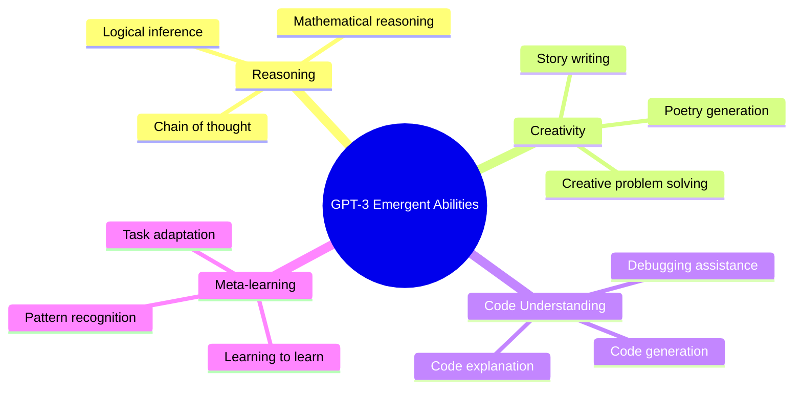
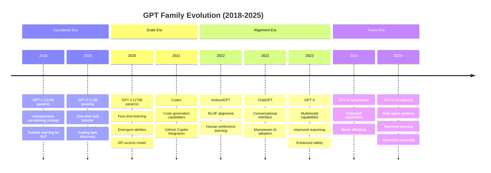
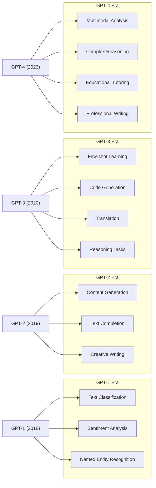

# History of GPT: From Language Modeling to General Intelligence (2018-2025)

## 🎯 Learning Objectives
By the end of this document, you will understand:
- The evolution of the GPT (Generative Pre-trained Transformer) family from GPT-1 to GPT-5
- Key architectural improvements and scaling patterns in each GPT version
- Mathematical foundations and innovations behind GPT models
- Major milestones and breakthroughs in language modeling
- The transition from language models to multimodal AI systems

## 📋 Prerequisites
- Basic understanding of transformer architecture (refer to [Transformer History](transformer-history.md))
- Familiarity with neural networks and attention mechanisms
- Knowledge of NLP fundamentals (refer to [NLP Learning Journey](https://github.com/vuhung16au/nlp-learning-journey))
- Understanding of key concepts from [Key Terms](key-terms.md)

## 📚 What We'll Cover
1. **The Foundation** (2018): GPT-1 and the birth of generative pre-training
2. **The Scale Revolution** (2019): GPT-2 and emergent capabilities
3. **The Few-Shot Era** (2020): GPT-3 and in-context learning
4. **The Alignment Era** (2022-2023): InstructGPT, ChatGPT, and GPT-4
5. **The Future** (2024-2025): GPT-5 and beyond

---

## 1. GPT-1: The Foundation (June 2018) 🚀

### Overview
**GPT-1** (Generative Pre-trained Transformer) introduced the revolutionary concept of **unsupervised pre-training followed by supervised fine-tuning** for NLP tasks.

### Key Innovations
- **Generative Pre-training**: Learning language representations through next-token prediction
- **Task-agnostic Architecture**: Single model adaptable to multiple downstream tasks
- **Transfer Learning**: Pre-trained knowledge transferred to specific tasks

### Architecture Details
- **Parameters**: 117 million
- **Layers**: 12 transformer decoder blocks
- **Hidden Size**: 768
- **Attention Heads**: 12
- **Context Length**: 512 tokens

### Mathematical Foundation
The core objective function combines unsupervised pre-training and supervised fine-tuning:

**Pre-training Objective:**
$$\mathcal{L}_1(\mathcal{U}) = \sum_i \log P(u_i | u_{i-k}, \ldots, u_{i-1}; \Theta)$$

Where:
- $\mathcal{U} = \{u_1, \ldots, u_n\}$ is the unsupervised corpus
- $k$ is the context window size
- $\Theta$ are the model parameters

**Fine-tuning Objective:**
$$\mathcal{L}_2(\mathcal{C}) = \sum_{(x,y)} \log P(y | x^1, \ldots, x^m)$$

**Combined Objective:**
$$\mathcal{L}_3(\mathcal{C}) = \mathcal{L}_2(\mathcal{C}) + \lambda \cdot \mathcal{L}_1(\mathcal{C})$$

### Code Example: GPT-1 Style Architecture
```python
import torch
import torch.nn as nn
from transformers import GPT2Config, GPT2LMHeadModel

def create_gpt1_style_model():
    """
    Create a GPT-1 style model using modern HuggingFace transformers.
    
    Note: This demonstrates the architectural concepts of GPT-1
    using current APIs for educational purposes.
    """
    # GPT-1 configuration
    config = GPT2Config(
        vocab_size=40478,  # BPE vocabulary size
        n_positions=512,   # Maximum sequence length
        n_embd=768,        # Hidden size
        n_layer=12,        # Number of layers
        n_head=12,         # Number of attention heads
        n_inner=3072,      # Feed-forward hidden size (4 * n_embd)
        activation_function="gelu",
        resid_pdrop=0.1,
        embd_pdrop=0.1,
        attn_pdrop=0.1,
    )
    
    # Create model
    model = GPT2LMHeadModel(config)
    
    print(f"GPT-1 Style Model Created:")
    print(f"Parameters: {model.num_parameters():,}")
    print(f"Architecture: {config.n_layer} layers, {config.n_head} heads")
    print(f"Context Length: {config.n_positions} tokens")
    
    return model, config

# Example usage
model, config = create_gpt1_style_model()
```

### Impact and Significance
> **Key Takeaway**: GPT-1 proved that unsupervised pre-training on large text corpora could learn general language representations useful for multiple downstream tasks.

---

## 2. GPT-2: The Scale Revolution (February 2019) 📈

### Overview
**GPT-2** demonstrated that **scaling up model size and training data** leads to significant improvements in language modeling and downstream task performance.

### Key Innovations
- **Scale**: 10x larger than GPT-1 (1.5B parameters in largest version)
- **Zero-shot Task Transfer**: Performing tasks without task-specific fine-tuning
- **Improved Training**: Better optimization and regularization techniques
- **Byte Pair Encoding (BPE)**: More efficient tokenization

### Architecture Scaling
| Model | Parameters | Layers | Hidden Size | Heads | Context |
|-------|------------|--------|-------------|-------|---------|
| GPT-2 Small | 117M | 12 | 768 | 12 | 1024 |
| GPT-2 Medium | 345M | 24 | 1024 | 16 | 1024 |
| GPT-2 Large | 762M | 36 | 1280 | 20 | 1024 |
| GPT-2 XL | 1.5B | 48 | 1600 | 25 | 1024 |

### Mathematical Improvements
**Improved Layer Normalization:**
GPT-2 moved layer normalization to the beginning of each sub-block:

$$\text{Output} = x + \text{SelfAttention}(\text{LayerNorm}(x))$$
$$\text{Output} = x + \text{MLP}(\text{LayerNorm}(x))$$

**Enhanced Attention Pattern:**
$$\text{Attention}(Q, K, V) = \text{softmax}\left(\frac{QK^T}{\sqrt{d_k}} + M\right)V$$

Where $M$ is the causal mask ensuring autoregressive generation.

### Code Example: GPT-2 Zero-Shot Capabilities
```python
from transformers import GPT2LMHeadModel, GPT2Tokenizer
import torch

def demonstrate_gpt2_zero_shot():
    """
    Demonstrate GPT-2's zero-shot capabilities on various tasks.
    """
    # Load pre-trained GPT-2
    tokenizer = GPT2Tokenizer.from_pretrained("gpt2")
    model = GPT2LMHeadModel.from_pretrained("gpt2")
    
    # Set pad token
    tokenizer.pad_token = tokenizer.eos_token
    
    # Zero-shot examples
    zero_shot_examples = [
        {
            "task": "Translation",
            "prompt": "English: Hello, how are you?\nFrench:",
            "description": "Translation without explicit training"
        },
        {
            "task": "Summarization", 
            "prompt": "Article: The quick brown fox jumps over the lazy dog. This sentence contains every letter of the alphabet.\nSummary:",
            "description": "Text summarization"
        },
        {
            "task": "Question Answering",
            "prompt": "Context: Paris is the capital of France.\nQuestion: What is the capital of France?\nAnswer:",
            "description": "Reading comprehension"
        }
    ]
    
    print("🔍 GPT-2 Zero-Shot Task Demonstration")
    print("=" * 50)
    
    for example in zero_shot_examples:
        print(f"\n📋 Task: {example['task']}")
        print(f"Description: {example['description']}")
        print(f"Prompt: {example['prompt']}")
        
        # Tokenize and generate
        inputs = tokenizer.encode(example['prompt'], return_tensors='pt')
        
        with torch.no_grad():
            outputs = model.generate(
                inputs,
                max_length=inputs.shape[1] + 20,
                num_return_sequences=1,
                temperature=0.7,
                do_sample=True,
                pad_token_id=tokenizer.eos_token_id
            )
        
        generated_text = tokenizer.decode(outputs[0], skip_special_tokens=True)
        completion = generated_text[len(example['prompt']):]
        
        print(f"Generated: {completion}")
        print("-" * 30)

# Example usage
# demonstrate_gpt2_zero_shot()
```

### Breakthrough Insights
> **Scaling Laws Discovery**: Larger models consistently showed better performance across tasks, suggesting predictable scaling relationships.

---

## 3. GPT-3: The Few-Shot Learning Revolution (May 2020) 🎯

### Overview
**GPT-3** introduced **few-shot learning** and demonstrated that sufficiently large language models could perform tasks with just a few examples in the prompt, without parameter updates.

### Key Innovations
- **Massive Scale**: 175 billion parameters (100x larger than GPT-2)
- **In-Context Learning**: Learning from examples within the input context
- **Few-Shot, One-Shot, and Zero-Shot**: Different learning paradigms
- **Emergent Abilities**: Capabilities not explicitly trained for

### Architecture Details
- **Parameters**: 175 billion
- **Layers**: 96 transformer decoder blocks  
- **Hidden Size**: 12,288
- **Attention Heads**: 96
- **Context Length**: 2,048 tokens (later extended to 4,096)
- **Training Data**: ~45TB of text from Common Crawl, WebText, Books, Wikipedia

### Mathematical Scaling Laws
GPT-3 validated the scaling laws discovered with GPT-2:

**Performance Scaling:**
$$\text{Loss} \propto N^{-\alpha}$$

Where:
- $N$ is the number of parameters
- $\alpha \approx 0.076$ for language modeling

**Compute Scaling:**
$$\text{Loss} \propto C^{-\beta}$$

Where:
- $C$ is the compute budget (FLOP)
- $\beta \approx 0.050$

### Few-Shot Learning Mathematics
The few-shot learning paradigm can be formalized as:

$$P(y|x, \text{context}) = \frac{\exp(f_\theta(x, y, \text{context}))}{\sum_{y'} \exp(f_\theta(x, y', \text{context}))}$$

Where:
- $\text{context}$ contains example input-output pairs
- $f_\theta$ is the transformer model with parameters $\theta$

### Code Example: GPT-3 Style Few-Shot Learning
```python
def demonstrate_few_shot_learning():
    """
    Demonstrate few-shot learning patterns using GPT-3 style prompting.
    
    Note: This example shows the prompting technique. 
    For actual GPT-3, you'd use OpenAI's API.
    """
    
    # Few-shot learning examples
    few_shot_examples = {
        "sentiment_analysis": {
            "prompt": """Classify the sentiment of the following texts as positive, negative, or neutral.

Text: I love this movie! It's fantastic.
Sentiment: positive

Text: This book is terrible and boring.
Sentiment: negative

Text: The weather is okay today.
Sentiment: neutral

Text: This restaurant has amazing food and great service!
Sentiment:""",
            "expected": "positive"
        },
        
        "arithmetic": {
            "prompt": """Solve the following arithmetic problems.

Q: What is 15 + 27?
A: 42

Q: What is 8 × 9?
A: 72

Q: What is 56 ÷ 7?
A: 8

Q: What is 23 + 19?
A:""",
            "expected": "42"
        },
        
        "code_generation": {
            "prompt": """Generate Python functions based on the description.

Description: Function to calculate the area of a circle
Code:
def circle_area(radius):
    return 3.14159 * radius ** 2

Description: Function to check if a number is even
Code:
def is_even(number):
    return number % 2 == 0

Description: Function to reverse a string
Code:""",
            "expected": "def reverse_string(s):\n    return s[::-1]"
        }
    }
    
    print("🎯 Few-Shot Learning Demonstration")
    print("=" * 50)
    
    for task_name, example in few_shot_examples.items():
        print(f"\n📝 Task: {task_name.replace('_', ' ').title()}")
        print("Prompt structure:")
        print(example["prompt"])
        print(f"\nExpected pattern: {example['expected']}")
        print("-" * 40)

# Learning paradigms comparison
def compare_learning_paradigms():
    """
    Compare different learning paradigms introduced with GPT-3.
    """
    paradigms = {
        "Zero-shot": {
            "description": "Task performed without any examples",
            "example": "Translate 'Hello' to French:",
            "advantage": "No examples needed",
            "limitation": "Lower performance on complex tasks"
        },
        "One-shot": {
            "description": "Task performed with one example", 
            "example": "English: Hello\nFrench: Bonjour\nEnglish: Goodbye\nFrench:",
            "advantage": "Quick adaptation with minimal context",
            "limitation": "May not capture task complexity"
        },
        "Few-shot": {
            "description": "Task performed with multiple examples",
            "example": "Multiple translation pairs provided before new input",
            "advantage": "Better performance, captures task patterns",
            "limitation": "Uses more context window"
        }
    }
    
    print("🔄 Learning Paradigms Comparison")
    print("=" * 50)
    
    for paradigm, details in paradigms.items():
        print(f"\n{paradigm} Learning:")
        print(f"  Description: {details['description']}")
        print(f"  Example: {details['example']}")
        print(f"  ✅ Advantage: {details['advantage']}")
        print(f"  ⚠️  Limitation: {details['limitation']}")

# Example usage
# demonstrate_few_shot_learning()
# compare_learning_paradigms()
```

### Emergent Abilities
GPT-3 exhibited several emergent abilities not explicitly trained:



### Impact and Significance
> **Key Takeaway**: GPT-3 demonstrated that scale can lead to qualitatively different capabilities, introducing the era of large language models (LLMs).

---

## 4. The Alignment Era: InstructGPT, ChatGPT, and GPT-4 (2022-2023) 🤖

### InstructGPT (January 2022) 📝

#### Overview
**InstructGPT** introduced **Reinforcement Learning from Human Feedback (RLHF)** to align model behavior with human preferences and instructions.

#### Key Innovations
- **RLHF Training**: Using human feedback to improve model alignment
- **Instruction Following**: Better adherence to user instructions
- **Safety Improvements**: Reduced harmful and biased outputs
- **Helpfulness**: More useful and relevant responses

#### RLHF Mathematical Framework
The RLHF process involves three stages:

**1. Supervised Fine-Tuning (SFT):**
$$\mathcal{L}_{\text{SFT}} = -\mathbb{E}_{(x,y) \sim \mathcal{D}_{\text{SFT}}} [\log \pi_{\text{SFT}}(y|x)]$$

**2. Reward Model Training:**
$$\mathcal{L}_{\text{RM}} = -\mathbb{E}_{(x,y_w,y_l) \sim \mathcal{D}_{\text{RM}}} [\log(\sigma(r_\phi(x,y_w) - r_\phi(x,y_l)))]$$

Where $y_w$ is preferred output and $y_l$ is less preferred output.

**3. Reinforcement Learning with PPO:**
$$\mathcal{L}_{\text{RL}} = \mathbb{E}_{x \sim \mathcal{D}, y \sim \pi_{\text{RL}}} [r_\phi(x,y)] - \beta \cdot KL[\pi_{\text{RL}}, \pi_{\text{SFT}}]$$

#### Code Example: RLHF Concept Implementation
```python
import torch
import torch.nn as nn
from transformers import AutoTokenizer, AutoModelForCausalLM

def demonstrate_rlhf_concept():
    """
    Educational demonstration of RLHF training stages.
    
    Note: This is a simplified conceptual implementation.
    Real RLHF requires complex infrastructure and human feedback collection.
    """
    
    print("🔄 RLHF Training Process Demonstration")
    print("=" * 50)
    
    # Stage 1: Supervised Fine-Tuning (SFT)
    print("\n1️⃣ Stage 1: Supervised Fine-Tuning")
    print("Goal: Train model on high-quality human demonstrations")
    
    sft_examples = [
        {
            "input": "Explain quantum computing",
            "output": "Quantum computing uses quantum mechanical phenomena like superposition and entanglement to process information..."
        },
        {
            "input": "Write a professional email",
            "output": "Subject: [Clear, specific subject line]\n\nDear [Name],\n\nI hope this email finds you well..."
        }
    ]
    
    print("Training data examples:")
    for i, example in enumerate(sft_examples, 1):
        print(f"  Example {i}:")
        print(f"    Input: {example['input']}")
        print(f"    Expected Output: {example['output'][:50]}...")
    
    # Stage 2: Reward Model Training  
    print("\n2️⃣ Stage 2: Reward Model Training")
    print("Goal: Train model to predict human preferences")
    
    preference_data = [
        {
            "prompt": "Explain photosynthesis",
            "response_A": "Photosynthesis is when plants make food from sunlight using chlorophyll...",
            "response_B": "Plants do photosynthesis stuff with light and make oxygen or something...",
            "human_preference": "A",
            "reason": "More accurate, detailed, and educational"
        }
    ]
    
    print("Preference comparison example:")
    for example in preference_data:
        print(f"  Prompt: {example['prompt']}")
        print(f"  Response A: {example['response_A'][:50]}...")
        print(f"  Response B: {example['response_B'][:50]}...")
        print(f"  Human Preference: Response {example['human_preference']}")
        print(f"  Reason: {example['reason']}")
    
    # Stage 3: Reinforcement Learning
    print("\n3️⃣ Stage 3: Reinforcement Learning with PPO")
    print("Goal: Optimize model using reward model feedback")
    
    rl_process = {
        "steps": [
            "Generate response to prompt",
            "Score response with reward model", 
            "Calculate policy gradient",
            "Update model parameters",
            "Repeat with KL penalty to prevent drift"
        ]
    }
    
    print("RL optimization steps:")
    for i, step in enumerate(rl_process["steps"], 1):
        print(f"  {i}. {step}")

# demonstrate_rlhf_concept()
```

### ChatGPT (November 2022) 💬

#### Overview
**ChatGPT** brought conversational AI to the mainstream, combining GPT-3.5 with RLHF for natural dialogue capabilities.

#### Key Features
- **Conversational Interface**: Multi-turn dialogue capabilities
- **Context Awareness**: Maintaining conversation context
- **Safety Measures**: Built-in content filtering and safety guidelines
- **Accessibility**: User-friendly web interface

#### Architecture Improvements
- **Enhanced Context Handling**: Better management of conversation history
- **Response Consistency**: More coherent multi-turn conversations  
- **Safety Filtering**: Multiple layers of content moderation

### GPT-4 (March 2023) 🖼️

#### Overview  
**GPT-4** introduced **multimodal capabilities**, processing both text and images while significantly improving reasoning and reliability.

#### Key Innovations
- **Multimodal Input**: Processing text and images together
- **Improved Reasoning**: Better performance on complex reasoning tasks
- **Enhanced Safety**: More robust safety measures and alignment
- **Extended Context**: Longer context windows (8K and 32K versions)

#### Architecture Scaling
| Capability | GPT-3.5 | GPT-4 |
|------------|---------|-------|
| Parameters | ~175B | ~1.8T (estimated) |
| Context Length | 4K | 8K/32K |
| Modalities | Text | Text + Images |
| Training Compute | ~3,000 PF-days | ~25,000 PF-days |

#### Multimodal Architecture
```python
def demonstrate_multimodal_concept():
    """
    Conceptual demonstration of multimodal processing in GPT-4.
    
    Note: This shows the conceptual approach. Actual GPT-4 implementation
    is more complex and proprietary.
    """
    
    print("🖼️ Multimodal Processing Concept")
    print("=" * 40)
    
    # Conceptual multimodal input processing
    multimodal_examples = [
        {
            "type": "Image + Text",
            "input": "Image: [photo of a chart] + Text: 'Explain this chart'",
            "processing": "Vision encoder → Text tokens → Unified transformer",
            "output": "Detailed explanation of chart contents and trends"
        },
        {
            "type": "Document Analysis", 
            "input": "Image: [screenshot of document] + Text: 'Summarize key points'",
            "processing": "OCR + Layout understanding → Text generation",
            "output": "Structured summary of document contents"
        }
    ]
    
    for example in multimodal_examples:
        print(f"\n📝 {example['type']}:")
        print(f"  Input: {example['input']}")
        print(f"  Processing: {example['processing']}")
        print(f"  Output: {example['output']}")

# demonstrate_multimodal_concept()
```

#### Mathematical Improvements in GPT-4

**Enhanced Attention Mechanism:**
GPT-4 likely uses improved attention patterns for handling longer sequences:

$$\text{Attention}_{i,j} = \begin{cases} 
\text{Full attention} & \text{if } |i-j| \leq w \\
\text{Sparse attention} & \text{if } |i-j| > w
\end{cases}$$

**Multimodal Fusion:**
$$h_{\text{fused}} = \text{Transformer}(\text{Concat}(h_{\text{text}}, h_{\text{vision}}))$$

Where $h_{\text{text}}$ and $h_{\text{vision}}$ are text and vision embeddings respectively.

---

## 5. GPT-5: The Future of AI (2024-2025+) 🚀

### Expected Developments
While GPT-5 details are not yet fully public (as of September 2025), we can anticipate several key improvements based on OpenAI's research direction:

#### Predicted Innovations
- **Multi-Agent Systems**: Coordinated AI agents working together
- **Enhanced Reasoning**: Improved logical and mathematical reasoning
- **Real-time Learning**: Ability to update knowledge from interactions
- **Extended Multimodality**: Video, audio, and real-time processing
- **Improved Efficiency**: Better performance per parameter

#### Architectural Predictions
```python
def gpt5_architectural_predictions():
    """
    Educational speculation about GPT-5 architectural improvements
    based on current research trends.
    """
    
    predicted_features = {
        "Scale": {
            "parameters": "10-100 trillion parameters",
            "context_length": "1M+ tokens",
            "modalities": "Text, Images, Video, Audio, Code"
        },
        "Reasoning": {
            "chain_of_thought": "Built-in reasoning processes",
            "tool_use": "Native integration with external tools",
            "multi_step": "Complex multi-step problem solving"
        },
        "Efficiency": {
            "sparse_models": "Mixture of Experts (MoE) scaling",
            "dynamic_compute": "Adaptive computation per task",
            "memory_efficiency": "Improved long-term memory systems"
        },
        "Safety": {
            "constitutional_ai": "Built-in ethical reasoning",
            "interpretability": "Better explanation of decisions", 
            "robustness": "Improved handling of edge cases"
        }
    }
    
    print("🔮 GPT-5 Architectural Predictions")
    print("=" * 50)
    
    for category, features in predicted_features.items():
        print(f"\n🎯 {category}:")
        for feature, description in features.items():
            print(f"  • {feature.replace('_', ' ').title()}: {description}")

# gpt5_architectural_predictions()
```

#### Mathematical Advances Expected in GPT-5

**1. Mixture of Experts (MoE) Scaling:**
$$y = \sum_{i=1}^{n} G(x)_i \cdot E_i(x)$$

Where:
- $G(x)$ is the gating function selecting experts
- $E_i(x)$ are individual expert networks
- Only a subset of experts are activated per input

**2. Retrieval-Augmented Generation (RAG):**
$$P(y|x) = \sum_{d \in D} P(d|x) \cdot P(y|x,d)$$

Where:
- $D$ is the knowledge base
- $P(d|x)$ is the probability of retrieving document $d$
- $P(y|x,d)$ is the probability of generating $y$ given context $d$

**3. Constitutional AI Framework:**
$$\mathcal{L}_{\text{Constitutional}} = \mathcal{L}_{\text{Base}} + \lambda_1 \mathcal{L}_{\text{Helpful}} + \lambda_2 \mathcal{L}_{\text{Harmless}} + \lambda_3 \mathcal{L}_{\text{Honest}}$$

---

## 6. Timeline and Milestones 📊

### GPT Evolution Timeline



### Key Scaling Metrics

| Model | Year | Parameters | Context | Training Data | Key Innovation |
|-------|------|------------|---------|---------------|----------------|
| GPT-1 | 2018 | 117M | 512 | BooksCorpus | Generative pre-training |
| GPT-2 | 2019 | 1.5B | 1024 | WebText | Zero-shot transfer |
| GPT-3 | 2020 | 175B | 2048 | ~45TB text | Few-shot learning |
| InstructGPT | 2022 | ~175B | 2048 | Human feedback | RLHF alignment |
| ChatGPT | 2022 | ~175B | 4096 | Conversation data | Dialogue interface |
| GPT-4 | 2023 | ~1.8T | 8K/32K | Text + Images | Multimodal reasoning |
| GPT-5 | 2025+ | 10T+? | 1M+? | Multimodal | Real-time learning? |

### Performance Improvements Across Versions

```python
def visualize_gpt_improvements():
    """
    Demonstrate the performance improvements across GPT versions
    on various benchmarks and capabilities.
    """
    
    performance_metrics = {
        "Language Modeling": {
            "GPT-1": 65,
            "GPT-2": 75, 
            "GPT-3": 85,
            "GPT-4": 92
        },
        "Reasoning Tasks": {
            "GPT-1": 30,
            "GPT-2": 45,
            "GPT-3": 65,
            "GPT-4": 85
        },
        "Code Generation": {
            "GPT-1": 20,
            "GPT-2": 35,
            "GPT-3": 70,
            "GPT-4": 88
        },
        "Safety/Alignment": {
            "GPT-1": 40,
            "GPT-2": 45,
            "GPT-3": 50,
            "GPT-4": 80
        }
    }
    
    print("📈 GPT Performance Evolution")
    print("=" * 50)
    
    for capability, scores in performance_metrics.items():
        print(f"\n🎯 {capability}:")
        for model, score in scores.items():
            bar = "█" * (score // 5)  # Visual bar representation
            print(f"  {model:8}: {bar} {score}%")

# visualize_gpt_improvements()
```

---

## 7. Key Mathematical Concepts Across GPT Versions 🧮

### Self-Attention Evolution

**Original Transformer Attention (GPT-1):**
$$\text{Attention}(Q, K, V) = \text{softmax}\left(\frac{QK^T}{\sqrt{d_k}}\right)V$$

**Causal Attention (GPT-2+):**
$$\text{Attention}(Q, K, V) = \text{softmax}\left(\frac{QK^T}{\sqrt{d_k}} + M\right)V$$

Where $M$ is the causal mask ensuring autoregressive property.

**Multi-Head Attention (All GPT models):**
$$\text{MultiHead}(Q, K, V) = \text{Concat}(\text{head}_1, ..., \text{head}_h)W^O$$

Where:
$$\text{head}_i = \text{Attention}(QW_i^Q, KW_i^K, VW_i^V)$$

### Position Encoding Evolution

**Learned Positional Embeddings (GPT-1, GPT-2):**
$$h_0 = E_{\text{token}} + E_{\text{position}}$$

**Rotary Position Encoding (Modern variants):**
$$\text{RoPE}(x, m) = x \odot \cos(m\theta) + \text{rotate}(x) \odot \sin(m\theta)$$

### Scaling Law Mathematics

**Parameter Scaling (Kaplan et al.):**
$$L(N) = (N_c/N)^{\alpha_N}$$

Where:
- $L(N)$ is the loss as a function of parameters $N$
- $N_c$ is a constant
- $\alpha_N \approx 0.076$

**Compute Scaling:**
$$L(C) = (C_c/C)^{\alpha_C}$$

Where:
- $C$ is compute budget (PetaFLOP-days)
- $\alpha_C \approx 0.050$

**Data Scaling:**
$$L(D) = (D_c/D)^{\alpha_D}$$

Where:
- $D$ is dataset size (tokens)
- $\alpha_D \approx 0.095$

### Code Example: Mathematical Concepts Implementation
```python
import torch
import torch.nn as nn
import math

class GPTAttentionMechanism(nn.Module):
    """
    Educational implementation of GPT attention mechanism
    showing the evolution from GPT-1 to modern variants.
    """
    
    def __init__(self, d_model, n_heads, max_seq_len=1024):
        super().__init__()
        self.d_model = d_model
        self.n_heads = n_heads
        self.d_k = d_model // n_heads
        
        # Linear projections for Q, K, V
        self.w_q = nn.Linear(d_model, d_model)
        self.w_k = nn.Linear(d_model, d_model)
        self.w_v = nn.Linear(d_model, d_model)
        self.w_o = nn.Linear(d_model, d_model)
        
        # Causal mask for autoregressive generation
        self.register_buffer(
            'causal_mask',
            torch.tril(torch.ones(max_seq_len, max_seq_len)).view(1, 1, max_seq_len, max_seq_len)
        )
        
    def forward(self, x):
        batch_size, seq_len, d_model = x.shape
        
        # Multi-head projections
        Q = self.w_q(x).view(batch_size, seq_len, self.n_heads, self.d_k).transpose(1, 2)
        K = self.w_k(x).view(batch_size, seq_len, self.n_heads, self.d_k).transpose(1, 2)
        V = self.w_v(x).view(batch_size, seq_len, self.n_heads, self.d_k).transpose(1, 2)
        
        # Scaled dot-product attention with causal masking
        scores = torch.matmul(Q, K.transpose(-2, -1)) / math.sqrt(self.d_k)
        
        # Apply causal mask
        mask = self.causal_mask[:, :, :seq_len, :seq_len]
        scores = scores.masked_fill(mask == 0, -1e9)
        
        # Softmax attention weights
        attention_weights = torch.softmax(scores, dim=-1)
        
        # Apply attention to values
        attention_output = torch.matmul(attention_weights, V)
        
        # Concatenate heads and apply output projection
        attention_output = attention_output.transpose(1, 2).contiguous().view(
            batch_size, seq_len, d_model
        )
        
        return self.w_o(attention_output)

def demonstrate_scaling_laws():
    """
    Demonstrate the mathematical relationship between model scale and performance.
    """
    import numpy as np
    
    # Scaling law parameters (approximate)
    alpha_N = 0.076  # Parameter scaling exponent
    alpha_C = 0.050  # Compute scaling exponent
    alpha_D = 0.095  # Data scaling exponent
    
    # Model parameters (in millions)
    models = {
        'GPT-1': 117,
        'GPT-2': 1500,
        'GPT-3': 175000,
        'GPT-4': 1800000  # Estimated
    }
    
    print("📊 GPT Scaling Laws Demonstration")
    print("=" * 50)
    
    # Calculate relative performance based on parameter scaling
    gpt1_params = models['GPT-1']
    
    for model, params in models.items():
        # Relative improvement based on parameter scaling law
        improvement = (params / gpt1_params) ** alpha_N
        
        print(f"{model:8}: {params:>8,}M params, {improvement:.2f}x performance improvement")
    
    return models

# Example usage
# attention_layer = GPTAttentionMechanism(d_model=768, n_heads=12)
# scaling_demo = demonstrate_scaling_laws()
```

---

## 8. Impact and Applications 🌟

### Transformative Applications Across GPT Versions



### Real-World Impact Metrics

| Capability | GPT-1 | GPT-2 | GPT-3 | GPT-4 |
|------------|-------|-------|-------|-------|
| **Academic Performance** | | | | |
| SAT Math | N/A | N/A | 590 | 700 |
| SAT Verbal | N/A | N/A | 650 | 730 |
| AP Exams (avg) | N/A | N/A | 3.2 | 4.2 |
| **Professional Tasks** | | | | |
| Code Completion | Basic | Good | Excellent | Expert |
| Creative Writing | Limited | Good | Excellent | Professional |
| Technical Writing | Basic | Fair | Good | Excellent |
| **Reasoning** | | | | |
| Math Problems | Weak | Weak | Fair | Good |
| Logic Puzzles | Weak | Fair | Good | Excellent |
| Multi-step Reasoning | Weak | Weak | Fair | Good |

---

## 9. Future Directions and Research Frontiers 🔬

### Emerging Research Areas

#### 1. Constitutional AI and Safety
```python
def constitutional_ai_concept():
    """
    Demonstrate the concept of Constitutional AI for safer AI systems.
    """
    
    constitutional_principles = [
        "Be helpful and harmless",
        "Respect human autonomy",
        "Be honest about limitations",
        "Protect privacy and confidentiality",
        "Avoid harmful or illegal advice",
        "Promote fairness and non-discrimination"
    ]
    
    print("🛡️ Constitutional AI Principles")
    print("=" * 40)
    
    for i, principle in enumerate(constitutional_principles, 1):
        print(f"{i}. {principle}")
    
    return constitutional_principles

# constitutional_ai_concept()
```

#### 2. Multi-Agent Systems
The future likely includes GPT models working together in coordinated systems:

$$\text{Multi-Agent Output} = \text{Coordinator}(\text{Agent}_1, \text{Agent}_2, ..., \text{Agent}_n)$$

#### 3. Real-Time Learning
Future models may update their knowledge in real-time:

$$\theta_{t+1} = \theta_t + \alpha \nabla_\theta \mathcal{L}(\text{new\_data}_t)$$

### Challenges and Open Problems

> **Key Challenges**: 
> - **Hallucination**: Generating false information
> - **Bias**: Reflecting societal biases in training data  
> - **Interpretability**: Understanding model decisions
> - **Efficiency**: Reducing computational requirements
> - **Alignment**: Ensuring AI goals align with human values

---

## 📋 Summary

### 🔑 Key Historical Insights

- **2018 (GPT-1)**: Established unsupervised pre-training as a powerful paradigm
- **2019 (GPT-2)**: Demonstrated that scale leads to emergent capabilities
- **2020 (GPT-3)**: Introduced few-shot learning and marked the LLM revolution
- **2022 (InstructGPT/ChatGPT)**: Showed the importance of human alignment
- **2023 (GPT-4)**: Brought multimodal reasoning to the mainstream
- **2024+ (GPT-5)**: Expected to introduce multi-agent coordination and real-time learning

### 📈 Evolution Patterns

1. **Scale → Capability**: Consistent improvements with increased model size
2. **Data → Performance**: More diverse training data leads to better generalization  
3. **Alignment → Safety**: Human feedback becomes crucial for safe deployment
4. **Multimodal → Versatility**: Expanding beyond text to images, video, and audio
5. **Efficiency → Accessibility**: Focus on making powerful models more accessible

### 🔮 Future Predictions

The GPT family's evolution suggests several future directions:
- **Reasoning**: Enhanced logical and mathematical capabilities
- **Interaction**: More natural and context-aware conversations  
- **Learning**: Ability to learn and adapt from individual interactions
- **Integration**: Seamless integration with tools and external systems
- **Specialization**: Domain-specific versions for medicine, law, science, etc.

### 🎯 Mathematical Foundation Evolution

From simple autoregressive language modeling:
$$P(x_{t+1}|x_1, ..., x_t)$$

To complex multimodal, multi-agent systems:
$$P(\text{output}|\text{text}, \text{image}, \text{context}, \text{agent\_state})$$

---

## 📚 Further Reading and Resources

### Academic Papers
- [Attention Is All You Need (Transformer)](https://arxiv.org/abs/1706.03762) - Vaswani et al., 2017
- [Improving Language Understanding by Generative Pre-Training (GPT-1)](https://openai.com/research/language-unsupervised) - Radford et al., 2018  
- [Language Models are Unsupervised Multitask Learners (GPT-2)](https://openai.com/research/better-language-models) - Radford et al., 2019
- [Language Models are Few-Shot Learners (GPT-3)](https://arxiv.org/abs/2005.14165) - Brown et al., 2020
- [Training language models to follow instructions with human feedback (InstructGPT)](https://arxiv.org/abs/2203.02155) - Ouyang et al., 2022
- [GPT-4 Technical Report](https://arxiv.org/abs/2303.08774) - OpenAI, 2023

### Related Documentation
- [Transformer History](transformer-history.md) - Complete transformer evolution
- [Key Terms](key-terms.md) - Essential HuggingFace concepts
- [Best Practices](best-practices.md) - Implementation guidelines

### External Resources
- [OpenAI Research](https://openai.com/research/) - Latest developments and papers
- [Hugging Face Model Hub](https://huggingface.co/models) - Pre-trained GPT models
- [The Illustrated GPT-2](http://jalammar.github.io/illustrated-gpt2/) - Visual explanation
- [Scaling Laws for Neural Language Models](https://arxiv.org/abs/2001.08361) - Mathematical foundations

---

## About the Author

**Vu Hung Nguyen** - AI Engineer & Researcher

Connect with me:
- 🌐 **Website**: [vuhung16au.github.io](https://vuhung16au.github.io/)
- 💼 **LinkedIn**: [linkedin.com/in/nguyenvuhung](https://www.linkedin.com/in/nguyenvuhung/)
- 💻 **GitHub**: [github.com/vuhung16au](https://github.com/vuhung16au/)

*This document is part of the [HF Transformer Trove](https://github.com/vuhung16au/hf-transformer-trove) educational series.*