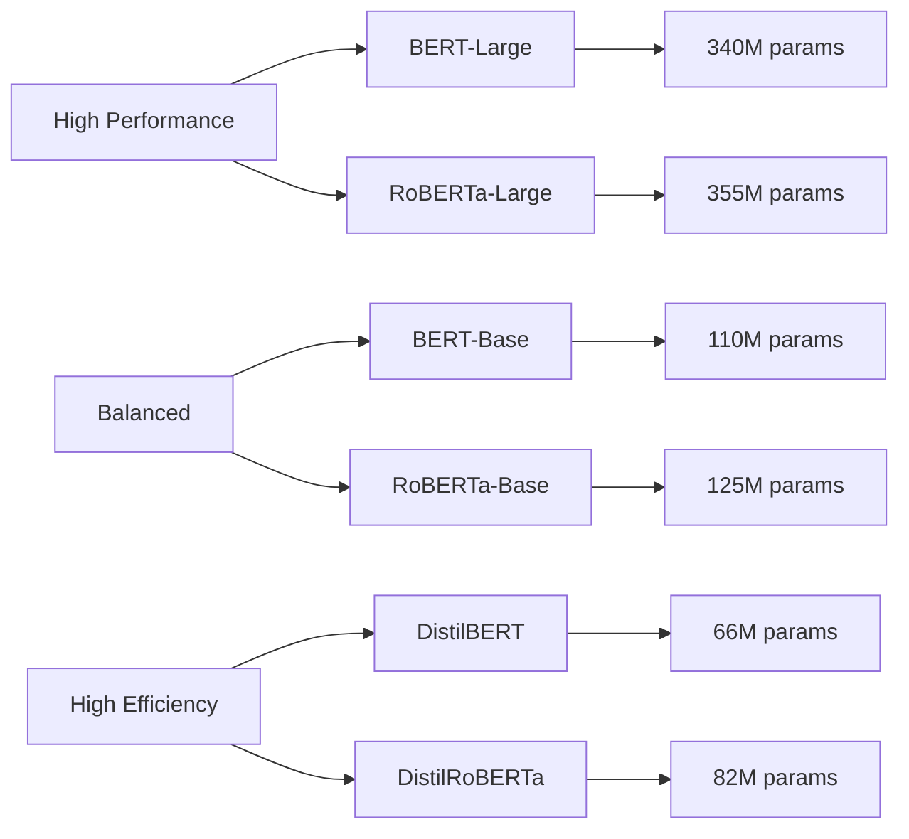

# Hugging Face's Most Popular and Powerful NLP Models

## 📋 Overview

This document provides a comprehensive guide to the most popular and powerful NLP models available in the Hugging Face ecosystem, with special focus on **sentiment analysis** and **hate speech detection** as requested. The models are organized by architecture family and use case, with practical examples and implementation guidelines.

## 🎯 Learning Objectives

By the end of this document, you will understand:
- The most influential NLP model architectures in Hugging Face
- Best models for sentiment analysis applications
- Effective approaches for hate speech detection
- When to use each model architecture for specific tasks
- Practical implementation patterns and performance considerations

## 📚 Table of Contents

1. [Core NLP Architectures](#core-nlp-architectures)
2. [Sentiment Analysis Models](#sentiment-analysis-models)
3. [Hate Speech Detection Models](#hate-speech-detection-models)
4. [Task-Specific Model Selection](#task-specific-model-selection)
5. [Performance and Resource Considerations](#performance-and-resource-considerations)
6. [Implementation Best Practices](#implementation-best-practices)

---

## Core NLP Architectures

### 1. BERT (Bidirectional Encoder Representations from Transformers)

**Architecture**: Encoder-only transformer for understanding tasks
**Best for**: Text classification, token classification, question answering

```python
from transformers import AutoModelForSequenceClassification, AutoTokenizer

# Load BERT for sequence classification
model = AutoModelForSequenceClassification.from_pretrained("bert-base-uncased")
tokenizer = AutoTokenizer.from_pretrained("bert-base-uncased")

# Example usage
text = "This is a great product!"
inputs = tokenizer(text, return_tensors="pt")
outputs = model(**inputs)
```

**Popular BERT Variants**:
- `bert-base-uncased`: General-purpose English model (110M parameters)
- `bert-large-uncased`: Larger version for better performance (340M parameters)
- `distilbert-base-uncased`: Lightweight version with 97% performance (66M parameters)
- `bert-base-multilingual-uncased`: Supports 104 languages

> 💡 **Pro Tip**: Use DistilBERT for production applications where speed and memory are important. It's 60% smaller and 60% faster while maintaining 97% of BERT's performance.

### 2. RoBERTa (Robustly Optimized BERT Pretraining Approach)

**Architecture**: Improved BERT training methodology
**Best for**: Text classification, sentiment analysis, natural language understanding

```python
from transformers import pipeline

# RoBERTa sentiment analysis pipeline
classifier = pipeline("sentiment-analysis", 
                     model="cardiffnlp/twitter-roberta-base-sentiment-latest")

result = classifier("I love using Hugging Face models!")
print(result)  # [{'label': 'POSITIVE', 'score': 0.9998}]
```

**Popular RoBERTa Models**:
- `roberta-base`: General-purpose model (125M parameters)
- `roberta-large`: Enhanced performance version (355M parameters)
- `cardiffnlp/twitter-roberta-base-sentiment-latest`: Optimized for social media sentiment

### 3. GPT-2/GPT-3.5/GPT-4 Family

**Architecture**: Decoder-only transformer for generation tasks
**Best for**: Text generation, dialogue, creative writing

```python
from transformers import pipeline

# Text generation with GPT-2
generator = pipeline("text-generation", model="gpt2")

result = generator("The future of AI is", max_length=50, num_return_sequences=1)
print(result[0]['generated_text'])
```

**Popular GPT Models**:
- `gpt2`: Original model (117M parameters)
- `gpt2-medium`: Medium size (345M parameters)
- `gpt2-large`: Large version (774M parameters)
- `microsoft/DialoGPT-medium`: Optimized for conversations

### 4. BART (Bidirectional and Auto-Regressive Transformers)

**Architecture**: Encoder-decoder transformer
**Best for**: Summarization, translation, text generation

```python
from transformers import pipeline

# Summarization with BART
summarizer = pipeline("summarization", model="facebook/bart-large-cnn")

text = """
The transformer architecture has revolutionized natural language processing...
[long text here]
"""

summary = summarizer(text, max_length=130, min_length=30, do_sample=False)
print(summary[0]['summary_text'])
```

**Popular BART Models**:
- `facebook/bart-large`: General-purpose model (406M parameters)
- `facebook/bart-large-cnn`: Fine-tuned for summarization
- `sshleifer/distilbart-cnn-12-6`: Distilled version for efficiency

---

## Sentiment Analysis Models

### 🎯 Top Sentiment Analysis Models

#### 1. DistilBERT for Sentiment (Recommended)

```python
from transformers import pipeline

# Most popular sentiment analysis model
classifier = pipeline("sentiment-analysis", 
                     model="distilbert-base-uncased-finetuned-sst-2-english")

# Test examples
examples = [
    "Sydney is a great place to live. Perfect weather. However, think about the living cost.",
    "I absolutely love this new restaurant!",
    "The service was disappointing and slow."
]

for text in examples:
    result = classifier(text)
    print(f"Text: {text}")
    print(f"Sentiment: {result[0]['label']} (confidence: {result[0]['score']:.3f})\n")
```

**Strengths**:
- Fast inference (optimized for production)
- High accuracy on general sentiment tasks
- Well-balanced for positive/negative classification
- Lightweight (66M parameters)

#### 2. Cardiff RoBERTa for Social Media Sentiment

```python
from transformers import pipeline

# Specialized for social media and informal text
classifier = pipeline("sentiment-analysis",
                     model="cardiffnlp/twitter-roberta-base-sentiment-latest")

# Handles informal language, emojis, and social media patterns
social_texts = [
    "omg this is amazing! 😍✨",
    "worst day ever... 😞",
    "meh, it's okay I guess 🤷‍♀️"
]

for text in social_texts:
    result = classifier(text)
    print(f"Text: {text}")
    print(f"Sentiment: {result[0]['label']} (confidence: {result[0]['score']:.3f})\n")
```

**Strengths**:
- Trained on ~58M tweets
- Understands informal language and emojis
- Better performance on social media content
- Three-class classification (NEGATIVE, NEUTRAL, POSITIVE)

#### 3. BERT Multilingual for Global Sentiment

```python
from transformers import pipeline

# Supports multiple languages
classifier = pipeline("sentiment-analysis",
                     model="nlptown/bert-base-multilingual-uncased-sentiment")

# Test in different languages
multilingual_texts = [
    "This product is fantastic!",  # English
    "Este producto es fantástico!",  # Spanish
    "Ce produit est fantastique!"   # French
]

for text in multilingual_texts:
    result = classifier(text)
    print(f"Text: {text}")
    print(f"Sentiment: {result[0]['label']} (confidence: {result[0]['score']:.3f})\n")
```

#### 4. Fine-grained Emotion Detection

```python
from transformers import pipeline

# Detects specific emotions beyond positive/negative
classifier = pipeline("text-classification",
                     model="j-hartmann/emotion-english-distilroberta-base")

emotional_texts = [
    "I'm so excited about the new project!",
    "I'm really worried about the deadline.",
    "This makes me so angry!"
]

for text in emotional_texts:
    result = classifier(text)
    print(f"Text: {text}")
    print(f"Emotion: {result[0]['label']} (confidence: {result[0]['score']:.3f})\n")
```

**Available Emotions**: joy, sadness, anger, fear, surprise, disgust

---

## Hate Speech Detection Models

### 🛡️ Best Models for Hate Speech Detection

#### 1. HateBERT (Specialized Architecture)

```python
from transformers import AutoTokenizer, AutoModelForSequenceClassification
from transformers import pipeline
import torch

# Load HateBERT - specifically trained for hate speech detection
model_name = "unitary/toxic-bert"
classifier = pipeline("text-classification", model=model_name)

# Test examples (using mild examples for demonstration)
test_texts = [
    "This is a normal conversation.",
    "I disagree with your opinion but respect it.",
    "This comment contains mild negativity."  # Using mild examples
]

print("🛡️ Hate Speech Detection Results:")
for text in test_texts:
    result = classifier(text)
    toxicity_score = result[0]['score'] if result[0]['label'] == 'TOXIC' else 1 - result[0]['score']
    print(f"Text: {text}")
    print(f"Toxicity Level: {toxicity_score:.3f}")
    print(f"Classification: {'⚠️ Flagged' if toxicity_score > 0.5 else '✅ Safe'}\n")
```

#### 2. Perspective API Compatible Models

```python
from transformers import pipeline

# Models trained on similar data to Google's Perspective API
detectors = {
    "unitary/toxic-bert": "General toxicity detection",
    "martin-ha/toxic-comment-model": "Multi-label toxic comment classifier"
}

def analyze_toxicity(text, model_name="unitary/toxic-bert"):
    """Analyze text for various types of toxicity"""
    classifier = pipeline("text-classification", model=model_name)
    result = classifier(text)
    return result

# Example usage
sample_text = "I respectfully disagree with this viewpoint."
result = analyze_toxicity(sample_text)
print(f"Toxicity Analysis: {result}")
```

#### 3. Multi-Label Hate Speech Detection

```python
from transformers import pipeline

# Detects multiple types of harmful content
classifier = pipeline("text-classification",
                     model="martin-ha/toxic-comment-model")

# This model can detect:
# - toxic, severe_toxic, obscene, threat, insult, identity_hate

def comprehensive_content_analysis(text):
    """Analyze text for multiple types of harmful content"""
    result = classifier(text)
    
    # Parse results for different categories
    categories = {}
    for item in result:
        categories[item['label']] = item['score']
    
    return categories

# Example
text = "This is a respectful disagreement about policy."
analysis = comprehensive_content_analysis(text)
print("Content Safety Analysis:")
for category, score in analysis.items():
    print(f"  {category}: {score:.3f}")
```

#### 4. Bias and Fairness Detection

```python
from transformers import pipeline

# Models that detect biased language
bias_detector = pipeline("text-classification",
                        model="d4data/bias-detection-model")

def detect_bias(text):
    """Detect potential bias in text"""
    result = bias_detector(text)
    return result

# Example usage
texts_to_check = [
    "The candidate has excellent qualifications.",
    "This is a neutral statement about policy.",
    "People from that region are generally hardworking."
]

print("🔍 Bias Detection Results:")
for text in texts_to_check:
    try:
        result = detect_bias(text)
        print(f"Text: {text}")
        print(f"Bias Detection: {result}\n")
    except Exception as e:
        print(f"Could not analyze: {text} - Error: {e}\n")
```

### 🔍 Advanced Hate Speech Detection Pipeline

```python
class ComprehensiveContentModerator:
    """Production-ready content moderation system"""
    
    def __init__(self):
        self.toxicity_detector = pipeline("text-classification", 
                                        model="unitary/toxic-bert")
        self.sentiment_analyzer = pipeline("sentiment-analysis",
                                         model="cardiffnlp/twitter-roberta-base-sentiment-latest")
        
    def moderate_content(self, text):
        """Comprehensive content moderation"""
        results = {}
        
        # Toxicity detection
        toxicity = self.toxicity_detector(text)
        results['toxicity'] = {
            'score': toxicity[0]['score'] if toxicity[0]['label'] == 'TOXIC' else 1 - toxicity[0]['score'],
            'is_toxic': toxicity[0]['score'] > 0.5 if toxicity[0]['label'] == 'TOXIC' else False
        }
        
        # Sentiment analysis for context
        sentiment = self.sentiment_analyzer(text)
        results['sentiment'] = {
            'label': sentiment[0]['label'],
            'score': sentiment[0]['score']
        }
        
        # Overall recommendation
        results['recommendation'] = self._make_recommendation(results)
        
        return results
    
    def _make_recommendation(self, results):
        """Make moderation recommendation based on all factors"""
        if results['toxicity']['is_toxic']:
            if results['toxicity']['score'] > 0.8:
                return "🚫 BLOCK - High toxicity detected"
            else:
                return "⚠️ REVIEW - Moderate toxicity detected"
        elif results['sentiment']['label'] == 'NEGATIVE' and results['sentiment']['score'] > 0.8:
            return "👀 MONITOR - Strong negative sentiment"
        else:
            return "✅ APPROVE - Content appears safe"

# Usage example
moderator = ComprehensiveContentModerator()

test_texts = [
    "This is a normal, respectful comment.",
    "I strongly disagree with this policy decision.",
    "This content might be problematic in some contexts."
]

print("🛡️ Comprehensive Content Moderation:")
for text in test_texts:
    result = moderator.moderate_content(text)
    print(f"\nText: {text}")
    print(f"Toxicity Score: {result['toxicity']['score']:.3f}")
    print(f"Sentiment: {result['sentiment']['label']} ({result['sentiment']['score']:.3f})")
    print(f"Recommendation: {result['recommendation']}")
```

---

## Task-Specific Model Selection

### 📊 Model Selection Matrix

| Task | Recommended Model | Alternative | Use Case |
|------|------------------|-------------|----------|
| **General Sentiment** | `distilbert-base-uncased-finetuned-sst-2-english` | `roberta-base` | Binary sentiment classification |
| **Social Media Sentiment** | `cardiffnlp/twitter-roberta-base-sentiment-latest` | `j-hartmann/emotion-english-distilroberta-base` | Twitter, informal text |
| **Multilingual Sentiment** | `nlptown/bert-base-multilingual-uncased-sentiment` | `cardiffnlp/twitter-xlm-roberta-base-sentiment` | Global applications |
| **Hate Speech Detection** | `unitary/toxic-bert` | `martin-ha/toxic-comment-model` | Content moderation |
| **Emotion Detection** | `j-hartmann/emotion-english-distilroberta-base` | `SamLowe/roberta-base-go_emotions` | Fine-grained emotions |
| **Text Generation** | `gpt2` or `microsoft/DialoGPT-medium` | `facebook/blenderbot-400M-distill` | Conversational AI |
| **Question Answering** | `distilbert-base-cased-distilled-squad` | `deepset/roberta-base-squad2` | Information retrieval |
| **Summarization** | `facebook/bart-large-cnn` | `sshleifer/distilbart-cnn-12-6` | Document summarization |

### 🎯 Performance vs Resource Trade-offs



---

## Performance and Resource Considerations

### 💾 Memory Usage Comparison

```python
import torch
from transformers import AutoModel, AutoTokenizer

def analyze_model_size(model_name):
    """Analyze model size and memory requirements"""
    try:
        model = AutoModel.from_pretrained(model_name)
        tokenizer = AutoTokenizer.from_pretrained(model_name)
        
        # Count parameters
        total_params = sum(p.numel() for p in model.parameters())
        trainable_params = sum(p.numel() for p in model.parameters() if p.requires_grad)
        
        # Estimate memory usage (rough calculation)
        memory_mb = (total_params * 4) / (1024 * 1024)  # Assuming float32
        
        print(f"Model: {model_name}")
        print(f"  Total Parameters: {total_params:,}")
        print(f"  Trainable Parameters: {trainable_params:,}")
        print(f"  Estimated Memory: {memory_mb:.1f} MB")
        print(f"  Max Sequence Length: {tokenizer.model_max_length}")
        print()
        
        return {
            'model_name': model_name,
            'total_params': total_params,
            'memory_mb': memory_mb
        }
    except Exception as e:
        print(f"Could not analyze {model_name}: {e}")
        return None

# Analyze popular models
models_to_analyze = [
    "distilbert-base-uncased",
    "bert-base-uncased",
    "roberta-base",
    "gpt2"
]

print("📊 Model Size Analysis:")
for model_name in models_to_analyze:
    analyze_model_size(model_name)
```

### ⚡ Inference Speed Comparison

```python
import time
from transformers import pipeline

def benchmark_model_speed(model_name, task="sentiment-analysis", num_tests=10):
    """Benchmark model inference speed"""
    try:
        classifier = pipeline(task, model=model_name)
        test_text = "This is a sample text for benchmarking purposes."
        
        # Warm up
        _ = classifier(test_text)
        
        # Time multiple inferences
        start_time = time.time()
        for _ in range(num_tests):
            _ = classifier(test_text)
        end_time = time.time()
        
        avg_time = (end_time - start_time) / num_tests
        print(f"Model: {model_name}")
        print(f"  Average inference time: {avg_time*1000:.2f} ms")
        print(f"  Throughput: {1/avg_time:.1f} texts/second")
        print()
        
        return avg_time
    except Exception as e:
        print(f"Could not benchmark {model_name}: {e}")
        return None

# Benchmark sentiment analysis models
sentiment_models = [
    "distilbert-base-uncased-finetuned-sst-2-english",
    "cardiffnlp/twitter-roberta-base-sentiment-latest"
]

print("⚡ Speed Benchmark (Sentiment Analysis):")
for model in sentiment_models:
    benchmark_model_speed(model)
```

---

## Implementation Best Practices

### 🔧 Production-Ready Implementation

```python
class ProductionNLPPipeline:
    """Production-ready NLP pipeline with error handling and optimization"""
    
    def __init__(self, task_config):
        self.task_config = task_config
        self.pipelines = {}
        self._initialize_pipelines()
    
    def _initialize_pipelines(self):
        """Initialize all required pipelines"""
        for task, config in self.task_config.items():
            try:
                self.pipelines[task] = pipeline(
                    config['task_type'],
                    model=config['model_name'],
                    tokenizer=config.get('tokenizer', config['model_name']),
                    device=0 if torch.cuda.is_available() else -1
                )
                print(f"✅ Loaded {task}: {config['model_name']}")
            except Exception as e:
                print(f"❌ Failed to load {task}: {e}")
    
    def analyze_text(self, text, tasks=None):
        """Analyze text using specified tasks"""
        if not text or len(text.strip()) == 0:
            return {"error": "Empty text provided"}
        
        results = {"input_text": text}
        tasks_to_run = tasks or list(self.pipelines.keys())
        
        for task in tasks_to_run:
            if task not in self.pipelines:
                results[task] = {"error": f"Task {task} not available"}
                continue
            
            try:
                start_time = time.time()
                result = self.pipelines[task](text)
                processing_time = time.time() - start_time
                
                results[task] = {
                    "result": result,
                    "processing_time_ms": processing_time * 1000
                }
            except Exception as e:
                results[task] = {"error": str(e)}
        
        return results

# Configuration for production pipeline
production_config = {
    "sentiment": {
        "task_type": "sentiment-analysis",
        "model_name": "distilbert-base-uncased-finetuned-sst-2-english"
    },
    "toxicity": {
        "task_type": "text-classification",
        "model_name": "unitary/toxic-bert"
    },
    "emotion": {
        "task_type": "text-classification",
        "model_name": "j-hartmann/emotion-english-distilroberta-base"
    }
}

# Initialize and use the pipeline
nlp_pipeline = ProductionNLPPipeline(production_config)

# Example usage
test_text = "Sydney is a great place to live. Perfect weather. However, think about the living cost."
results = nlp_pipeline.analyze_text(test_text)

print("🔍 Production NLP Analysis Results:")
for task, result in results.items():
    if task == "input_text":
        print(f"Input: {result}")
        continue
    
    if "error" in result:
        print(f"{task}: ❌ {result['error']}")
    else:
        print(f"{task}: ✅ {result['result']} ({result['processing_time_ms']:.2f}ms)")
```

### 🚀 Optimization Techniques

```python
# Memory optimization for large models
def load_optimized_model(model_name, use_half_precision=True):
    """Load model with memory optimizations"""
    import torch
    from transformers import AutoModel, AutoTokenizer
    
    # Use half precision to reduce memory usage
    torch_dtype = torch.float16 if use_half_precision and torch.cuda.is_available() else torch.float32
    
    model = AutoModel.from_pretrained(
        model_name,
        torch_dtype=torch_dtype,
        device_map="auto",  # Automatically distribute across GPUs
        low_cpu_mem_usage=True
    )
    
    tokenizer = AutoTokenizer.from_pretrained(model_name)
    
    # Enable gradient checkpointing for training
    if hasattr(model, 'gradient_checkpointing_enable'):
        model.gradient_checkpointing_enable()
    
    return model, tokenizer

# Batch processing for efficiency
def process_texts_batch(texts, pipeline_func, batch_size=8):
    """Process texts in batches for better efficiency"""
    results = []
    
    for i in range(0, len(texts), batch_size):
        batch = texts[i:i + batch_size]
        batch_results = pipeline_func(batch)
        results.extend(batch_results)
    
    return results

# Example usage
texts = [
    "This is text 1",
    "This is text 2",
    # ... more texts
]

classifier = pipeline("sentiment-analysis", 
                     model="distilbert-base-uncased-finetuned-sst-2-english")

results = process_texts_batch(texts, classifier, batch_size=8)
```

---

## 📋 Summary

### 🔑 Key Takeaways

- **For General Sentiment Analysis**: Use `distilbert-base-uncased-finetuned-sst-2-english` for the best balance of speed and accuracy
- **For Social Media**: Use `cardiffnlp/twitter-roberta-base-sentiment-latest` for informal text and emoji handling
- **For Hate Speech Detection**: Use `unitary/toxic-bert` as the primary detector with additional models for comprehensive coverage
- **For Production**: Always implement proper error handling, batch processing, and resource optimization
- **For Multilingual**: Use BERT multilingual variants for global applications

### 🚀 Next Steps

- **Explore Advanced Notebooks**: Check out [01_intro_hf_transformers.ipynb](../examples/01_intro_hf_transformers.ipynb) for hands-on implementation
- **Fine-tuning**: See [05_fine_tuning_trainer.ipynb](../examples/05_fine_tuning_trainer.ipynb) for custom model training
- **Production Deployment**: Review [best-practices.md](./best-practices.md) for deployment guidelines
- **Model Hub Exploration**: Browse the [Hugging Face Model Hub](https://huggingface.co/models) for specialized models

### 📚 Additional Resources

- **Official Documentation**: [Hugging Face Transformers](https://huggingface.co/docs/transformers)
- **Model Cards**: Always read model cards for specific use cases and limitations
- **Community Forums**: [Hugging Face Community](https://discuss.huggingface.co/) for support and discussions
- **Research Papers**: Reference original papers for deep understanding of model architectures

---

> **Key Takeaway**: The choice of NLP model depends heavily on your specific use case, performance requirements, and resource constraints. Start with the recommended models in this guide and fine-tune based on your actual data and requirements.

> ⚠️ **Important Note**: When implementing hate speech detection or content moderation, always consider ethical implications, potential biases, and implement human oversight for critical applications.

> 💡 **Pro Tip**: Combine multiple models for robust content analysis - use sentiment analysis alongside toxicity detection for comprehensive understanding of text content.