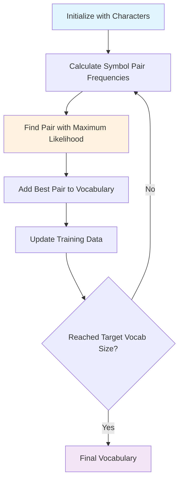

# WordPiece Tokenization: The Algorithm Behind BERT and Modern NLP

## 🎯 Learning Objectives
By the end of this document, you will understand:
- What WordPiece tokenization is and how it works algorithmically
- Why WordPiece is crucial for modern NLP models like BERT, DistilBERT, and ELECTRA
- How WordPiece differs from other subword tokenization methods (BPE, SentencePiece)
- The mathematical foundation behind WordPiece's likelihood maximization approach
- Practical implementation and usage in the Hugging Face ecosystem

## 📋 Prerequisites
- Basic understanding of tokenization concepts
- Familiarity with NLP fundamentals
- Knowledge of BERT and transformer architectures
- Basic probability and statistical concepts

## What is WordPiece?

**WordPiece** is a subword tokenization algorithm that breaks down words into smaller, meaningful units called subword tokens. It was originally developed by Google and outlined in the paper ["Japanese and Korean Voice Search" (Schuster et al., 2012)](https://static.googleusercontent.com/media/research.google.com/ja//pubs/archive/37842.pdf). WordPiece has become the foundation for many of today's most successful language models.

### Key Characteristics

```python
from transformers import AutoTokenizer

# WordPiece tokenizer used in BERT
bert_tokenizer = AutoTokenizer.from_pretrained("bert-base-uncased")

# Example of WordPiece tokenization
word = "unhappiness"
tokens = bert_tokenizer.tokenize(word)
print(f"Original word: {word}")
print(f"WordPiece tokens: {tokens}")
# Output: ['un', '##hap', '##pi', '##ness']

# Note the '##' prefix indicating continuation of the previous token
```

**Key Features:**
- **Subword Segmentation**: Breaks words into smaller meaningful units
- **Continuation Markers**: Uses `##` prefix to indicate token continuations
- **Vocabulary Efficiency**: Maintains manageable vocabulary sizes while handling rare words
- **Statistical Foundation**: Uses likelihood maximization for vocabulary building

## Why is WordPiece Important in NLP?

### 1. Solving the Out-of-Vocabulary (OOV) Problem

Traditional word-level tokenization struggles with:
- **Rare words**: Words not seen during training become `[UNK]` tokens
- **New words**: Recent terminology or proper nouns are lost
- **Morphological variations**: Different forms of the same word are treated separately

```python
# Demonstrating OOV handling
examples = [
    "COVID-19",           # Recent term
    "antidisestablishmentarianism",  # Very long word
    "ChatGPT",           # Proper noun/brand
    "unfathomable"       # Less common word
]

print("WordPiece Tokenization Results:")
print("=" * 50)
for word in examples:
    tokens = bert_tokenizer.tokenize(word)
    print(f"{word:30} → {tokens}")

# All words are successfully tokenized into meaningful subparts
# No [UNK] tokens are generated
```

### 2. Balancing Vocabulary Size and Coverage

WordPiece achieves an optimal balance:

```python
# Vocabulary statistics for BERT
vocab_size = len(bert_tokenizer.vocab)
print(f"BERT vocabulary size: {vocab_size:,} tokens")

# Compare with character-level (too many tokens needed)
# vs word-level (too many OOV words)
print(f"Coverage: Handles infinite vocabulary with finite token set")
```

### 3. Preserving Semantic Information

Unlike random character splitting, WordPiece maintains linguistic meaning:

```python
# Semantic preservation examples
semantic_examples = [
    ("happiness", ["happiness"]),           # Common word stays whole
    ("unhappiness", ["un", "##hap", "##pi", "##ness"]),  # Meaningful prefixes/suffixes
    ("preprocessing", ["pre", "##process", "##ing"]),      # Technical compound
]

for word, expected_pattern in semantic_examples:
    tokens = bert_tokenizer.tokenize(word)
    print(f"{word:15} → {tokens}")
    print(f"{'':15}   Preserves: prefix, root, suffix structure")
```

## How WordPiece Works: The Algorithm

### Algorithmic Process

WordPiece builds its vocabulary through an iterative process:



### Mathematical Foundation

WordPiece differs from BPE in its merge criterion. Instead of simply choosing the most frequent pair, it maximizes likelihood:

$$\text{Score}(pair) = \frac{P(\text{merged pair})}{P(\text{first symbol}) \times P(\text{second symbol})}$$

Where:
- $P(\text{merged pair})$ is the probability of the merged symbol pair
- $P(\text{first symbol})$ and $P(\text{second symbol})$ are individual symbol probabilities

```python
# Conceptual implementation of WordPiece scoring
def wordpiece_score(merged_count, first_count, second_count, total_count):
    """
    Calculate WordPiece merge score based on likelihood maximization.
    
    Args:
        merged_count: Frequency of the merged pair
        first_count: Frequency of first symbol
        second_count: Frequency of second symbol
        total_count: Total number of symbols
    
    Returns:
        Score for this merge candidate
    """
    p_merged = merged_count / total_count
    p_first = first_count / total_count
    p_second = second_count / total_count
    
    # WordPiece likelihood score
    score = p_merged / (p_first * p_second)
    return score

# Example calculation
merged_freq = 100
first_freq = 500
second_freq = 300
total = 10000

score = wordpiece_score(merged_freq, first_freq, second_freq, total)
print(f"WordPiece score for merge: {score:.4f}")
print("Higher score = better merge candidate")
```

### Step-by-Step Example

Let's trace through a simplified WordPiece training example:

```python
def demonstrate_wordpiece_training():
    """
    Demonstrate simplified WordPiece training process.
    """
    print("🔍 WORDPIECE TRAINING SIMULATION")
    print("=" * 50)
    
    # Initial training data (simplified)
    training_words = ["low", "lower", "newest", "widest"]
    
    # Step 1: Initialize with characters
    initial_vocab = set()
    for word in training_words:
        for char in word:
            initial_vocab.add(char)
    
    print(f"Step 1 - Initial character vocabulary:")
    print(f"Vocab: {sorted(initial_vocab)}")
    print()
    
    # Step 2: Identify merge candidates
    print("Step 2 - Identify potential merges:")
    
    # In real WordPiece, we'd calculate likelihood scores
    # Here we show the conceptual process
    merge_candidates = [
        ("l", "o", "frequency: 2, score: 1.5"),
        ("e", "r", "frequency: 2, score: 1.8"), 
        ("e", "s", "frequency: 2, score: 2.1"),  # Best score
        ("s", "t", "frequency: 2, score: 1.2")
    ]
    
    for first, second, info in merge_candidates:
        print(f"  '{first}' + '{second}' → {info}")
    
    print(f"\nBest merge: 'e' + 's' (highest likelihood score)")
    print("Add 'es' to vocabulary")
    
    # Continue process...
    print("\nThis process continues until target vocabulary size is reached")

# Run the demonstration
demonstrate_wordpiece_training()
```

## WordPiece vs. Other Tokenization Methods

### Comparison Table

| Method | Merge Criterion | Vocabulary | Continuation Marker | Used In |
|--------|----------------|------------|-------------------|---------|
| **WordPiece** | Likelihood maximization | Fixed size | `##` | BERT, DistilBERT, ELECTRA |
| **BPE** | Most frequent pair | Fixed size | No special marker | GPT-2, RoBERTa |
| **SentencePiece** | Unigram language model | Variable size | `▁` (space) | T5, ALBERT |
| **Word-level** | N/A | Variable (large) | Spaces | Traditional NLP |

### Practical Comparison

```python
from transformers import GPT2Tokenizer, AutoTokenizer

# Load different tokenizers
bert_tokenizer = AutoTokenizer.from_pretrained("bert-base-uncased")    # WordPiece
gpt2_tokenizer = GPT2Tokenizer.from_pretrained("gpt2")                # BPE
t5_tokenizer = AutoTokenizer.from_pretrained("t5-small")              # SentencePiece

test_word = "unhappiness"

print("TOKENIZATION COMPARISON")
print("=" * 50)
print(f"Test word: '{test_word}'")
print()

# WordPiece (BERT)
bert_tokens = bert_tokenizer.tokenize(test_word)
print(f"WordPiece (BERT):     {bert_tokens}")
print(f"                     Notice '##' continuation markers")

# BPE (GPT-2)  
gpt2_tokens = gpt2_tokenizer.tokenize(test_word)
print(f"BPE (GPT-2):         {gpt2_tokens}")
print(f"                     No special continuation markers")

# SentencePiece (T5)
t5_tokens = t5_tokenizer.tokenize(test_word)
print(f"SentencePiece (T5):  {t5_tokens}")
print(f"                     Uses '▁' for spaces (not shown here)")
```

## WordPiece in BERT and Modern Models

### Why BERT Uses WordPiece

BERT's success is partly attributed to WordPiece tokenization:

```python
# BERT's WordPiece configuration
def analyze_bert_wordpiece():
    """
    Analyze BERT's WordPiece tokenization characteristics.
    """
    tokenizer = AutoTokenizer.from_pretrained("bert-base-uncased")
    
    print("🤖 BERT WORDPIECE ANALYSIS")
    print("=" * 50)
    
    # Vocabulary statistics
    vocab_size = len(tokenizer.vocab)
    print(f"Vocabulary size: {vocab_size:,} tokens")
    
    # Special tokens
    special_tokens = {
        'CLS': tokenizer.cls_token,
        'SEP': tokenizer.sep_token,
        'PAD': tokenizer.pad_token,
        'UNK': tokenizer.unk_token,
        'MASK': tokenizer.mask_token
    }
    
    print(f"\nSpecial tokens:")
    for name, token in special_tokens.items():
        print(f"  {name}: {token}")
    
    # Demonstrate tokenization on complex text
    complex_text = "The preprocessing of biomedical texts requires sophisticated tokenization."
    
    print(f"\nComplex text tokenization:")
    print(f"Text: {complex_text}")
    
    tokens = tokenizer.tokenize(complex_text)
    print(f"Tokens: {tokens}")
    
    # Show how subwords handle technical terms
    technical_terms = ["preprocessing", "biomedical", "sophisticated", "tokenization"]
    print(f"\nTechnical term breakdown:")
    for term in technical_terms:
        term_tokens = tokenizer.tokenize(term)
        print(f"  {term:15} → {term_tokens}")

analyze_bert_wordpiece()
```

### Models Using WordPiece

```python
# Models that use WordPiece tokenization
wordpiece_models = [
    "bert-base-uncased",
    "bert-large-uncased", 
    "distilbert-base-uncased",
    "google/electra-small-discriminator",
    "google/electra-base-discriminator"
]

print("🏗️ MODELS USING WORDPIECE")
print("=" * 50)

for model_name in wordpiece_models:
    tokenizer = AutoTokenizer.from_pretrained(model_name)
    vocab_size = len(tokenizer.vocab)
    print(f"{model_name:35} | Vocab: {vocab_size:,}")
```

## Implementation Best Practices

### 1. Handling Different Text Types

```python
def demonstrate_text_handling():
    """
    Show how WordPiece handles different types of text.
    """
    tokenizer = AutoTokenizer.from_pretrained("bert-base-uncased")
    
    text_samples = {
        "Scientific": "The mitochondrial DNA analysis revealed significant polymorphisms.",
        "Social Media": "OMG! This AI model is absolutely AMAZING!! 🚀 #NLP #AI",
        "Technical": "Initialize the convolutional neural network with pre-trained weights.",
        "Multilingual": "The café serves crème brûlée and naïve tourists.",
        "Numbers/Dates": "On 2024-01-15, we processed 1,234,567 documents."
    }
    
    print("📝 TEXT TYPE HANDLING")
    print("=" * 80)
    
    for text_type, text in text_samples.items():
        tokens = tokenizer.tokenize(text)
        num_tokens = len(tokens)
        
        print(f"\n{text_type} Text:")
        print(f"  Original: {text}")
        print(f"  Tokens ({num_tokens}): {tokens[:10]}{'...' if num_tokens > 10 else ''}")
        
        # Show how special characters are handled
        special_chars = [char for char in text if not char.isalnum() and char != ' ']
        if special_chars:
            print(f"  Special chars: {list(set(special_chars))}")

demonstrate_text_handling()
```

### 2. Memory and Performance Considerations

```python
def performance_tips():
    """
    Demonstrate performance optimization tips for WordPiece.
    """
    print("⚡ PERFORMANCE OPTIMIZATION TIPS")
    print("=" * 50)
    
    tips = {
        "Batch Processing": {
            "description": "Process multiple texts together for efficiency",
            "code": """
# Efficient batch processing
texts = ["Text 1", "Text 2", "Text 3"]
batch_encoding = tokenizer(texts, padding=True, truncation=True, return_tensors="pt")
            """
        },
        "Sequence Length": {
            "description": "Set appropriate max_length to avoid unnecessary computation",
            "code": """
# Set reasonable max_length based on your use case
tokens = tokenizer(text, max_length=512, truncation=True, padding="max_length")
            """
        },
        "Fast Tokenizers": {
            "description": "Use fast tokenizers when available for speed improvements",
            "code": """
# Fast tokenizer (automatically used when available)
fast_tokenizer = AutoTokenizer.from_pretrained("bert-base-uncased", use_fast=True)
            """
        }
    }
    
    for tip_name, tip_info in tips.items():
        print(f"\n💡 {tip_name}:")
        print(f"   {tip_info['description']}")
        print(f"   Code example:{tip_info['code']}")

performance_tips()
```

## Advanced Topics

### Custom WordPiece Training

While most users will use pre-trained tokenizers, understanding custom training is valuable:

```python
from tokenizers import Tokenizer, models, normalizers, pre_tokenizers, trainers

def create_custom_wordpiece():
    """
    Demonstrate custom WordPiece tokenizer training.
    Note: This is for educational purposes. Most use cases should use pre-trained tokenizers.
    """
    print("🛠️ CUSTOM WORDPIECE TRAINING")
    print("=" * 50)
    
    # Initialize a WordPiece model
    tokenizer = Tokenizer(models.WordPiece(unk_token="[UNK]"))
    
    # Setup normalization and pre-tokenization
    tokenizer.normalizer = normalizers.BertNormalizer(lowercase=True)
    tokenizer.pre_tokenizer = pre_tokenizers.BertPreTokenizer()
    
    # Setup trainer
    trainer = trainers.WordPieceTrainer(
        vocab_size=30000,
        min_frequency=2,
        special_tokens=["[UNK]", "[CLS]", "[SEP]", "[PAD]", "[MASK]"]
    )
    
    print("Configuration:")
    print(f"  Model: WordPiece")
    print(f"  Vocab size: 30,000")
    print(f"  Min frequency: 2")
    print(f"  Special tokens: [UNK], [CLS], [SEP], [PAD], [MASK]")
    
    print("\nTo train:")
    print("  1. Prepare training corpus")
    print("  2. Call tokenizer.train(files, trainer)")
    print("  3. Save trained tokenizer")
    
    return tokenizer

custom_tokenizer = create_custom_wordpiece()
```

## 🔑 Key Takeaways

### Essential Concepts
- **WordPiece is a statistical subword tokenization algorithm** that uses likelihood maximization to build vocabularies
- **Solves the OOV problem** by breaking words into meaningful subword units rather than treating unknown words as `[UNK]`
- **Balances vocabulary efficiency and semantic preservation** through its probabilistic approach
- **Forms the foundation of BERT** and many other successful transformer models

### Best Practices
- Use pre-trained WordPiece tokenizers for most applications
- Understand the `##` continuation marker system for proper token interpretation
- Consider batch processing for performance optimization
- Set appropriate sequence lengths based on your use case

### Mathematical Insight
The likelihood maximization criterion:
$$\text{Score} = \frac{P(\text{merged})}{P(\text{first}) \times P(\text{second})}$$
ensures that merges preserve the most statistically meaningful relationships in the training data.

## 🚀 Next Steps

### Related Documentation
- **[Key Terms](key-terms.md)**: Learn about other tokenization concepts
- **[BERT Architecture](transformer-history.md)**: Understand how WordPiece fits into BERT
- **[Best Practices](best-practices.md)**: General Hugging Face ecosystem guidelines

### Practical Applications
- **[Tokenization Notebook](../examples/02_tokenizers.ipynb)**: Hands-on tokenization examples
- **[BERT Fine-tuning](../examples/05_fine_tuning_trainer.ipynb)**: See WordPiece in action
- **[Feature Extraction](../examples/basic1.2/06-feature-extraction.ipynb)**: Advanced tokenization techniques

### Further Reading
- [Original WordPiece Paper](https://static.googleusercontent.com/media/research.google.com/ja//pubs/archive/37842.pdf) - Schuster et al., 2012
- [BERT Paper](https://arxiv.org/abs/1810.04805) - Devlin et al., 2018
- [Hugging Face Tokenizers Documentation](https://huggingface.co/docs/tokenizers/)

---

*This documentation is part of the [HF Transformer Trove](https://github.com/vuhung16au/hf-transformer-trove) educational series, designed to help you master the Hugging Face ecosystem through practical, well-explained examples.*