# Attention Layers: The Heart of Transformers

## 🎯 Learning Objectives
By the end of this document, you will understand:
- What attention layers are and why they revolutionized NLP
- How attention mechanisms work mathematically and conceptually
- The transformer architecture overview as implemented in Hugging Face
- Different types of attention mechanisms (self-attention, multi-head, etc.)
- Why attention is crucial for learning NLP and modern language models
- Practical implementation patterns using Hugging Face transformers
- How to visualize and interpret attention weights

## 📋 Prerequisites
- Basic understanding of neural networks and linear algebra
- Familiarity with PyTorch fundamentals
- Knowledge of NLP basics (refer to [NLP Learning Journey](https://github.com/vuhung16au/nlp-learning-journey))
- Understanding of matrix operations and dot products

## 📚 What We'll Cover
1. **Attention Fundamentals**: What attention is and why it matters
2. **Mathematical Foundation**: The core attention mechanism equations
3. **Transformer Architecture**: How attention fits in the transformer model
4. **Multi-Head Attention**: Parallel attention for richer representations
5. **Practical Implementation**: Using Hugging Face to work with attention
6. **Attention Visualization**: Interpreting what models learn
7. **Advanced Patterns**: Masked attention, cross-attention, and efficiency

---

## 1. Attention Fundamentals: Why "Attention Is All You Need"

### The Problem Attention Solves

Before transformers, language models processed words sequentially using RNNs or LSTMs. This created several problems:
- **Sequential bottleneck**: Models had to process one word at a time
- **Long-range dependencies**: Information from early words could get "forgotten"
- **Limited parallelization**: Sequential nature prevented efficient GPU utilization

> **Key Insight**: Attention allows models to directly connect any two positions in a sequence, regardless of distance, enabling parallel processing and better long-range understanding.

### The Translation Example: Context Matters

Consider translating "You like this course" to French. The word "like" needs different translations based on who "You" refers to:
- **English**: "You like" → **French**: "Tu aimes" (informal) or "Vous aimez" (formal)
- **Context dependency**: The model must "pay attention" to "You" when translating "like"

```python
# Conceptual example of what attention helps with
english_sentence = ["You", "like", "this", "course"]
# When translating "like", attention weights might be:
attention_weights = {
    "You": 0.8,      # High attention - affects conjugation
    "like": 0.1,     # Self-attention
    "this": 0.05,    # Low attention
    "course": 0.05   # Low attention
}
```

### Attention vs. Traditional Approaches


---

## 2. Mathematical Foundation: Scaled Dot-Product Attention

### The Core Attention Equation

The fundamental attention mechanism is elegantly simple:

$$\text{Attention}(Q, K, V) = \text{softmax}\left(\frac{QK^T}{\sqrt{d_k}}\right)V$$

**Where:**
- $Q \in \mathbb{R}^{n \times d_k}$ is the **Query** matrix (what we're looking for)
- $K \in \mathbb{R}^{n \times d_k}$ is the **Key** matrix (what we're comparing against)
- $V \in \mathbb{R}^{n \times d_v}$ is the **Value** matrix (what we extract)
- $d_k$ is the dimension of key vectors
- $n$ is the sequence length

### Step-by-Step Breakdown

```python
import torch
import torch.nn.functional as F
import numpy as np

def scaled_dot_product_attention(query, key, value, mask=None):
    """
    The fundamental attention mechanism from "Attention Is All You Need"
    
    This function demonstrates each step of computing attention weights
    and applying them to values for educational purposes.
    
    Args:
        query: Query tensor [batch_size, seq_len, d_model]
        key: Key tensor [batch_size, seq_len, d_model]
        value: Value tensor [batch_size, seq_len, d_model]
        mask: Optional attention mask to prevent attending to certain positions
        
    Returns:
        output: Attended values [batch_size, seq_len, d_model]
        attention_weights: Attention probabilities [batch_size, seq_len, seq_len]
    """
    d_k = query.size(-1)  # Dimension of key vectors
    
    # Step 1: Compute attention scores (Q * K^T)
    # This measures similarity between queries and keys
    scores = torch.matmul(query, key.transpose(-2, -1))
    print(f"Raw attention scores shape: {scores.shape}")
    
    # Step 2: Scale by sqrt(d_k) to prevent vanishing gradients
    # Larger d_k leads to larger dot products, making softmax too sharp
    scores = scores / torch.sqrt(torch.tensor(d_k, dtype=torch.float32))
    print(f"Scaled attention scores range: [{scores.min():.3f}, {scores.max():.3f}]")
    
    # Step 3: Apply mask if provided (e.g., for padding or future positions)
    if mask is not None:
        scores = scores.masked_fill(mask == 0, -1e9)
    
    # Step 4: Apply softmax to get attention probabilities
    # This ensures all attention weights sum to 1 for each query
    attention_weights = F.softmax(scores, dim=-1)
    print(f"Attention weights shape: {attention_weights.shape}")
    print(f"Attention weights sum (should be ~1): {attention_weights.sum(dim=-1)[0, 0]:.3f}")
    
    # Step 5: Apply attention weights to values
    # This computes weighted average of values based on attention
    output = torch.matmul(attention_weights, value)
    print(f"Output shape: {output.shape}")
    
    return output, attention_weights

# Educational example with detailed analysis
def demonstrate_attention_mechanism():
    """Demonstrate attention with a concrete example"""
    print("=== Attention Mechanism Demonstration ===")
    
    # Create sample data
    batch_size, seq_len, d_model = 1, 4, 8
    
    # Sample sentence: "The cat sat on"
    # We'll create simple embeddings to show concept
    torch.manual_seed(42)  # For reproducible results
    
    query = torch.randn(batch_size, seq_len, d_model)
    key = torch.randn(batch_size, seq_len, d_model)
    value = torch.randn(batch_size, seq_len, d_model)
    
    print(f"Input dimensions:")
    print(f"  Sequence length: {seq_len}")
    print(f"  Model dimension: {d_model}")
    print(f"  Batch size: {batch_size}")
    print()
    
    # Compute attention
    output, attention_weights = scaled_dot_product_attention(query, key, value)
    
    # Analyze attention patterns
    print("\nAttention Weight Analysis:")
    words = ["The", "cat", "sat", "on"]
    
    print("\nAttention matrix (who attends to whom):")
    print("Rows = queries (from), Columns = keys (to)")
    print(f"{'':>8}", end="")
    for word in words:
        print(f"{word:>8}", end="")
    print()
    
    for i, query_word in enumerate(words):
        print(f"{query_word:>8}", end="")
        for j in range(seq_len):
            print(f"{attention_weights[0, i, j]:.3f}".rjust(8), end="")
        print()

# Run demonstration
demonstrate_attention_mechanism()
```

### Why Scaling Matters

The scaling factor $\frac{1}{\sqrt{d_k}}$ is crucial:

```python
# Demonstrate why scaling prevents vanishing gradients
def show_scaling_importance():
    """Show why we need to scale by sqrt(d_k)"""
    
    d_k_values = [64, 256, 512, 1024]
    
    for d_k in d_k_values:
        # Create random query and key vectors
        q = torch.randn(1, d_k)
        k = torch.randn(1, d_k)
        
        # Compute dot product
        dot_product = torch.dot(q[0], k[0])
        scaled_dot_product = dot_product / torch.sqrt(torch.tensor(d_k, dtype=torch.float32))
        
        # Show softmax sharpness
        unscaled_prob = F.softmax(torch.tensor([dot_product, 0.0]), dim=0)[0]
        scaled_prob = F.softmax(torch.tensor([scaled_dot_product, 0.0]), dim=0)[0]
        
        print(f"d_k = {d_k:4d}: "
              f"Dot product = {dot_product:6.2f}, "
              f"Scaled = {scaled_dot_product:6.2f}, "
              f"Unscaled softmax = {unscaled_prob:.3f}, "
              f"Scaled softmax = {scaled_prob:.3f}")

print("=== Scaling Factor Importance ===")
show_scaling_importance()
```

---

## 3. Transformer Architecture: Attention in Context

### The Complete Transformer Block

Attention layers don't work in isolation. Here's how they fit in the transformer architecture:

```mermaid
graph TB
    A[Input Embeddings + Positional Encoding] --> B[Multi-Head Attention]
    B --> C[Add & Norm]
    C --> D[Feed Forward Network]
    D --> E[Add & Norm]
    E --> F[Output to Next Layer]
    
    subgraph "Transformer Block"
        B
        C
        D
        E
    end
    
    subgraph "Multi-Head Attention Detail"
        G[Input] --> H1[Head 1: Q₁K₁V₁]
        G --> H2[Head 2: Q₂K₂V₂]
        G --> H3[Head h: QₕKₕVₕ]
        H1 --> I[Concatenate]
        H2 --> I
        H3 --> I
        I --> J[Linear Projection]
    end
    
    B -.-> G
    
    style B fill:#e1f5fe
    style D fill:#fff3e0
    style I fill:#f3e5f5
```



### Implementing a Transformer Block with Attention

```python
from transformers import AutoTokenizer, AutoModel, AutoConfig
import torch
import torch.nn as nn

class EducationalTransformerBlock(nn.Module):
    """
    Educational implementation of a transformer block showing attention clearly.
    
    This is a simplified version for learning purposes - in practice,
    use Hugging Face's optimized implementations.
    """
    
    def __init__(self, d_model, num_heads, d_ff, dropout=0.1):
        super().__init__()
        self.d_model = d_model
        self.num_heads = num_heads
        
        # Multi-head attention
        self.multihead_attn = nn.MultiheadAttention(
            embed_dim=d_model,
            num_heads=num_heads,
            dropout=dropout,
            batch_first=True  # Input shape: [batch, seq, feature]
        )
        
        # Feed forward network
        self.ffn = nn.Sequential(
            nn.Linear(d_model, d_ff),
            nn.ReLU(),
            nn.Linear(d_ff, d_model)
        )
        
        # Layer normalization
        self.norm1 = nn.LayerNorm(d_model)
        self.norm2 = nn.LayerNorm(d_model)
        
        # Dropout
        self.dropout = nn.Dropout(dropout)
        
    def forward(self, x, mask=None):
        """
        Forward pass through transformer block
        
        Args:
            x: Input tensor [batch_size, seq_len, d_model]
            mask: Optional attention mask
            
        Returns:
            output: Transformed tensor [batch_size, seq_len, d_model]
            attention_weights: Attention weights for visualization
        """
        # Multi-head attention with residual connection
        attn_output, attention_weights = self.multihead_attn(
            query=x, key=x, value=x,  # Self-attention: Q, K, V all from same input
            key_padding_mask=mask,
            need_weights=True  # Return attention weights for visualization
        )
        
        # Add & Norm 1
        x1 = self.norm1(x + self.dropout(attn_output))
        
        # Feed forward with residual connection
        ffn_output = self.ffn(x1)
        
        # Add & Norm 2
        output = self.norm2(x1 + self.dropout(ffn_output))
        
        return output, attention_weights

# Demonstrate the transformer block
def demo_transformer_block():
    """Demonstrate transformer block with attention visualization"""
    
    # Initialize model
    d_model, num_heads, d_ff = 512, 8, 2048
    block = EducationalTransformerBlock(d_model, num_heads, d_ff)
    
    # Create sample input (batch_size=1, seq_len=10, d_model=512)
    x = torch.randn(1, 10, d_model)
    
    # Forward pass
    output, attention_weights = block(x)
    
    print("=== Transformer Block Demonstration ===")
    print(f"Input shape: {x.shape}")
    print(f"Output shape: {output.shape}")
    print(f"Attention weights shape: {attention_weights.shape}")
    print(f"Number of attention heads: {num_heads}")
    print(f"Each head attends to: {attention_weights.shape[-1]} positions")
    
    # Show attention pattern for first head
    print(f"\nFirst attention head pattern (first 5x5):")
    first_head_attention = attention_weights[0, 0, :5, :5]  # [batch, head, query, key]
    for i in range(5):
        print([f"{val:.3f}" for val in first_head_attention[i].tolist()])

demo_transformer_block()
```

### Comparing Different Transformer Variants

```python
def compare_transformer_architectures():
    """Compare different transformer architectures available in Hugging Face"""
    
    model_configs = [
        ("bert-base-uncased", "Encoder-only (BERT-like)"),
        ("gpt2", "Decoder-only (GPT-like)"),
        ("t5-small", "Encoder-Decoder (T5-like)")
    ]
    
    print("=== Transformer Architecture Comparison ===")
    
    for model_name, description in model_configs:
        try:
            config = AutoConfig.from_pretrained(model_name)
            
            print(f"\n{description} ({model_name}):")
            print(f"  Hidden size (d_model): {config.hidden_size}")
            print(f"  Number of layers: {config.num_hidden_layers if hasattr(config, 'num_hidden_layers') else config.num_layers}")
            print(f"  Attention heads: {config.num_attention_heads}")
            print(f"  Max sequence length: {getattr(config, 'max_position_embeddings', 'N/A')}")
            
            # Calculate attention parameters
            if hasattr(config, 'hidden_size') and hasattr(config, 'num_attention_heads'):
                head_dim = config.hidden_size // config.num_attention_heads
                print(f"  Head dimension: {head_dim}")
                
                # Attention parameter count (Q, K, V projections)
                attn_params = 3 * config.hidden_size * config.hidden_size
                total_layers = config.num_hidden_layers if hasattr(config, 'num_hidden_layers') else config.num_layers
                total_attn_params = attn_params * total_layers
                print(f"  Attention parameters: ~{total_attn_params:,}")
                
        except Exception as e:
            print(f"Error loading {model_name}: {e}")

compare_transformer_architectures()
```

---

## 4. Multi-Head Attention: Parallel Attention Mechanisms

### Why Multiple Attention Heads?

Multi-head attention allows the model to attend to different aspects simultaneously:
- **Head 1**: Might focus on syntactic relationships
- **Head 2**: Might capture semantic similarities  
- **Head 3**: Might handle long-range dependencies

### Mathematical Formulation

$$\text{MultiHead}(Q, K, V) = \text{Concat}(\text{head}_1, \ldots, \text{head}_h)W^O$$

Where each head is:
$$\text{head}_i = \text{Attention}(QW_i^Q, KW_i^K, VW_i^V)$$

```python
def demonstrate_multihead_attention():
    """Demonstrate multi-head attention with interpretable example"""
    
    from transformers import AutoModel, AutoTokenizer
    import matplotlib.pyplot as plt
    import seaborn as sns
    
    # Load a pre-trained model
    model_name = "bert-base-uncased"
    model = AutoModel.from_pretrained(model_name, output_attentions=True)
    tokenizer = AutoTokenizer.from_pretrained(model_name)
    
    # Example sentence showing different types of relationships
    text = "The quick brown fox jumps over the lazy dog"
    inputs = tokenizer(text, return_tensors="pt")
    
    # Get model outputs with attention weights
    with torch.no_grad():
        outputs = model(**inputs)
        attentions = outputs.attentions  # Tuple of attention weights for each layer
    
    # Analyze attention patterns
    tokens = tokenizer.tokenize(text)
    print("=== Multi-Head Attention Analysis ===")
    print(f"Input text: '{text}'")
    print(f"Tokens: {tokens}")
    print(f"Number of layers: {len(attentions)}")
    print(f"Number of heads per layer: {attentions[0].shape[1]}")
    
    # Look at the last layer (most refined representations)
    last_layer_attention = attentions[-1][0]  # [num_heads, seq_len, seq_len]
    
    # Analyze different heads
    print(f"\nAttention patterns in different heads (layer {len(attentions)}):")
    
    for head_idx in range(min(4, last_layer_attention.shape[0])):
        print(f"\nHead {head_idx + 1}:")
        head_attention = last_layer_attention[head_idx]
        
        # Find most attended-to tokens for each position
        for i, token in enumerate(tokens[:8]):  # Show first 8 tokens
            if i < head_attention.shape[0]:
                # Get top 3 most attended positions
                top_attention_indices = torch.topk(head_attention[i], k=3).indices
                top_attention_values = torch.topk(head_attention[i], k=3).values
                
                attended_tokens = [tokens[idx] if idx < len(tokens) else "[PAD]" 
                                 for idx in top_attention_indices]
                attention_scores = top_attention_values.tolist()
                
                print(f"  '{token}' attends most to: {list(zip(attended_tokens, attention_scores))}")

demonstrate_multihead_attention()
```

### Visualizing Attention Patterns

```python
def visualize_attention_patterns():
    """Create educational visualizations of attention patterns"""
    
    import matplotlib.pyplot as plt
    import seaborn as sns
    from transformers import AutoModel, AutoTokenizer
    
    # Load model and tokenizer
    model_name = "distilbert-base-uncased"  # Smaller model for faster processing
    model = AutoModel.from_pretrained(model_name, output_attentions=True)
    tokenizer = AutoTokenizer.from_pretrained(model_name)
    
    # Educational example with clear relationships
    text = "The student reads the book in the library"
    inputs = tokenizer(text, return_tensors="pt")
    
    with torch.no_grad():
        outputs = model(**inputs)
        attentions = outputs.attentions
    
    # Get tokens for visualization
    tokens = tokenizer.convert_ids_to_tokens(inputs['input_ids'][0])
    
    # Create attention heatmap
    fig, axes = plt.subplots(2, 3, figsize=(15, 10))
    fig.suptitle(f'Attention Patterns: "{text}"', fontsize=16)
    
    # Show different heads from the last layer
    last_layer = attentions[-1][0]  # Remove batch dimension
    
    for idx, ax in enumerate(axes.flat[:6]):
        if idx < last_layer.shape[0]:
            # Get attention weights for this head
            attention_matrix = last_layer[idx].numpy()
            
            # Create heatmap
            sns.heatmap(
                attention_matrix,
                xticklabels=tokens,
                yticklabels=tokens,
                cmap='Blues',
                ax=ax,
                cbar=True,
                square=True
            )
            ax.set_title(f'Head {idx + 1}')
            ax.set_xlabel('Keys (to)')
            ax.set_ylabel('Queries (from)')
            
            # Rotate labels for readability
            ax.tick_params(axis='x', rotation=45)
            ax.tick_params(axis='y', rotation=0)
    
    plt.tight_layout()
    plt.savefig('/tmp/attention_visualization.png', dpi=150, bbox_inches='tight')
    plt.show()
    
    # Print interesting patterns
    print("=== Attention Pattern Analysis ===")
    
    # Find the head with strongest self-attention
    self_attention_scores = []
    for head_idx in range(last_layer.shape[0]):
        # Sum of diagonal elements (self-attention)
        self_attn = torch.diag(last_layer[head_idx]).sum().item()
        self_attention_scores.append((head_idx, self_attn))
    
    self_attention_scores.sort(key=lambda x: x[1], reverse=True)
    
    print(f"Heads ranked by self-attention strength:")
    for head_idx, score in self_attention_scores:
        print(f"  Head {head_idx + 1}: {score:.3f}")

# Note: This function would create visualizations in a notebook environment
# visualize_attention_patterns()
```

---

## 5. Practical Implementation with Hugging Face

### Loading and Using Transformer Models with Attention

```python
from transformers import AutoModel, AutoTokenizer, AutoConfig
import torch

def get_device() -> torch.device:
    """
    Get the best available device for PyTorch operations.
    
    Priority: CUDA > MPS (Apple Silicon) > CPU
    """
    if torch.cuda.is_available():
        device = torch.device("cuda")
        print(f"🚀 Using CUDA GPU: {torch.cuda.get_device_name()}")
    elif torch.backends.mps.is_available():
        device = torch.device("mps")
        print("🍎 Using Apple MPS for Apple Silicon optimization")
    else:
        device = torch.device("cpu")
        print("💻 Using CPU - consider GPU for better performance")
    
    return device

def comprehensive_attention_example():
    """Comprehensive example showing attention in practice"""
    
    # Initialize device
    device = get_device()
    
    # Load model with attention outputs enabled
    model_name = "bert-base-uncased"
    print(f"\n📥 Loading model: {model_name}")
    
    model = AutoModel.from_pretrained(model_name)
    tokenizer = AutoTokenizer.from_pretrained(model_name)
    config = AutoConfig.from_pretrained(model_name)
    
    # Move model to device
    model = model.to(device)
    model.eval()  # Set to evaluation mode
    
    # Print model architecture info
    print(f"✅ Model loaded successfully")
    print(f"📊 Model parameters: {model.num_parameters():,}")
    print(f"🏗️  Architecture details:")
    print(f"   - Hidden size: {config.hidden_size}")
    print(f"   - Number of layers: {config.num_hidden_layers}")
    print(f"   - Attention heads: {config.num_attention_heads}")
    print(f"   - Head dimension: {config.hidden_size // config.num_attention_heads}")
    
    # Example sentences with different complexity
    examples = [
        "The cat sits on the mat.",
        "Although the weather was terrible, we decided to go hiking.",
        "The book that I borrowed from the library yesterday is fascinating."
    ]
    
    print(f"\n🔍 Analyzing attention patterns...")
    
    for i, text in enumerate(examples):
        print(f"\n--- Example {i+1}: '{text}' ---")
        
        # Tokenize and prepare input
        inputs = tokenizer(text, return_tensors="pt", padding=True, truncation=True)
        inputs = {k: v.to(device) for k, v in inputs.items()}
        
        # Get model outputs with attention
        with torch.no_grad():
            outputs = model(**inputs, output_attentions=True)
        
        # Extract attention weights
        attentions = outputs.attentions  # Tuple of attention tensors
        tokens = tokenizer.convert_ids_to_tokens(inputs['input_ids'][0])
        
        # Analyze attention statistics
        last_layer_attention = attentions[-1][0]  # [num_heads, seq_len, seq_len]
        
        print(f"📊 Attention statistics:")
        print(f"   - Tokens: {tokens}")
        print(f"   - Sequence length: {len(tokens)}")
        print(f"   - Attention shape: {last_layer_attention.shape}")
        
        # Find most attended-to token for each position
        print(f"🎯 Most attended patterns (last layer):")
        for pos, token in enumerate(tokens[:8]):  # Show first 8 tokens
            if pos < last_layer_attention.shape[1]:
                # Average across all heads
                avg_attention = last_layer_attention.mean(dim=0)[pos]  # [seq_len]
                max_idx = torch.argmax(avg_attention).item()
                max_score = avg_attention[max_idx].item()
                
                if max_idx < len(tokens):
                    attended_token = tokens[max_idx]
                    print(f"   '{token}' → '{attended_token}' (score: {max_score:.3f})")

comprehensive_attention_example()
```

### Extracting and Working with Attention Weights

```python
def attention_analysis_toolkit():
    """Toolkit for analyzing attention patterns in pre-trained models"""
    
    class AttentionAnalyzer:
        """Helper class for attention analysis"""
        
        def __init__(self, model_name: str):
            self.model_name = model_name
            self.model = AutoModel.from_pretrained(model_name)
            self.tokenizer = AutoTokenizer.from_pretrained(model_name)
            self.device = get_device()
            self.model.to(self.device)
            self.model.eval()
        
        def analyze_attention(self, text: str, layer: int = -1, head: int = None):
            """
            Analyze attention patterns for given text
            
            Args:
                text: Input text to analyze
                layer: Which layer to analyze (-1 for last layer)
                head: Which head to analyze (None for average across heads)
            
            Returns:
                Dictionary with attention analysis results
            """
            # Tokenize input
            inputs = self.tokenizer(text, return_tensors="pt")
            inputs = {k: v.to(self.device) for k, v in inputs.items()}
            
            # Get attention weights
            with torch.no_grad():
                outputs = self.model(**inputs, output_attentions=True)
            
            tokens = self.tokenizer.convert_ids_to_tokens(inputs['input_ids'][0])
            attentions = outputs.attentions[layer][0]  # Remove batch dimension
            
            if head is not None:
                # Analyze specific head
                attention_matrix = attentions[head]
                analysis_type = f"Layer {layer}, Head {head}"
            else:
                # Average across all heads
                attention_matrix = attentions.mean(dim=0)
                analysis_type = f"Layer {layer}, Average across heads"
            
            return {
                'tokens': tokens,
                'attention_matrix': attention_matrix,
                'analysis_type': analysis_type,
                'text': text
            }
        
        def find_attention_patterns(self, text: str):
            """Find interesting attention patterns"""
            
            result = self.analyze_attention(text)
            tokens = result['tokens']
            attention_matrix = result['attention_matrix']
            
            patterns = {}
            
            # 1. Self-attention strength
            self_attention = torch.diag(attention_matrix)
            patterns['self_attention'] = {
                'scores': self_attention.tolist(),
                'strongest': tokens[torch.argmax(self_attention).item()]
            }
            
            # 2. Most attended-to token
            total_attention_received = attention_matrix.sum(dim=0)
            patterns['most_attended'] = {
                'token': tokens[torch.argmax(total_attention_received).item()],
                'score': torch.max(total_attention_received).item()
            }
            
            # 3. Token that attends most broadly
            attention_entropy = torch.sum(-attention_matrix * torch.log(attention_matrix + 1e-9), dim=1)
            patterns['most_distributed'] = {
                'token': tokens[torch.argmax(attention_entropy).item()],
                'entropy': torch.max(attention_entropy).item()
            }
            
            return patterns
    
    # Demonstrate the analyzer
    print("=== Attention Analysis Toolkit ===")
    
    analyzer = AttentionAnalyzer("distilbert-base-uncased")
    
    # Test sentences with different structures
    test_sentences = [
        "The quick brown fox jumps.",
        "She loves reading books about artificial intelligence.",
        "Despite the rain, the game continued."
    ]
    
    for sentence in test_sentences:
        print(f"\n📝 Analyzing: '{sentence}'")
        patterns = analyzer.find_attention_patterns(sentence)
        
        print(f"   🔍 Strongest self-attention: '{patterns['self_attention']['strongest']}'")
        print(f"   🎯 Most attended token: '{patterns['most_attended']['token']}'")
        print(f"   🌐 Most distributed attention: '{patterns['most_distributed']['token']}'")

attention_analysis_toolkit()
```

---

## 6. Advanced Attention Patterns

### Masked Attention: Preventing Future Information Leakage

In language generation (like GPT), models shouldn't see future tokens:

```python
def demonstrate_masked_attention():
    """Show how masked attention works in causal language models"""
    
    def create_causal_mask(seq_len):
        """Create a causal mask to prevent attending to future positions"""
        # Upper triangular matrix filled with -inf
        mask = torch.triu(torch.full((seq_len, seq_len), float('-inf')), diagonal=1)
        return mask
    
    def apply_masked_attention(query, key, value, mask):
        """Apply masked attention mechanism"""
        d_k = query.size(-1)
        
        # Compute attention scores
        scores = torch.matmul(query, key.transpose(-2, -1)) / torch.sqrt(torch.tensor(d_k, dtype=torch.float32))
        
        # Apply causal mask
        scores = scores + mask
        
        # Softmax
        attention_weights = F.softmax(scores, dim=-1)
        
        # Apply to values
        output = torch.matmul(attention_weights, value)
        
        return output, attention_weights
    
    print("=== Masked Attention Demonstration ===")
    
    seq_len = 5
    d_model = 8
    
    # Create sample QKV
    q = torch.randn(1, seq_len, d_model)
    k = torch.randn(1, seq_len, d_model)  
    v = torch.randn(1, seq_len, d_model)
    
    # Create causal mask
    causal_mask = create_causal_mask(seq_len)
    
    print(f"Causal mask for sequence length {seq_len}:")
    print(causal_mask.numpy())
    
    # Apply masked attention
    output, masked_attention = apply_masked_attention(q, k, v, causal_mask)
    
    print(f"\nMasked attention weights:")
    print("(Note how upper triangle is zero - no future information)")
    tokens = ["I", "am", "learning", "about", "attention"]
    
    print(f"{'Token':>12}", end="")
    for token in tokens:
        print(f"{token:>10}", end="")
    print()
    
    for i, token in enumerate(tokens):
        print(f"{token:>12}", end="")
        for j in range(seq_len):
            print(f"{masked_attention[0, i, j]:.3f}".rjust(10), end="")
        print()

demonstrate_masked_attention()
```

### Cross-Attention: Attending Between Different Sequences

```python
def demonstrate_cross_attention():
    """Show cross-attention between encoder and decoder"""
    
    def cross_attention(query, key, value):
        """Cross-attention where Q comes from decoder, K,V from encoder"""
        d_k = query.size(-1)
        
        scores = torch.matmul(query, key.transpose(-2, -1)) / torch.sqrt(torch.tensor(d_k, dtype=torch.float32))
        attention_weights = F.softmax(scores, dim=-1)
        output = torch.matmul(attention_weights, value)
        
        return output, attention_weights
    
    print("=== Cross-Attention Demonstration ===")
    print("Scenario: Machine Translation (English to French)")
    
    # Encoder sequence (English)
    encoder_seq_len = 6
    # Decoder sequence (French - being generated)
    decoder_seq_len = 4
    d_model = 8
    
    # Encoder outputs (Keys and Values from English sentence)
    encoder_output = torch.randn(1, encoder_seq_len, d_model)
    
    # Decoder states (Queries from partially generated French sentence)
    decoder_queries = torch.randn(1, decoder_seq_len, d_model)
    
    # Cross-attention: decoder attends to encoder
    cross_output, cross_attention = cross_attention(
        query=decoder_queries,
        key=encoder_output,
        value=encoder_output
    )
    
    # Visualization
    english_tokens = ["The", "cat", "sits", "on", "the", "mat"]
    french_tokens = ["Le", "chat", "est", "assis"]  # "The cat is sitting"
    
    print(f"\nCross-attention pattern (French → English):")
    print(f"Decoder queries: {french_tokens}")
    print(f"Encoder keys/values: {english_tokens}")
    
    print(f"\nCross-attention weights:")
    print(f"{'French':>10}", end="")
    for eng_token in english_tokens:
        print(f"{eng_token:>8}", end="")
    print()
    
    for i, fr_token in enumerate(french_tokens):
        print(f"{fr_token:>10}", end="")
        for j in range(encoder_seq_len):
            print(f"{cross_attention[0, i, j]:.3f}".rjust(8), end="")
        print()
    
    # Interpretation
    print(f"\nInterpretation:")
    for i, fr_token in enumerate(french_tokens):
        max_attention_idx = torch.argmax(cross_attention[0, i]).item()
        max_attention_score = cross_attention[0, i, max_attention_idx].item()
        most_attended_english = english_tokens[max_attention_idx]
        
        print(f"'{fr_token}' attends most to '{most_attended_english}' (score: {max_attention_score:.3f})")

demonstrate_cross_attention()
```

---

## 7. Why Attention Matters for Learning NLP

### The Learning Perspective

Understanding attention layers is crucial for NLP practitioners because:

1. **Interpretability**: Attention weights provide insights into model decisions
2. **Debugging**: Attention patterns help identify model errors
3. **Architecture Design**: Understanding enables better model customization
4. **Transfer Learning**: Attention patterns reveal what models learn from pre-training

### Educational Benefits

```python
def why_attention_matters_for_learning():
    """Demonstrate why understanding attention helps in learning NLP"""
    
    print("=== Why Attention Matters for NLP Learning ===")
    
    # 1. Model Interpretability
    print("\n1. 🔍 Model Interpretability:")
    print("   - Attention weights show which words the model focuses on")
    print("   - Helps understand model reasoning")
    print("   - Reveals potential biases or errors")
    
    # 2. Task-Specific Patterns
    print("\n2. 🎯 Task-Specific Patterns:")
    
    task_patterns = {
        "Machine Translation": {
            "pattern": "Cross-attention between source and target",
            "insight": "Shows word alignment between languages"
        },
        "Reading Comprehension": {
            "pattern": "High attention from question words to relevant context",
            "insight": "Reveals which context parts answer the question"
        },
        "Sentiment Analysis": {
            "pattern": "Strong attention to opinion words and modifiers",
            "insight": "Shows which words drive sentiment decisions"
        },
        "Named Entity Recognition": {
            "pattern": "Local attention patterns around entity mentions",
            "insight": "Demonstrates how context disambiguates entities"
        }
    }
    
    for task, info in task_patterns.items():
        print(f"   {task}:")
        print(f"     - Pattern: {info['pattern']}")
        print(f"     - Insight: {info['insight']}")
    
    # 3. Common Attention Phenomena
    print("\n3. 🧠 Common Attention Phenomena to Learn:")
    
    phenomena = [
        ("Positional Bias", "Models often attend more to recent tokens"),
        ("Syntactic Patterns", "Attention follows grammatical relationships"),
        ("Semantic Clustering", "Similar concepts receive similar attention"),
        ("Special Token Focus", "[CLS], [SEP] tokens get high attention"),
        ("Attention Head Specialization", "Different heads learn different patterns")
    ]
    
    for phenomenon, description in phenomena:
        print(f"   - {phenomenon}: {description}")
    
    # 4. Practical Learning Applications
    print("\n4. 🛠️ Practical Applications for Learners:")
    
    applications = [
        "Debugging poor model performance",
        "Validating model behavior on edge cases",
        "Understanding pre-trained model capabilities",
        "Designing better prompts for language models",
        "Creating more effective fine-tuning strategies"
    ]
    
    for app in applications:
        print(f"   • {app}")

why_attention_matters_for_learning()
```

### Hands-On Learning Exercises

```python
def attention_learning_exercises():
    """Provide practical exercises for learning attention mechanisms"""
    
    print("=== Attention Learning Exercises ===")
    
    exercises = [
        {
            "title": "Exercise 1: Basic Attention Implementation",
            "description": "Implement scaled dot-product attention from scratch",
            "code": """
# Your task: Complete this function
def my_attention(Q, K, V, mask=None):
    # TODO: Implement scaled dot-product attention
    # Remember: scores = QK^T / sqrt(d_k)
    # Then apply softmax and multiply by V
    pass
            """,
            "learning_goals": [
                "Understand the mathematical foundation",
                "Practice matrix operations with PyTorch",
                "Learn why scaling is important"
            ]
        },
        {
            "title": "Exercise 2: Attention Visualization",
            "description": "Create attention heatmaps for different sentence types",
            "code": """
# Your task: Analyze attention patterns
sentences = [
    "The quick brown fox jumps over the lazy dog.",
    "Although it was raining, we went for a walk.",
    "The book that I read yesterday was fascinating."
]

# TODO: 
# 1. Load a pre-trained model
# 2. Extract attention weights for each sentence
# 3. Create heatmap visualizations
# 4. Compare patterns across sentences
            """,
            "learning_goals": [
                "Practice working with real models",
                "Learn to interpret attention patterns",
                "Understand how syntax affects attention"
            ]
        },
        {
            "title": "Exercise 3: Multi-Head Analysis", 
            "description": "Compare different attention heads in the same layer",
            "code": """
# Your task: Analyze head specialization
def analyze_head_patterns(model, tokenizer, text):
    # TODO:
    # 1. Extract attention from all heads in one layer
    # 2. Find which heads focus on different patterns:
    #    - Syntactic relationships
    #    - Positional patterns  
    #    - Semantic similarities
    # 3. Quantify the differences between heads
    pass
            """,
            "learning_goals": [
                "Understand multi-head attention benefits",
                "Learn about attention head specialization",
                "Practice advanced analysis techniques"
            ]
        }
    ]
    
    for i, exercise in enumerate(exercises, 1):
        print(f"\n📚 {exercise['title']}")
        print(f"Description: {exercise['description']}")
        
        print("Learning Goals:")
        for goal in exercise['learning_goals']:
            print(f"   • {goal}")
        
        print("Sample Code:")
        print(exercise['code'])
        print("-" * 50)

attention_learning_exercises()
```

---

## 📋 Summary

### 🔑 Key Concepts Mastered

- **Attention Fundamentals**: Attention allows models to dynamically focus on relevant information, solving the sequential processing limitations of RNNs
- **Mathematical Foundation**: The scaled dot-product attention formula $\text{Attention}(Q,K,V) = \text{softmax}(\frac{QK^T}{\sqrt{d_k}})V$ is the core of transformer success
- **Multi-Head Attention**: Multiple attention heads enable models to capture different types of relationships simultaneously
- **Transformer Architecture**: Attention layers work within a broader architecture including normalization, feed-forward networks, and residual connections
- **Practical Implementation**: Hugging Face transformers make attention mechanisms accessible for real-world applications

### 📈 Best Practices Learned

- **Always visualize attention** patterns when debugging model behavior
- **Use proper masking** for causal language modeling and padding
- **Consider computational complexity** of attention (quadratic in sequence length)
- **Leverage pre-trained models** rather than training attention from scratch
- **Understand different attention types** (self, cross, masked) for different tasks

### 🚀 Next Steps

- **Notebook 05**: [Fine-tuning with Trainer API](../examples/05_fine_tuning_trainer.ipynb) - Apply attention-based models to specific tasks
- **Documentation**: [Transformer History](transformer-history.md) - Learn about the evolution of attention mechanisms
- **Advanced Topics**: Explore efficient attention mechanisms like sparse attention and linear attention
- **External Resources**: 
  - [The Illustrated Transformer](http://jalammar.github.io/illustrated-transformer/) - Visual explanation
  - [Attention Is All You Need](https://arxiv.org/abs/1706.03762) - Original transformer paper
  - [Hugging Face Course](https://huggingface.co/learn/nlp-course) - Comprehensive transformer tutorial

> **Key Takeaway**: Attention mechanisms transformed NLP by enabling models to efficiently process sequences in parallel while maintaining the ability to capture long-range dependencies. Understanding attention is essential for modern NLP practitioners.

---

## About the Author

**Vu Hung Nguyen** - AI Engineer & Researcher

Connect with me:
- 🌐 **Website**: [vuhung16au.github.io](https://vuhung16au.github.io/)
- 💼 **LinkedIn**: [linkedin.com/in/nguyenvuhung](https://www.linkedin.com/in/nguyenvuhung/)
- 💻 **GitHub**: [github.com/vuhung16au](https://github.com/vuhung16au/)

*This document is part of the [HF Transformer Trove](https://github.com/vuhung16au/hf-transformer-trove) educational series.*