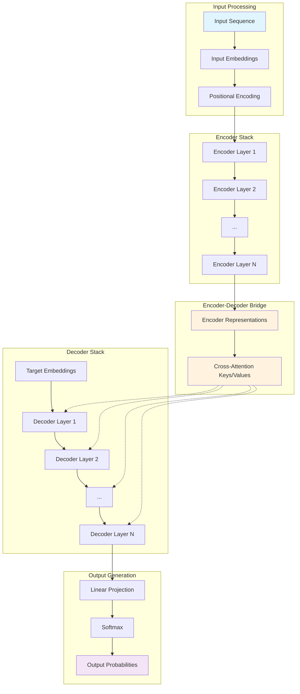

# Encoder-Decoder Architecture Guide

## 🎯 Learning Objectives
By the end of this guide, you will understand:
- The fundamental architecture of encoder-decoder models
- How attention mechanisms work in sequence-to-sequence tasks
- Mathematical foundations of encoder-decoder transformers
- Popular encoder-decoder models like T5, BART, and mT5
- When and how to use encoder-decoder models effectively

## 📋 Prerequisites
- Basic understanding of neural networks and attention mechanisms
- Familiarity with transformer architecture concepts
- Knowledge of sequence-to-sequence learning tasks
- Reference: [NLP Learning Journey](https://github.com/vuhung16au/nlp-learning-journey/docs/) for foundational NLP concepts

## 🏗️ Architecture Overview

The **Encoder-Decoder** architecture, also known as **Sequence-to-Sequence (Seq2Seq)** models, is designed for tasks where input and output sequences can have different lengths and structures. This architecture excels at tasks like machine translation, summarization, and text generation.



## 🧮 Mathematical Foundations

### Encoder Architecture

The encoder processes the input sequence $X = (x_1, x_2, ..., x_n)$ and produces a sequence of hidden representations $H = (h_1, h_2, ..., h_n)$.

For each encoder layer $l$, the computation follows:

$$
\begin{align}
\text{MultiHead}(Q, K, V) &= \text{Concat}(\text{head}_1, ..., \text{head}_h)W^O \\
\text{head}_i &= \text{Attention}(QW_i^Q, KW_i^K, VW_i^V) \\
\text{Attention}(Q, K, V) &= \text{softmax}\left(\frac{QK^T}{\sqrt{d_k}}\right)V
\end{align}
$$

Where:
- $Q, K, V$ are the query, key, and value matrices
- $W_i^Q, W_i^K, W_i^V$ are learned projection matrices for head $i$
- $d_k$ is the dimension of the key vectors
- $h$ is the number of attention heads

### Decoder with Cross-Attention

The decoder generates output sequence $Y = (y_1, y_2, ..., y_m)$ using three types of attention:

1. **Masked Self-Attention**: Prevents attending to future tokens
$$\text{MaskedAttn}(Q, K, V) = \text{softmax}\left(\frac{QK^T + M}{\sqrt{d_k}}\right)V$$
where $M$ is a mask matrix with $M_{ij} = -\infty$ if $i < j$, else $0$.

2. **Cross-Attention**: Attends to encoder representations
$$\text{CrossAttn}(Q_{dec}, K_{enc}, V_{enc}) = \text{softmax}\left(\frac{Q_{dec}K_{enc}^T}{\sqrt{d_k}}\right)V_{enc}$$

3. **Feed-Forward Network**: 
$$\text{FFN}(x) = \max(0, xW_1 + b_1)W_2 + b_2$$

### Auto-regressive Generation

During generation, the decoder produces tokens sequentially:

$$P(y_t | y_{<t}, X) = \text{softmax}(\text{Decoder}(y_{<t}, X)W_{vocab} + b_{vocab})$$

The complete sequence probability is:
$$P(Y | X) = \prod_{t=1}^{|Y|} P(y_t | y_{<t}, X)$$

## 🔍 Key Components Explained

### 1. Encoder Phase

> **Purpose**: Extract meaningful representations from input sequence

The encoder performs these operations:
- **Input Processing**: Tokenization and embedding of source sequence
- **Positional Encoding**: Adding position information to embeddings
- **Self-Attention**: Each token attends to all positions in input sequence
- **Feed-Forward**: Non-linear transformations for each position
- **Layer Normalization**: Stabilizes training and improves convergence

**Key Insight**: The encoder has **bi-directional attention** - each token can attend to both past and future tokens, enabling rich contextual understanding.

### 2. Decoder Phase

> **Purpose**: Generate target sequence using encoder representations and previous outputs

The decoder includes:
- **Masked Self-Attention**: Only attends to previous tokens (causal masking)
- **Cross-Attention**: Attends to encoder outputs for context
- **Feed-Forward**: Position-wise transformations
- **Auto-regressive Generation**: Uses previous outputs to generate next token

**Key Insight**: The decoder combines **causal self-attention** (for target sequence coherence) with **cross-attention** (for source sequence understanding).

### 3. Attention Mechanisms Comparison

| Attention Type | Purpose | Attention Pattern | Used In |
|---------------|---------|-------------------|---------|
| **Encoder Self-Attention** | Understand input context | Bi-directional | Encoder layers |
| **Decoder Self-Attention** | Maintain output coherence | Uni-directional (masked) | Decoder layers |
| **Cross-Attention** | Connect input and output | Decoder-to-Encoder | Decoder layers |

## 🏆 Popular Encoder-Decoder Models

### T5 (Text-to-Text Transfer Transformer)

> **Key Innovation**: Treats every NLP task as a text-to-text problem

```mermaid
graph LR
    A[Input: "translate English to French: Hello"] --> B[T5 Encoder]
    B --> C[Encoder Representations]
    C --> D[T5 Decoder]
    D --> E[Output: "Bonjour"]
    
    style A fill:#e1f5fe
    style E fill:#f3e5f5
    style C fill:#fff3e0
```

**Characteristics**:
- Unified framework for all NLP tasks
- Explicit task prefixes (e.g., "summarize:", "translate:")
- Span corruption pre-training objective
- Various sizes: T5-small, T5-base, T5-large, T5-3B, T5-11B

### BART (Bidirectional and Auto-Regressive Transformers)

> **Key Innovation**: Denoising pre-training with various corruption schemes

**Pre-training Objectives**:
- Token masking and deletion
- Text infilling and sentence permutation
- Document rotation

**Best Use Cases**:
- Text summarization
- Text generation
- Translation tasks

### mT5 (Multilingual T5)

> **Key Innovation**: Extends T5 to 101 languages

**Features**:
- Cross-lingual understanding and generation
- Zero-shot and few-shot transfer to new languages
- Shared vocabulary across languages

## 🎯 Use Cases and Applications

### 1. Machine Translation
```python
# Example: English to French translation
input: "translate English to French: The weather is beautiful today."
output: "Le temps est magnifique aujourd'hui."
```

### 2. Text Summarization
```python
# Example: Document summarization
input: "summarize: [Long article text...]"
output: "Brief summary of key points..."
```

### 3. Question Answering
```python
# Example: Generative QA
input: "answer: What is the capital of France? context: France is a country..."
output: "Paris"
```

### 4. Code Generation
```python
# Example: Code synthesis
input: "generate Python: function to calculate fibonacci numbers"
output: "def fibonacci(n): ..."
```

## 💡 Best Practices

### Model Selection Guidelines

> **💡 Pro Tip**: Choose model size based on your computational constraints and task complexity.

| Model Size | Parameters | Use Case | Memory Requirement |
|------------|------------|----------|-------------------|
| **T5-small** | 60M | Development, testing | ~1GB |
| **T5-base** | 220M | Most applications | ~2GB |
| **T5-large** | 770M | High-quality results | ~4GB |
| **T5-3B** | 3B | Production systems | ~12GB |

### Training Strategies

> **🚀 Performance**: Use gradient checkpointing and mixed precision for memory efficiency.

1. **Fine-tuning**: Start with pre-trained weights
2. **Task Formatting**: Use consistent task prefixes
3. **Beam Search**: Use beam search for better generation quality
4. **Length Control**: Set appropriate min/max length constraints

### Common Pitfalls

> **⚠️ Common Pitfall**: Forgetting to include task prefixes for T5-style models can lead to poor performance.

- **Inconsistent Formatting**: Always use the same task prefix format
- **Insufficient Context**: Provide enough context for cross-attention
- **Memory Issues**: Monitor GPU memory usage during training
- **Generation Parameters**: Tune temperature, top-k, and beam size appropriately

## 🔄 Encoder vs Decoder vs Encoder-Decoder

| Architecture | Best For | Attention Type | Example Models |
|--------------|----------|----------------|----------------|
| **Encoder-only** | Classification, feature extraction | Bi-directional | BERT, RoBERTa |
| **Decoder-only** | Text generation, completion | Uni-directional | GPT-2, GPT-3 |
| **Encoder-Decoder** | Translation, summarization | Both + Cross-attention | T5, BART, mT5 |

## 📚 Advanced Topics

### Attention Visualization
Understanding what the model attends to can provide insights into its behavior:

```python
# Visualizing cross-attention patterns
attention_weights = model.get_cross_attention_weights()
# attention_weights.shape: [batch, heads, seq_len_target, seq_len_source]
```

### Custom Task Formatting
Creating your own task formats for T5-style models:

```python
# Custom task format
def format_task(task_name, input_text, target_text=None):
    formatted_input = f"{task_name}: {input_text}"
    return formatted_input, target_text
```

### Multi-task Learning
Training a single model on multiple tasks simultaneously:

```python
# Multi-task training approach
tasks = {
    "translate": translate_dataset,
    "summarize": summarization_dataset,
    "question_answer": qa_dataset
}
```

## 🚀 Next Steps

### Practical Implementation
- **Notebook**: [Encoder-Decoder Examples](../examples/basic1.4/encoder-decoder.ipynb)
- **Translation Tutorial**: [Machine Translation Guide](../examples/basic1.2/08-translation.ipynb)
- **Summarization Tutorial**: [Text Summarization Guide](../examples/basic1.2/07-summarization.ipynb)

### Further Learning
- **Fine-tuning**: Learn to adapt models to specific domains
- **Evaluation Metrics**: Study BLEU, ROUGE, and BERTScore
- **Optimization**: Explore knowledge distillation and model compression
- **Deployment**: Build scalable inference systems

### External Resources
- [Hugging Face Encoder-Decoder Models](https://huggingface.co/models?pipeline_tag=text2text-generation)
- [T5 Paper: "Exploring the Limits of Transfer Learning"](https://arxiv.org/abs/1910.10683)
- [BART Paper: "Denoising Sequence-to-Sequence Pre-training"](https://arxiv.org/abs/1910.13461)
- [Attention Is All You Need Paper](https://arxiv.org/abs/1706.03762)

---

> **Key Takeaway**: Encoder-decoder models excel at tasks requiring transformation between different sequence types or lengths. The combination of bi-directional encoding and auto-regressive decoding with cross-attention makes them powerful for sequence-to-sequence tasks.