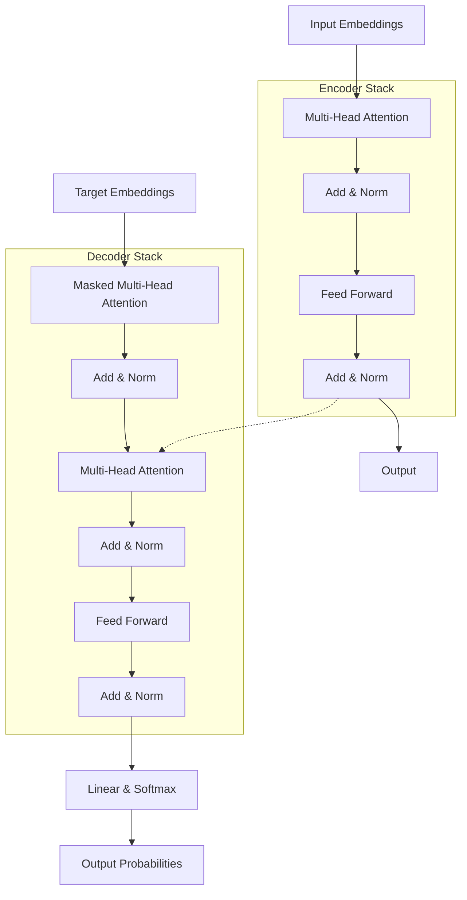
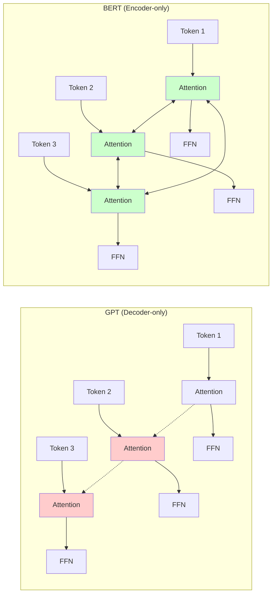
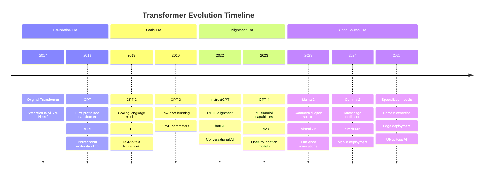

# History of Transformers: The AI Revolution (2017-2025)

## 🎯 Learning Objectives
By the end of this document, you will understand:
- The timeline of major transformer model developments from 2017 to 2025
- Key breakthrough models and their innovations
- Evolution from translation-focused to general-purpose language models
- Different transformer architectures and their use cases
- Recent developments in efficiency and specialization

## 📋 Prerequisites
- Basic understanding of machine learning concepts
- Familiarity with neural networks and attention mechanisms
- Knowledge of NLP fundamentals (refer to [NLP Learning Journey](https://github.com/vuhung16au/nlp-learning-journey))

## 📚 What We'll Cover
1. **The Foundation Era** (2017-2018): Birth of the transformer
2. **The Breakthrough Era** (2018-2020): BERT, GPT, and the encoder-decoder split
3. **The Scale Era** (2020-2022): Massive models and emergent abilities
4. **The Efficiency Era** (2022-2024): Optimization and democratization
5. **The Specialization Era** (2024-2025): Domain-specific and efficient models

---

## 1. The Foundation Era (2017-2018)

### June 2017: The Original Transformer 🚀
The [**Transformer architecture**](https://arxiv.org/abs/1706.03762) was introduced by Vaswani et al. in the groundbreaking paper "Attention Is All You Need."

**Key Innovation**: Self-attention mechanism replacing recurrent and convolutional layers entirely.

```python
# The core attention mechanism that started it all
import torch
import torch.nn.functional as F

def scaled_dot_product_attention(query, key, value, mask=None):
    """
    The fundamental attention mechanism from the original transformer paper.
    
    Args:
        query: Query tensor [batch_size, seq_len, d_model]
        key: Key tensor [batch_size, seq_len, d_model]  
        value: Value tensor [batch_size, seq_len, d_model]
        mask: Optional attention mask
    """
    d_k = query.size(-1)
    
    # Compute attention scores
    scores = torch.matmul(query, key.transpose(-2, -1)) / torch.sqrt(torch.tensor(d_k, dtype=torch.float32))
    
    if mask is not None:
        scores = scores.masked_fill(mask == 0, -1e9)
    
    # Apply softmax
    attention_weights = F.softmax(scores, dim=-1)
    
    # Apply attention to values
    output = torch.matmul(attention_weights, value)
    
    return output, attention_weights

# Example usage
batch_size, seq_len, d_model = 2, 10, 512
query = torch.randn(batch_size, seq_len, d_model)
key = torch.randn(batch_size, seq_len, d_model)
value = torch.randn(batch_size, seq_len, d_model)

output, attention = scaled_dot_product_attention(query, key, value)
print(f"Output shape: {output.shape}")
print(f"Attention weights shape: {attention.shape}")
```

**Architecture Overview**:


### June 2018: GPT - The First Pretrained Transformer 🎭

**GPT (Generative Pre-trained Transformer)** by OpenAI marked the first successful application of transformer architecture for generative language modeling.

**Key Innovation**: Unsupervised pre-training followed by supervised fine-tuning.

```python
# GPT-style autoregressive generation (simplified)
from transformers import GPT2LMHeadModel, GPT2Tokenizer
import torch

def generate_text_gpt_style(model, tokenizer, prompt, max_length=50):
    """
    Generate text using GPT-style autoregressive sampling.
    Educational example showing the core generation loop.
    """
    # Tokenize input
    input_ids = tokenizer.encode(prompt, return_tensors='pt')
    
    # Generate tokens one by one
    with torch.no_grad():
        for _ in range(max_length):
            # Forward pass
            outputs = model(input_ids)
            logits = outputs.logits
            
            # Get next token probabilities
            next_token_logits = logits[0, -1, :]
            next_token_probs = torch.softmax(next_token_logits, dim=-1)
            
            # Sample next token (greedy decoding for simplicity)
            next_token = torch.argmax(next_token_probs)
            
            # Add to sequence
            input_ids = torch.cat([input_ids, next_token.unsqueeze(0).unsqueeze(0)], dim=1)
            
            # Stop if end token
            if next_token == tokenizer.eos_token_id:
                break
    
    return tokenizer.decode(input_ids[0], skip_special_tokens=True)

# Example usage (requires actual model loading)
# tokenizer = GPT2Tokenizer.from_pretrained('gpt2')
# model = GPT2LMHeadModel.from_pretrained('gpt2')
# generated = generate_text_gpt_style(model, tokenizer, "The future of AI is")
```

---

## 2. The Breakthrough Era (2018-2020)

### October 2018: BERT - Bidirectional Understanding 🔄

**BERT (Bidirectional Encoder Representations from Transformers)** revolutionized NLP by introducing bidirectional pre-training.

**Key Innovation**: Masked language modeling enabling bidirectional context understanding.

```python
# BERT-style masked language modeling (educational example)
from transformers import AutoTokenizer, AutoModelForMaskedLM
import torch

def demonstrate_bert_masking():
    """
    Demonstrate BERT's masked language modeling capability.
    """
    # Load BERT model and tokenizer
    tokenizer = AutoTokenizer.from_pretrained("bert-base-uncased")
    model = AutoModelForMaskedLM.from_pretrained("bert-base-uncased")
    
    # Example text with mask
    text = "The transformer architecture revolutionized [MASK] language processing."
    
    # Tokenize
    inputs = tokenizer(text, return_tensors="pt")
    
    # Find mask token position
    mask_token_index = torch.where(inputs["input_ids"] == tokenizer.mask_token_id)[1]
    
    # Forward pass
    with torch.no_grad():
        outputs = model(**inputs)
        predictions = outputs.logits
    
    # Get predictions for mask token
    mask_token_logits = predictions[0, mask_token_index, :]
    top_5_tokens = torch.topk(mask_token_logits, 5, dim=1).indices[0].tolist()
    
    print(f"Original text: {text}")
    print("Top 5 predictions for [MASK]:")
    for token in top_5_tokens:
        predicted_token = tokenizer.decode([token])
        filled_text = text.replace("[MASK]", predicted_token)
        print(f"  - {predicted_token}: {filled_text}")

# demonstrate_bert_masking()
```

**BERT vs GPT Architecture Comparison**:


### February 2019: GPT-2 - Scaling Up Language Models 📈

**GPT-2** demonstrated that larger models exhibit qualitatively different behaviors and capabilities.

**Key Innovation**: Demonstrating emergent capabilities through scale (1.5B parameters).

> 💡 **Historical Note**: GPT-2 was initially withheld from public release due to concerns about potential misuse, highlighting early awareness of AI safety considerations.

### October 2019: T5 - Text-to-Text Transfer Transformer 🔄

**T5** unified all NLP tasks under a single text-to-text framework.

**Key Innovation**: "Everything is text" - treating all tasks as text generation problems.

```python
# T5-style text-to-text framework (educational example)
from transformers import T5ForConditionalGeneration, T5Tokenizer

def demonstrate_t5_tasks():
    """
    Show how T5 handles multiple tasks with text-to-text format.
    """
    tokenizer = T5Tokenizer.from_pretrained("t5-small")
    model = T5ForConditionalGeneration.from_pretrained("t5-small")
    
    # Different tasks using T5's text-to-text format
    tasks = [
        {
            "name": "Translation", 
            "input": "translate English to German: Hello, how are you?",
            "description": "Translate between languages"
        },
        {
            "name": "Summarization",
            "input": "summarize: The transformer architecture has revolutionized natural language processing...",
            "description": "Generate summaries of long texts"
        },
        {
            "name": "Question Answering",
            "input": "question: What is the capital of France? context: France is a country in Europe. Paris is its capital.",
            "description": "Answer questions based on context"
        }
    ]
    
    for task in tasks:
        print(f"\n=== {task['name']} ===")
        print(f"Task: {task['description']}")
        print(f"Input format: {task['input'][:50]}...")
        
        # Tokenize and generate (simplified)
        input_ids = tokenizer(task['input'], return_tensors="pt").input_ids
        
        with torch.no_grad():
            outputs = model.generate(input_ids, max_length=50, num_beams=2)
        
        generated_text = tokenizer.decode(outputs[0], skip_special_tokens=True)
        print(f"Generated: {generated_text}")

# demonstrate_t5_tasks()
```

---

## 3. The Scale Era (2020-2022)

### May 2020: GPT-3 - The Emergence of Few-Shot Learning 🎯

**GPT-3** with 175 billion parameters demonstrated unprecedented few-shot learning capabilities.

**Key Innovation**: In-context learning - learning from examples provided in the prompt without parameter updates.

```python
# GPT-3 style few-shot learning example
def few_shot_learning_example():
    """
    Demonstrate the concept of few-shot learning that GPT-3 popularized.
    This shows the prompt structure, not actual GPT-3 API calls.
    """
    
    # Few-shot prompt structure
    few_shot_prompt = """
    Translate English to French:
    
    English: Hello
    French: Bonjour
    
    English: How are you?
    French: Comment allez-vous?
    
    English: Good morning
    French: Bonjour
    
    English: Thank you
    French: """
    
    print("Few-shot learning prompt structure:")
    print(few_shot_prompt)
    print("\nExpected output: Merci")
    
    # Zero-shot example
    zero_shot_prompt = "Translate 'Thank you' to French:"
    
    print(f"\nComparison - Zero-shot: {zero_shot_prompt}")

few_shot_learning_example()
```

### January 2021: Switch Transformer - Sparse Expert Models 🔀

**Switch Transformer** introduced sparse expert models, enabling training of trillion-parameter models efficiently.

**Key Innovation**: Mixture of Experts (MoE) with sparse routing.

### 2021: Vision Transformers (ViT) - Beyond Language 👁️

**Vision Transformer** successfully applied transformer architecture to computer vision tasks.

**Key Innovation**: Treating images as sequences of patches.

---

## 4. The Instruction Following Era (2022-2024)

### January 2022: InstructGPT - Alignment and Following Instructions 📝

**InstructGPT** introduced reinforcement learning from human feedback (RLHF) to better align models with human preferences.

**Key Innovation**: RLHF for improving helpfulness, harmlessness, and honesty.

```python
# RLHF concept demonstration (simplified)
def demonstrate_rlhf_concept():
    """
    Educational demonstration of RLHF training stages.
    This is conceptual - actual RLHF requires complex infrastructure.
    """
    
    training_stages = [
        {
            "stage": "1. Supervised Fine-tuning (SFT)",
            "description": "Train on high-quality human-written responses",
            "example_data": "Question: Explain gravity\nAnswer: Gravity is a fundamental force..."
        },
        {
            "stage": "2. Reward Model Training", 
            "description": "Train a model to predict human preferences",
            "example_data": "Response A vs Response B → Human prefers A (label: 1)"
        },
        {
            "stage": "3. PPO Training",
            "description": "Use reward model to fine-tune policy with RL",
            "example_data": "Generate response → Get reward → Update policy"
        }
    ]
    
    for stage in training_stages:
        print(f"\n{stage['stage']}")
        print(f"Purpose: {stage['description']}")
        print(f"Data type: {stage['example_data']}")

demonstrate_rlhf_concept()
```

### March 2023: GPT-4 - Multimodal Capabilities 🖼️

**GPT-4** introduced vision capabilities while maintaining strong language performance.

**Key Innovation**: Multimodal understanding combining text and images.

---

## 5. The Open Source and Efficiency Revolution (2023-2025)

### February 2023: LLaMA - Open Foundation Models 🦙

**LLaMA** (Large Language Model Meta AI) democratized access to powerful language models.

**Key Innovation**: Strong performance at smaller sizes (7B, 13B, 30B, 65B parameters).

```python
# Efficient model loading and inference pattern popularized by LLaMA era
from transformers import AutoTokenizer, AutoModelForCausalLM
import torch

def load_efficient_model(model_name, max_memory_gb=8):
    """
    Load model efficiently with memory constraints.
    Demonstrates patterns common in the open-source LLM era.
    """
    # Calculate approximate memory requirements
    def estimate_model_memory(model_name):
        # Rough estimation based on model name
        if "7b" in model_name.lower():
            return 14  # GB (roughly 2 bytes per parameter)
        elif "13b" in model_name.lower():
            return 26
        else:
            return 50  # Assume large model
    
    estimated_memory = estimate_model_memory(model_name)
    
    # Choose loading strategy based on available memory
    if estimated_memory > max_memory_gb:
        print(f"Model requires ~{estimated_memory}GB, using optimizations...")
        
        # Load with optimizations
        tokenizer = AutoTokenizer.from_pretrained(model_name)
        model = AutoModelForCausalLM.from_pretrained(
            model_name,
            torch_dtype=torch.float16,  # Half precision
            device_map="auto",          # Auto device placement
            low_cpu_mem_usage=True,     # Reduce CPU memory during loading
        )
    else:
        print(f"Model fits in {max_memory_gb}GB, using standard loading...")
        tokenizer = AutoTokenizer.from_pretrained(model_name)
        model = AutoModelForCausalLM.from_pretrained(model_name)
    
    return tokenizer, model

# Example usage (commented to avoid actual loading)
# tokenizer, model = load_efficient_model("huggingface/CodeBERTa-small-v1", max_memory_gb=4)
```

### July 2023: Llama 2 - Commercial Open Source 📈

**Llama 2** provided commercial-use licensing, further accelerating open-source AI development.

**Key Innovation**: High-quality open models with commercial licensing.

### September 2023: Mistral 7B - Efficiency Leadership 🚀

**Mistral 7B** demonstrated that careful architecture choices could match larger models.

**Key Innovation**: Grouped-query attention and sliding window attention for efficiency.

```python
# Sliding window attention concept (educational)
def sliding_window_attention_concept(sequence_length=1000, window_size=512):
    """
    Demonstrate the concept of sliding window attention used in Mistral.
    This reduces memory complexity from O(n²) to O(n*window_size).
    """
    import numpy as np
    
    # Create attention mask for sliding window
    attention_mask = np.zeros((sequence_length, sequence_length))
    
    for i in range(sequence_length):
        # Each position can attend to positions within the window
        start = max(0, i - window_size // 2)
        end = min(sequence_length, i + window_size // 2 + 1)
        attention_mask[i, start:end] = 1
    
    print(f"Full attention matrix: {sequence_length}x{sequence_length} = {sequence_length**2:,} elements")
    print(f"Sliding window attention: ~{window_size} elements per position")
    print(f"Memory reduction: {(1 - window_size/sequence_length)*100:.1f}% savings")
    
    return attention_mask

# Demonstrate efficiency gains
mask = sliding_window_attention_concept(sequence_length=2048, window_size=512)
```

### 2024: The Small Model Renaissance 🌱

#### May 2024: Gemma 2 - Google's Open Models

**Gemma 2** family (2B to 27B) demonstrated strong performance across different scales.

**Key Innovation**: Knowledge distillation from larger models to smaller ones.

#### November 2024: SmolLM2 - Extreme Efficiency 📱

**SmolLM2** pushed the boundaries of what's possible with very small models (135M-1.7B parameters).

**Key Innovation**: High performance in mobile and edge deployments.

```python
# Small model deployment pattern
def deploy_small_model_efficiently():
    """
    Demonstrate deployment patterns for small, efficient models.
    Popular in the 2024-2025 era for edge and mobile devices.
    """
    
    deployment_strategies = {
        "Mobile/Edge": {
            "model_size": "135M - 1.7B parameters",
            "quantization": "8-bit or 4-bit",
            "framework": "ONNX Runtime, TensorFlow Lite",
            "memory_usage": "< 2GB RAM",
            "use_cases": ["On-device assistants", "Offline translation", "Code completion"]
        },
        "Server": {
            "model_size": "7B - 13B parameters", 
            "quantization": "16-bit or 8-bit",
            "framework": "vLLM, TensorRT",
            "memory_usage": "8-24GB VRAM",
            "use_cases": ["Chat applications", "Content generation", "API services"]
        },
        "Cloud": {
            "model_size": "70B+ parameters",
            "quantization": "16-bit",
            "framework": "DeepSpeed, FairScale",
            "memory_usage": "Multiple GPUs",
            "use_cases": ["Research", "Complex reasoning", "Multimodal tasks"]
        }
    }
    
    for deployment, specs in deployment_strategies.items():
        print(f"\n=== {deployment} Deployment ===")
        for key, value in specs.items():
            print(f"{key.replace('_', ' ').title()}: {value}")

deploy_small_model_efficiently()
```

---

## 6. Model Categories and Architectures

### Encoder-Only Models (BERT-like) 🔍
**Use Cases**: Classification, token labeling, embeddings
**Key Models**: BERT, RoBERTa, DeBERTa, ELECTRA

```python
# Encoder-only model usage pattern
from transformers import AutoModel, AutoTokenizer

def use_encoder_model_for_classification(text, model_name="bert-base-uncased"):
    """
    Demonstrate encoder-only model usage for classification tasks.
    """
    tokenizer = AutoTokenizer.from_pretrained(model_name)
    model = AutoModel.from_pretrained(model_name)
    
    # Tokenize input
    inputs = tokenizer(text, return_tensors="pt", padding=True, truncation=True)
    
    # Get encodings
    with torch.no_grad():
        outputs = model(**inputs)
        
    # Use [CLS] token embedding for classification
    cls_embedding = outputs.last_hidden_state[:, 0, :]  # [CLS] token
    
    print(f"Input text: {text}")
    print(f"CLS embedding shape: {cls_embedding.shape}")
    print("This embedding can be used for classification tasks")
    
    return cls_embedding

# Example
# embedding = use_encoder_model_for_classification("The transformer architecture is powerful")
```

### Decoder-Only Models (GPT-like) 🎭
**Use Cases**: Text generation, completion, chat
**Key Models**: GPT family, LLaMA, Mistral, Gemma

```python
# Decoder-only model generation pattern
def use_decoder_model_for_generation(prompt, model_name="gpt2"):
    """
    Demonstrate decoder-only model usage for text generation.
    """
    from transformers import AutoTokenizer, AutoModelForCausalLM
    
    tokenizer = AutoTokenizer.from_pretrained(model_name)
    model = AutoModelForCausalLM.from_pretrained(model_name)
    
    # Add pad token if not present
    if tokenizer.pad_token is None:
        tokenizer.pad_token = tokenizer.eos_token
    
    # Tokenize input
    inputs = tokenizer(prompt, return_tensors="pt")
    
    # Generate
    with torch.no_grad():
        outputs = model.generate(
            inputs.input_ids,
            max_length=inputs.input_ids.shape[1] + 50,
            num_return_sequences=1,
            temperature=0.7,
            do_sample=True,
            pad_token_id=tokenizer.eos_token_id
        )
    
    generated_text = tokenizer.decode(outputs[0], skip_special_tokens=True)
    
    print(f"Prompt: {prompt}")
    print(f"Generated: {generated_text}")
    
    return generated_text

# Example
# text = use_decoder_model_for_generation("The future of AI is")
```

### Encoder-Decoder Models (T5-like) 🔄
**Use Cases**: Translation, summarization, question answering
**Key Models**: T5, BART, mT5, PEGASUS

```python
# Encoder-decoder model usage pattern
def use_encoder_decoder_model(input_text, task_prefix="summarize:", model_name="t5-small"):
    """
    Demonstrate encoder-decoder model usage for text-to-text tasks.
    """
    from transformers import AutoTokenizer, AutoModelForSeq2SeqLM
    
    tokenizer = AutoTokenizer.from_pretrained(model_name)
    model = AutoModelForSeq2SeqLM.from_pretrained(model_name)
    
    # Prepare input with task prefix
    full_input = f"{task_prefix} {input_text}"
    
    # Tokenize
    inputs = tokenizer(full_input, return_tensors="pt", max_length=512, truncation=True)
    
    # Generate
    with torch.no_grad():
        outputs = model.generate(
            inputs.input_ids,
            max_length=150,
            num_beams=4,
            early_stopping=True
        )
    
    generated_text = tokenizer.decode(outputs[0], skip_special_tokens=True)
    
    print(f"Task: {task_prefix}")
    print(f"Input: {input_text[:100]}...")
    print(f"Output: {generated_text}")
    
    return generated_text

# Example
# summary = use_encoder_decoder_model(
#     "The transformer architecture has revolutionized natural language processing...",
#     "summarize:"
# )
```

---

## 7. Timeline Summary



---

## 8. Key Innovations Timeline

| Year | Model | Key Innovation | Impact |
|------|-------|----------------|--------|
| 2017 | Transformer | Self-attention mechanism | Foundation for all subsequent models |
| 2018 | GPT | Unsupervised pre-training | Showed power of transfer learning |
| 2018 | BERT | Bidirectional training | Revolutionized understanding tasks |
| 2019 | GPT-2 | Scaling effects | Demonstrated emergent capabilities |
| 2019 | T5 | Text-to-text framework | Unified approach to NLP tasks |
| 2020 | GPT-3 | Few-shot learning | In-context learning without fine-tuning |
| 2022 | InstructGPT | RLHF alignment | Human preference alignment |
| 2023 | LLaMA | Open efficient models | Democratized large language models |
| 2023 | Mistral | Architectural efficiency | Better performance per parameter |
| 2024 | Gemma 2 | Knowledge distillation | Small models with large model knowledge |
| 2024 | SmolLM2 | Edge optimization | Mobile and edge deployment |

---

## 9. Current Trends and Future Directions (2025 and Beyond)

### 🚀 Current Focus Areas

1. **Efficiency and Optimization**
   - Model compression techniques
   - Quantization and pruning
   - Efficient architectures (MoE, sparse attention)

2. **Multimodality** 
   - Vision-language models
   - Audio-text integration
   - Video understanding

3. **Specialization**
   - Domain-specific models (code, science, medicine)
   - Task-specific optimizations
   - Industry applications

4. **Alignment and Safety**
   - Constitutional AI
   - Interpretability research
   - Robustness improvements

### 💡 Emerging Patterns

```python
# Future model design patterns (conceptual)
def future_model_patterns():
    """
    Conceptual overview of emerging patterns in transformer design.
    """
    
    patterns = {
        "Mixture of Experts": {
            "concept": "Sparse activation of expert networks",
            "benefit": "Scale parameters without proportional compute increase",
            "example": "Switch Transformer, GLaM"
        },
        "Retrieval Augmentation": {
            "concept": "Combine parametric and non-parametric knowledge",
            "benefit": "Dynamic knowledge updating without retraining",
            "example": "RAG, FiD, REALM"
        },
        "Multi-modal Integration": {
            "concept": "Single model handling text, images, audio, video",
            "benefit": "Unified understanding across modalities", 
            "example": "GPT-4V, Flamingo, DALL-E 2"
        },
        "Efficient Architectures": {
            "concept": "Reduce computational complexity while maintaining performance",
            "benefit": "Deployment on resource-constrained devices",
            "example": "Linformer, Performer, Linear Attention"
        }
    }
    
    for pattern, details in patterns.items():
        print(f"\n=== {pattern} ===")
        print(f"Concept: {details['concept']}")
        print(f"Benefit: {details['benefit']}")
        print(f"Examples: {details['example']}")

future_model_patterns()
```

---

## 📋 Summary

### 🔑 Key Historical Insights

- **2017-2018**: Foundation with attention mechanism and first successful applications
- **2018-2020**: Architecture exploration (encoder-only, decoder-only, encoder-decoder)
- **2020-2022**: Scale scaling effects and emergent capabilities
- **2022-2024**: Alignment with human preferences and values
- **2023-2025**: Open source democratization and efficiency optimization

### 📈 Evolution Patterns

1. **Scale → Quality**: Larger models consistently showed better performance
2. **Closed → Open**: Transition from proprietary to open source models
3. **General → Specialized**: Movement toward domain and task-specific models
4. **Cloud → Edge**: Deployment shifting toward local and mobile devices

### 🎯 Learning Takeaways

- **Attention mechanism** remains the core innovation driving all advances
- **Scale** has been crucial but is now being balanced with **efficiency**
- **Open source** has accelerated innovation and democratized access
- **Alignment** with human values has become increasingly important
- **Multimodality** is the next frontier for general intelligence

### 🚀 Next Steps in Your Learning Journey

- **Notebook 01**: Start with [Introduction to Hugging Face Transformers](../examples/01_intro_hf_transformers.ipynb)
- **Notebook 05**: Explore [Fine-tuning with Trainer API](../examples/05_fine_tuning_trainer.ipynb) 
- **Notebook 09**: Learn about [PEFT LoRA QLoRA](../examples/09_peft_lora_qlora.ipynb) modern techniques
- **Key Terms**: Review [Hugging Face Key Terms](./key-terms.md) for terminology
- **Best Practices**: Check [Best Practices Guide](./best-practices.md) for implementation patterns

### 📚 Further Reading

- [Hugging Face Transformers Course](https://huggingface.co/learn/nlm-course) - Comprehensive course on transformers
- [Attention Is All You Need](https://arxiv.org/abs/1706.03762) - Original transformer paper
- [Language Models are Unsupervised Multitask Learners](https://d4mucfpksywv.cloudfront.net/better-language-models/language_models_are_unsupervised_multitask_learners.pdf) - GPT-2 paper
- [BERT Paper](https://arxiv.org/abs/1810.04805) - Bidirectional encoder representations
- [The Illustrated Transformer](http://jalammar.github.io/illustrated-transformer/) - Visual explanation of transformers

---

> 💡 **Pro Tip**: The transformer revolution is ongoing! Stay updated with new developments by following [Hugging Face's Model Hub](https://huggingface.co/models) and papers on [arXiv](https://arxiv.org/list/cs.CL/recent).

> 🌟 **Remember**: Each model builds on previous innovations. Understanding this historical progression helps you better grasp current architectures and predict future developments.

---

*This document is part of the [HF Transformer Trove](https://github.com/vuhung16au/hf-transformer-trove) educational series, designed to help you master the Hugging Face ecosystem through practical, hands-on learning.*